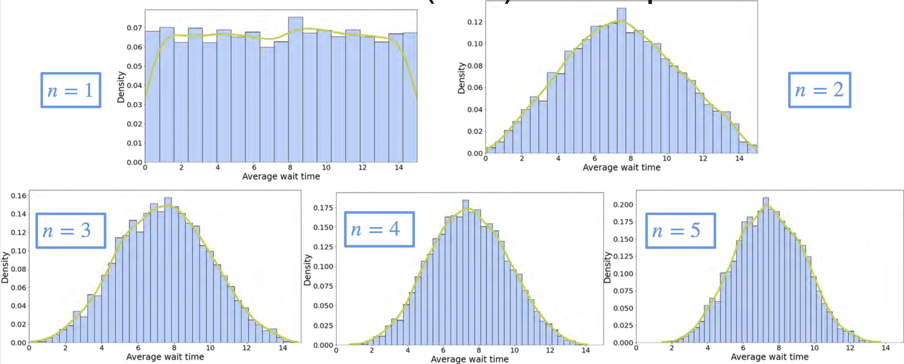

# Central Limit Theorem for Continuous Random Variables

Let's see the central limit theorem in the context of a continuous random variable.

Consider the text support line example: when you call, the operator can answer any time between 0 and 15 minutes. The wait time $x$ follows a uniform distribution from 0 to 15.

## Averaging Wait Times

Suppose you want to estimate the mean wait time.  
- If you use one sample, that sample is your estimate.
- If you use two samples, you average the two wait times.
- For three samples, you average three wait times, and so on.

Define $y_n$ as the average of $n$ wait times.

## Distribution of Averages

- For $n=1$, the histogram of averages looks like the original uniform distribution.
- For $n=2$, the histogram of averages looks like a triangle, symmetric around 7.5 (the population mean).
- For $n=3$, the histogram starts to look bell-shaped and is still symmetric around 7.5.
- For $n=4$ and $n=5$, the distribution becomes more bell-shaped and less dispersed.

As $n$ increases, the distribution of the sample mean looks more and more like a Gaussian (normal) distribution.

## Mean and Variance of the Average

- The mean of $y_n$ is the same as the population mean.
- For a uniform distribution from 0 to 15, the mean is 7.5.
- The variance of $y_n$ is the population variance divided by $n$.

For the uniform distribution $U(0, 15)$:
- Population variance = 18.75
- Variance of the average = $18.75 / n$

As $n$ grows, the variance of the average gets smaller, so the distribution becomes narrower around the mean.

## Comparing to the Gaussian

If you plot the probability density function for a Gaussian with the same mean and variance as $y_n$, the fit becomes closer as $n$ increases.  
For small $n$, the fit is rough, but for $n=4$ or $n=5$, the distributions are almost indistinguishable.

**Graph:**  
{insert screenshot comparing kernel density estimation and Gaussian PDF for different $n$}

## Standardizing the Average

Standardizing the average makes it easier to compare distributions for different $n$.  
As $n$ increases, the standardized average approaches a standard normal distribution.

## Formal Statement of the Central Limit Theorem

Whenever you consider the average of $n$ independent, identically distributed random variables:
- The mean of $y_n$ is the population mean.
- The variance of $y_n$ is the population variance divided by $n$.

As $n$ goes to infinity, the standardized average follows a standard normal distribution:

$$
\frac{y_n - \mu}{\sigma / \sqrt{n}} \to N(0, 1)
$$

Or, in terms of sums:

$$
\frac{\sum_{i=1}^n X_i - n\mu}{\sqrt{n}\sigma} \to N(0, 1)
$$

## Practical Notes

- For most well-behaved distributions, a sample size of about 30 is enough for the sample mean to be approximately normal.
- If the original distribution is very skewed, you may need larger samples.

## Key Takeaway

No matter the original distribution, the average of a large enough number of independent samples will be approximately normal.  
The mean stays the same, but the variance gets smaller as $n$ increases.

---

**Next:** 