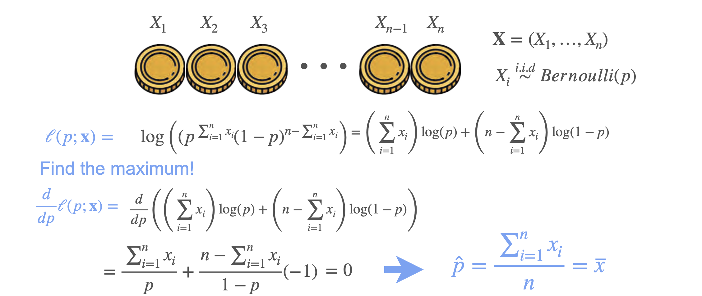

# Maximum Likelihood Estimation: Bernoulli Example

Let's go back to the coin example. Suppose you toss a coin ten times and it lands heads 8 times and tails 2 times.  You have three possible coins:
- Coin 1: Probability of heads = 0.7
- Coin 2: Probability of heads = 0.5 (fair coin)
- Coin 3: Probability of heads = 0.3

Which coin most likely produced these results?

## Calculating Likelihoods

For each coin, calculate the probability of getting 8 heads and 2 tails:

- **Coin 1:** $0.7^8 \times 0.3^2 = 0.0051$
- **Coin 2:** $0.5^{10} = 0.0010$
- **Coin 3:** $0.3^8 \times 0.7^2 = 0.00003$

Coin 1 has the highest probability, so it is the most likely coin to have generated the data.  

This is **maximum likelihood**: pick the scenario that makes the observed data most likely.

## Generalizing the Likelihood

Suppose you have a coin with probability $P$ for heads and $1-P$ for tails. The probability of getting 8 heads and 2 tails is:

$$
L(P) = P^8 \times (1-P)^2
$$

To find the best $P$, maximize this likelihood.

## Log Likelihood

It's easier to maximize the log likelihood:

$$
\log L(P) = 8 \log P + 2 \log (1-P)
$$

Take the derivative with respect to $P$ and set it to zero:

$$
\frac{d}{dP} [8 \log P + 2 \log (1-P)] = \frac{8}{P} - \frac{2}{1-P}
$$

Set equal to zero and solve for $P$:

$$
\frac{8}{P} = \frac{2}{1-P} \implies 8(1-P) = 2P \implies 8 - 8P = 2P \implies 8 = 10P \implies P = 0.8
$$

So, the best estimate for the probability of heads is $P = 8/10 = 0.8$.

## General Case

For $n$ tosses and $k$ heads, the likelihood is:

$$
L(P) = P^k (1-P)^{n-k}
$$

The log likelihood is:

$$
\log L(P) = k \log P + (n-k) \log (1-P)
$$

Maximizing this gives:

$$
\hat{P} = \frac{k}{n}
$$

So, the maximum likelihood estimate for the probability of heads is simply the proportion of heads observed.

---

**Next:** [Maximum Likelihood Estimation: Gaussian Example](./03_mle--gaussian_example.md)