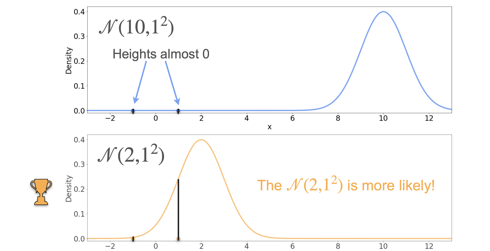
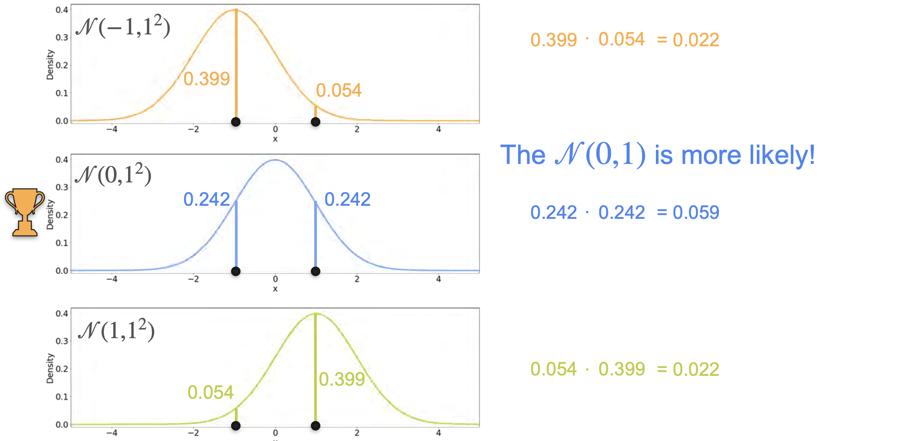
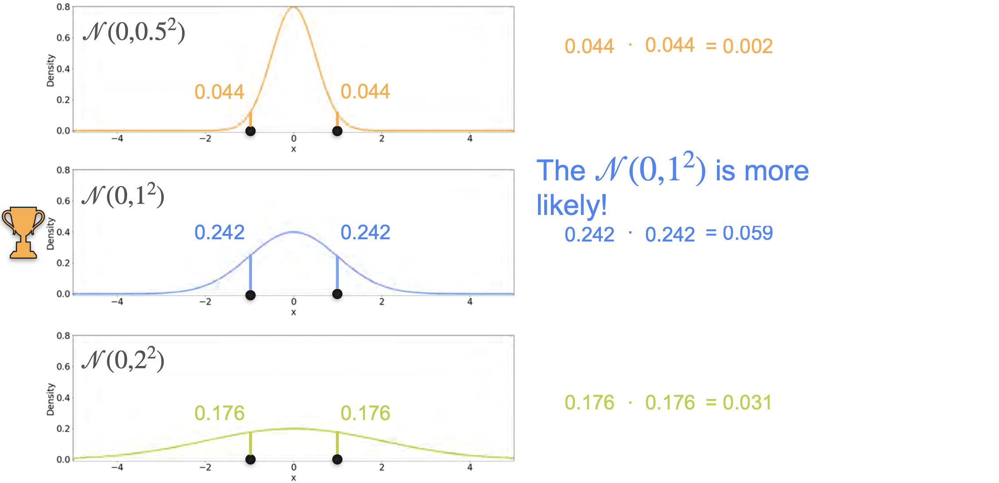

# Maximum Likelihood Estimation: Gaussian Example

Let's look at a similar problem using the normal (Gaussian) distribution.  

Suppose you observe the numbers 1 and -1. These observations were sampled from some distribution. Which distribution most likely generated them?

## Comparing Two Candidate Gaussians

Suppose you have two candidates:
- Gaussian with mean 10, standard deviation 1
- Gaussian with mean 2, standard deviation 1

Plot the two observations (1 and -1) on both curves. The heights of the curves at these points represent the likelihoods.  

The Gaussian with mean 2 produces higher likelihoods for both points than the one with mean 10, so it is more likely to have generated the data.

## Comparing Three Candidate Gaussians

Now consider three Gaussians:
- Mean = -1, std = 1
- Mean = 0, std = 1
- Mean = 1, std = 1

Calculate the likelihoods (heights of the curve) for each observation under each distribution:

| Distribution | Likelihood at 1 | Likelihood at -1 | Product |
|--------------|-----------------|------------------|---------|
| Mean -1      | 0.399           | 0.054            | 0.022   |
| Mean 0       | 0.242           | 0.242            | 0.059   |
| Mean 1       | 0.054           | 0.399            | 0.022   |

Multiply the likelihoods for each distribution (since the observations are independent). 

The highest product is for the Gaussian with mean 0 and std 1, so this is the most likely distribution.

**Notice:** The mean of the winning distribution matches the mean of the sample data (mean = 0).

## Varying the Standard Deviation

Now, fix the mean at 0 and compare three Gaussians with different standard deviations:
- std = 0.5
- std = 1
- std = 2

Calculate the likelihoods for each:

| Std Dev | Likelihood at 1 | Likelihood at -1 | Product |
|---------|-----------------|------------------|---------|
| 0.5     | 0.044           | 0.044            | 0.002   |
| 1       | 0.242           | 0.242            | 0.059   |
| 2       | 0.176           | 0.176            | 0.031   |

Again, the highest product is for std = 1. So, the Gaussian with mean 0 and std 1 is the most likely to have generated the data.

## Connection to Sample Statistics

Notice that:
- The mean of the best-fitting Gaussian matches the sample mean.
- The variance of the best-fitting Gaussian matches the sample variance.

For the observations [1, -1]:
- Sample mean = 0
- Sample variance = 1

The Gaussian with mean 0 and variance 1 is the maximum likelihood estimate.

---

**Next:** 