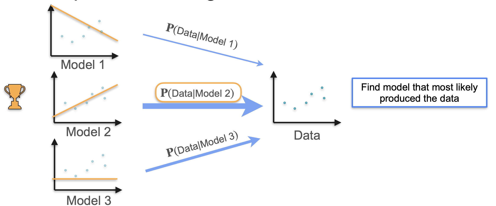
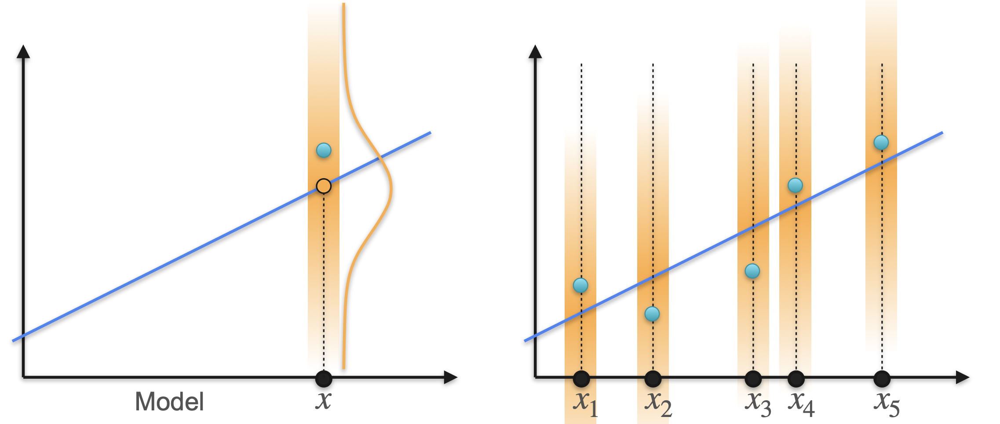
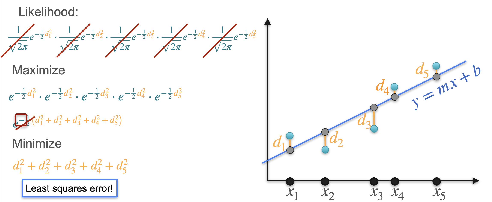

# Maximum Likelihood Estimation: Linear Regression

Recall that maximum likelihood in machine learning means:  

> Given data and several possible models, you calculate the probability that the data was generated by each model. The model that gives the highest probability is the winner—it maximizes $P(\text{data} \mid \text{model})$.

## Linear Regression Example

Suppose you have a set of points and want to fit a line. Instead of just fitting, let's use probability:

- **Model 1:** Line 1
- **Model 2:** Line 2
- **Model 3:** Line 3

Which line is the best fit? The best fit is the one that gives the highest probability of generating the observed data.

## How Does a Line Generate Points?

Imagine each line as a "road" and the points as "houses" built close to the road. For each $x_i$, the line predicts a value, and the actual observed $y_i$ is likely to be close to this prediction.

We model this using a Gaussian (normal) distribution centered at the line's prediction for each $x_i$.  

The probability of observing $y_i$ is highest when $y_i$ is close to the line.

## Likelihood Calculation

For a line $y = mx + b$, the vertical distance from each point to the line is $d_i = y_i - (mx_i + b)$.

Assume each point is generated from a Gaussian with mean $mx_i + b$ and standard deviation 1:

$$
\text{Likelihood for one point: } \frac{1}{\sqrt{2\pi}} e^{-\frac{1}{2} d_i^2}
$$

For all points, the total likelihood is the product of individual likelihoods:

$$
L = \prod_{i=1}^n \frac{1}{\sqrt{2\pi}} e^{-\frac{1}{2} d_i^2}
$$

Maximizing the likelihood is equivalent to maximizing the log-likelihood:

$$
\log L = \text{const} - \frac{1}{2} \sum_{i=1}^n d_i^2
$$

Since the constant doesn't affect the maximum, maximizing log-likelihood is the same as **minimizing the sum of squared distances**—this is the least squares error.

## Connection to Linear Regression

Finding the line that most likely produces the observed points using maximum likelihood is **exactly the same** as minimizing the least square error in linear regression.

---

**Next:** 