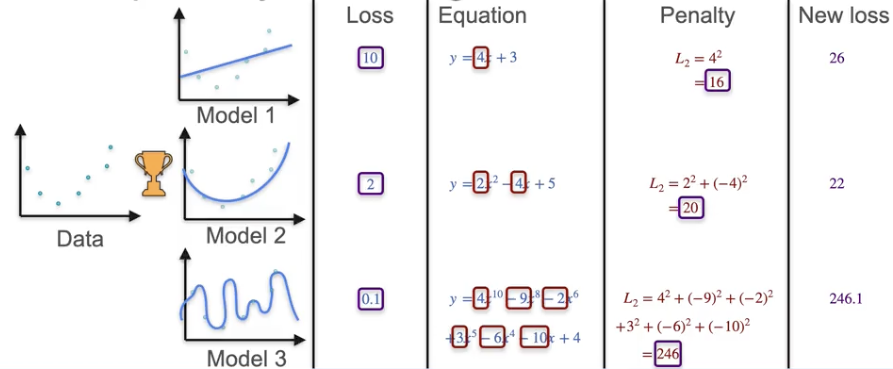
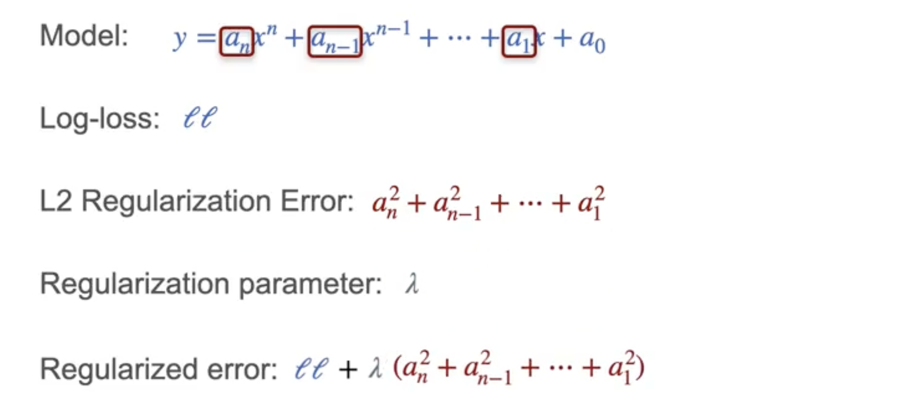

# Regularization

Imagine you have a dataset and three models that could fit it:
- Model 1: Linear
- Model 2: Quadratic polynomial
- Model 3: Polynomial of degree ten

To find the best fit, you look at the loss (e.g., squared error):
- Model 1: Loss = 10
- Model 2: Loss = 2
- Model 3: Loss = 0.1

Model 3 fits the data extremely well, but it’s very complex and likely overfits. Intuitively, Model 2 is a better choice.

## Why Regularization?

Regularization helps prevent choosing overly complex models that fit the data too well but fail to generalize. We apply a penalty to each model based on its complexity.

## L2 Regularization (Ridge)

The penalty is called the **L2 penalty**. It’s the sum of the squares of all the coefficients of the polynomial (except the constant term).

- Model 1: $y = 4x + 3$ → Penalty: $4^2 = 16$
- Model 2: $y = 2x^2 - 4x + 5$ → Penalty: $2^2 + (-4)^2 = 4 + 16 = 20$
- Model 3: Degree 10 polynomial → Penalty: $= 246$ (sum of squares of all coefficients except the constant)

## Regularized Loss

The new loss is the sum of the original loss and the penalty:

- Model 1: $10 + 16 = 26$
- Model 2: $2 + 20 = 22$
- Model 3: $0.1 + 262 = 246.1$

Now, Model 2 wins.

## Regularization Parameter

Often, we use a regularization parameter $\lambda$ to control the strength of the penalty:

$$
\text{Regularized Error} = \text{Loss} + \lambda \times \text{L2 Penalty}
$$

This lets us balance fitting the data and keeping the model simple.

## Summary

Regularization penalizes complex models, helping us find the simplest model that fits the data well.  

This is crucial for generalization and avoiding overfitting.

---

**Next:** 