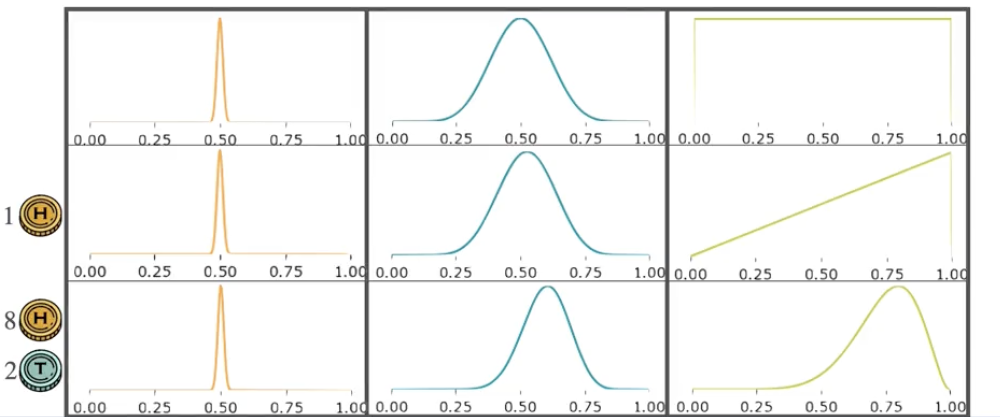

# Bayesian Statistics: MAP Estimation

Imagine three Bayesians find a coin on the street and want to estimate the probability of landing heads.  

Each starts with a different prior belief:

- **Bayesian 1:** Absolutely convinced the coin is fair. Their prior is very narrow and centered at 0.5, meaning they strongly believe $p = 0.5$.
- **Bayesian 2:** Thinks the coin is probably fair, but is open to some bias. Their prior is also highest at 0.5, but more spread out.
- **Bayesian 3:** Has no assumptions and assigns equal weight to all possible values of $p$. This is a non-informative prior.

## Updating Beliefs After Seeing Data

After one toss resulting in heads:
- The conservative Bayesian barely shifts their belief.
- The middle Bayesian updates slightly.
- The non-informative Bayesian changes their belief drastically, now favoring higher values of $p$.

After 10 tosses (8 heads, 2 tails):
- The first Bayesian’s belief curve barely moves.
- The second Bayesian’s curve shifts and peaks around 0.65.
- The third Bayesian’s belief now peaks around 0.8.

**Key point:** Even though all three observe the same data, their final beliefs differ because they started with different priors.

## Posterior and MAP Estimation

The updated belief after seeing data is called the **posterior**.  

To choose a single representative value for the parameter, one common approach is to pick the value with the highest probability in the posterior—this is the **mode**.

This is called **Maximum a Posteriori (MAP) estimation**.

> **MAP:** The value of the parameter that maximizes the posterior belief.

## MAP vs. Frequentist

- For the conservative Bayesian, MAP for $p$ is about 0.501 (barely changed).
- For the middle Bayesian, MAP for $p$ is about 0.607.
- For the non-informative Bayesian, MAP for $p$ is 0.8—same as the frequentist estimate.

**Insight:**  
> If you use a non-informative prior, MAP estimation gives the same result as the frequentist approach. The inclusion of priors is what makes Bayesian statistics unique.

---

**Next:** [Bayesian Statistics: Updating Priors](./10_bayesian_statistics--updating_priors.md)