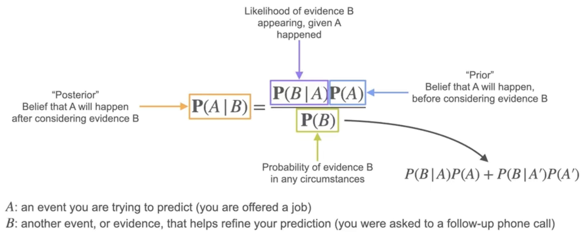
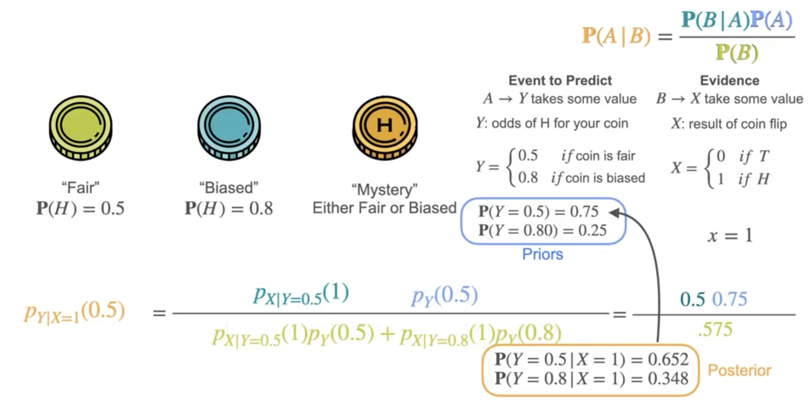
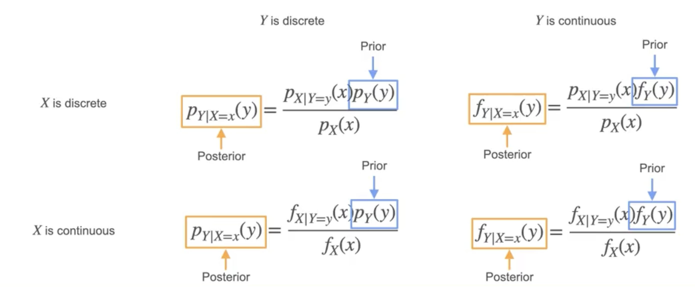
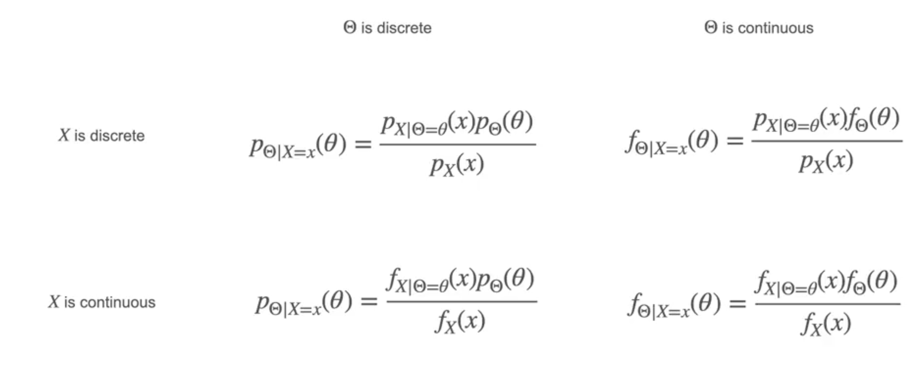

# Bayesian Statistics: Updating Priors

Now that you have a good intuition for Bayesian statistics, let's see how to actually update beliefs using Bayes' theorem.

Given two events $A$ and $B$:

$$
P(A \mid B) = \frac{P(B \mid A) \cdot P(A)}{P(B)}
$$

- $A$: The event you want to predict (e.g., being offered a job)
- $B$: Observed evidence (e.g., being asked for a follow-up interview)

- $P(A)$: **Prior** — your belief about $A$ before seeing $B$
- $P(B \mid A)$: **Likelihood** — probability of seeing $B$ if $A$ is true
- $P(B)$: **Evidence** — overall probability of seeing $B$
- $P(A \mid B)$: **Posterior** — updated belief about $A$ after seeing $B$

## Example: Fair or Biased Coin

Suppose you have a coin that could be:
- Fair ($P(\text{heads}) = 0.5$)
- Biased ($P(\text{heads}) = 0.8$)

You believe most coins are fair, so your priors are:
- $P(\text{fair}) = 0.75$
- $P(\text{biased}) = 0.25$

You flip the coin and get heads ($x = 1$).  

Let's update your belief that the coin is fair:

$$
P(\text{fair} \mid x=1) = \frac{P(x=1 \mid \text{fair}) \cdot P(\text{fair})}{P(x=1)}
$$

- $P(x=1 \mid \text{fair}) = 0.5$
- $P(\text{fair}) = 0.75$
- $P(x=1) = 0.5 \times 0.75 + 0.8 \times 0.25 = 0.575$

So,

$$
P(\text{fair} \mid x=1) = \frac{0.5 \times 0.75}{0.575} = 0.652
$$

Your updated (posterior) belief that the coin is fair is now 65.2%. Similarly, your belief that the coin is biased increases to 34.8%. Notice the sum is still 1.

## Generalizing with Probability Mass Functions

## Notation in Machine Learning

Often, $y$ is replaced by $\theta$ (the parameter you want to estimate):

Depending on whether $x$ and $\theta$ are discrete or continuous, you use the appropriate PMF or PDF.

---

**Next:** [Bayesian Statistics: Full Worked Example](./11_bayesian_statistics--full_worked_example.md)