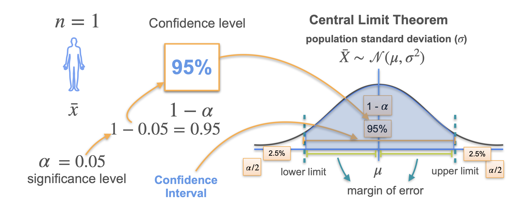
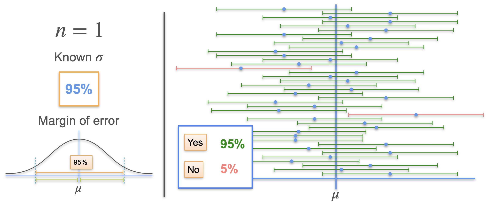

# Confidence Intervals: Overview

## Why Confidence Intervals?

- In practice, you rarely know the true population mean ($\mu$).
- You estimate $\mu$ using a sample mean, but each sample gives a slightly different result.
- Even with good sampling practices (random, large, independent samples), there is always uncertainty.

## What is a Confidence Interval?

- A confidence interval gives a range (lower and upper limits) that is likely to contain the true population parameter (e.g., $\mu$) with a specified level of confidence.
- Example: "We are 95% confident that the true mean height is between 165 cm and 175 cm."

## Building Intuition: The Lost Key Analogy

- Imagine searching for a lost key along a road.
- You park at your best guess and search a certain distance in both directions.
- The search interval is like a confidence interval: your best guess plus a margin for uncertainty.
- The key’s location is fixed but unknown; the interval is random, based on your guess and chosen search distance.
- Increasing your search distance increases your confidence of finding the key, but also means searching a larger area.

## Statistical Interpretation

- The confidence interval is constructed around your sample mean.
- The randomness comes from the sample mean, not the population mean (which is fixed but unknown).
- A 95% confidence interval means that, if you repeated the sampling process many times, 95% of the intervals you construct would contain the true mean.

## Applying to Statistopia

- Assume heights follow a normal distribution with unknown mean ($\mu$) and known variance ($\sigma^2$).
- Take a random sample (e.g., one person) and use their height as the sample mean ($\bar{x}$).
- The sample mean is itself a random variable, normally distributed around $\mu$.

## Margin of Error and Confidence Level

- The margin of error is the distance added/subtracted from the sample mean to create the interval.
- The confidence level (e.g., 95%) is the probability that the interval contains the true mean.
- The significance level ($\alpha$) is the probability that the interval does *not* contain the mean (e.g., $\alpha = 0.05$ for 95% confidence).

## Formula for Confidence Interval

- For a normal distribution with known variance:
  $$
  \text{Confidence Interval} = \bar{x} \pm \text{margin of error}
  $$
- The margin of error depends on the confidence level and the variability of the sample mean.

## Visualizing Confidence Intervals

- If you generate many confidence intervals from repeated samples, about 95% will contain the true mean (for 95% confidence).
- You only generate one interval in practice, but the method ensures that, in the long run, the intervals are accurate.

## Key Takeaways

- Confidence intervals quantify uncertainty in your estimate of a population parameter.
- The interval is random, but the parameter is fixed.
- Higher confidence requires a wider interval.
- Most intervals constructed this way will contain the true parameter, but not all.

---

**Next:** [Confidence Intervals: Changing the Interval](./02_confidence_intervals--changing_the_interval.md)