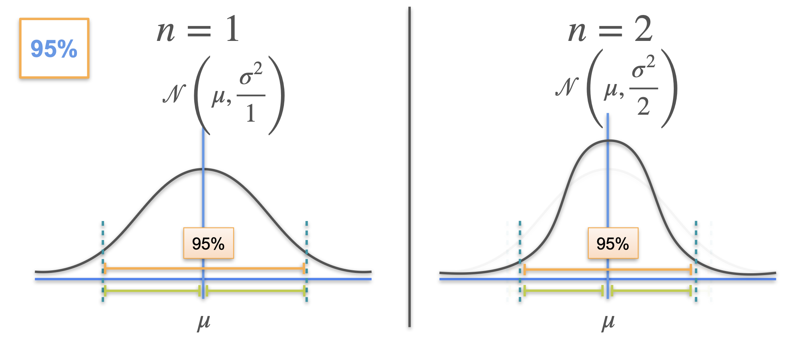
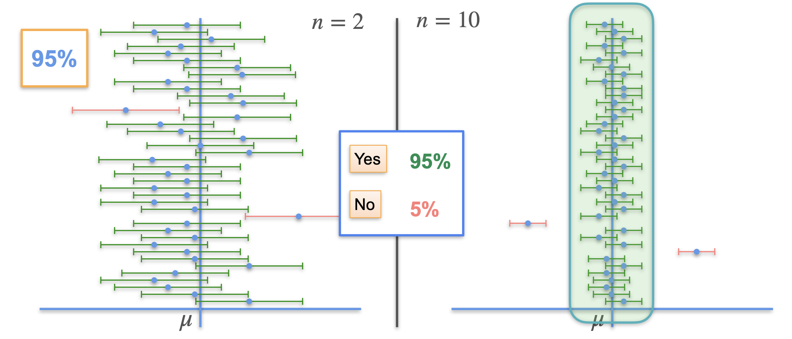
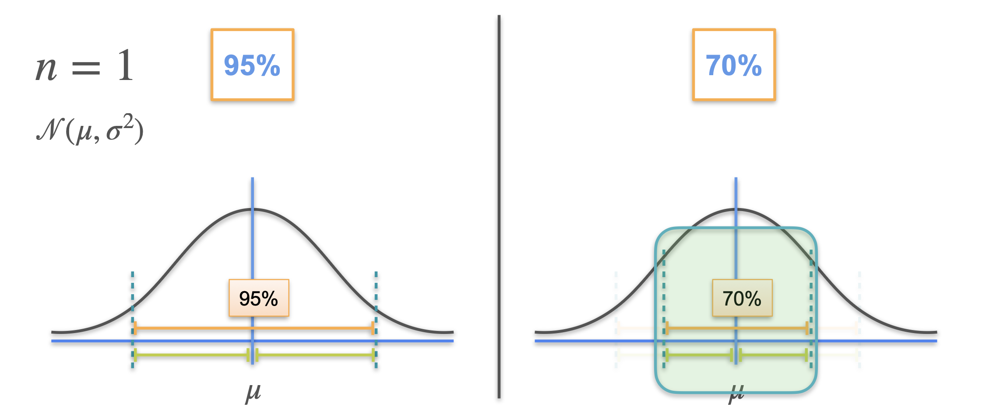

# Confidence Intervals: Changing the Interval

## Sample Size and Confidence Intervals

- The sample mean ($\bar{x}$) is normally distributed with mean $\mu$ and standard deviation $\sigma$.
- The expected value of the sample mean is always the population mean, regardless of sample size.
- The standard deviation of the sample mean ($\sigma_{\bar{x}}$) is $\sigma / \sqrt{n}$, where $n$ is the sample size.
- As $n$ increases, the distribution of sample means becomes narrower (less spread), meaning sample means are more tightly clustered around $\mu$.

## Effect of Increasing Sample Size

- With a larger sample size, the margin of error for a given confidence level shrinks.
- Confidence intervals become narrower, providing more precise estimates of $\mu$.
- For example, with $n=2$, the confidence interval is narrower than with $n=1$; with $n=10$, it is even narrower.
- Larger samples lead to greater accuracy and smaller confidence intervals, while maintaining the same confidence level.

## Visualizing Confidence Intervals

- When generating many confidence intervals at a fixed confidence level (e.g., 95%), about 95% of them will contain the population mean, regardless of sample size.
- However, intervals from larger samples are more desirable because they are narrower and more precise.

## Changing the Confidence Level

- The confidence level (e.g., 95%, 70%) determines the probability that the interval contains the population mean.
- Lowering the confidence level (e.g., to 70%) allows for smaller margins of error and narrower intervals, but increases the chance that the interval does not contain $\mu$.
- The distribution of sample means does not change, only the width of the interval does.

## Tradeoff: Precision vs. Confidence

- Higher confidence requires a wider interval (larger margin of error).
- Lower confidence allows for a narrower interval, but with less certainty that it contains the true mean.
- The ideal is a high confidence level and a narrow interval, but this usually requires more data.

## Summary

- Confidence intervals depend on both sample size and confidence level.
- Larger samples yield narrower intervals for the same confidence level.
- Lower confidence levels yield narrower intervals, but with less certainty.
- In practice, 95% confidence intervals are most common; intervals below 90% are rarely used.
- To get more precise estimates, collect more data.

---

**Next:** [Confidence Intervals: Margin of Error](./03_confidence_intervals--margin_of_error.md)