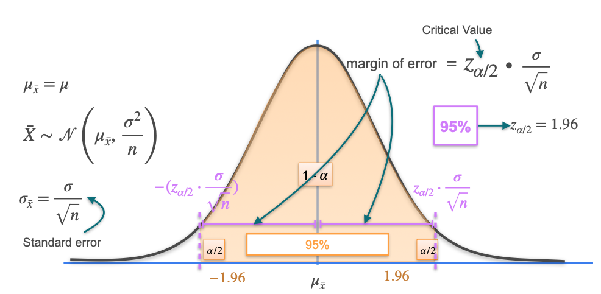

# Confidence Intervals: Margin of Error

## Constructing a Confidence Interval

- To build a confidence interval, you need two ingredients:
  - The sample mean ($\bar{x}$)
  - The margin of error

- The margin of error depends on:
  - The sample size ($n$)
  - The confidence level (e.g., 95%)

- The confidence interval is:
  $$
  \bar{x} \pm \text{margin of error}
  $$

## Calculating the Margin of Error

- Suppose you have a population with unknown mean $\mu$ and known variance $\sigma^2$.
- Take a sample of size $n$ and compute the sample mean $\bar{x}$.
- The sample mean is normally distributed with mean $\mu_{\bar{x}}$ and variance $\sigma^2 / n$.

- For a normal distribution:
  - About 68% of values lie within 1 standard deviation of the mean.
  - About 95% lie within 2 standard deviations.
  - These points are called **z-scores** or **critical values**.

- For a 95% confidence interval, the critical values are $-1.96$ and $+1.96$.
  - These values are found using lookup tables or software.

- The margin of error is:
  $$
  z_{1-\alpha/2} \times \text{standard error}
  $$
  where $\text{standard error} = \frac{\sigma}{\sqrt{n}}$

- For 95% confidence:
  $$
  \text{margin of error} = 1.96 \times \frac{\sigma}{\sqrt{n}}
  $$

## Rearranging the Inequality

- The confidence interval bounds the sample mean, not $\mu$.
- Rearranging the inequality gives an interval for $\mu$:
  $$
  \bar{x} - \text{margin of error} \leq \mu \leq \bar{x} + \text{margin of error}
  $$

## Non-Normal Populations

- Even if the population is not normal, the **Central Limit Theorem** says that for large $n$, the sample mean is approximately normal.
- The process for constructing confidence intervals still works for large samples, even if the population distribution is unknown.

## Summary

- The margin of error quantifies uncertainty in your estimate.
- Larger samples and lower confidence levels yield smaller margins of error.
- The confidence interval is constructed by adding and subtracting the margin of error from the sample mean.
- For large samples, the normal approximation is valid due to the Central Limit Theorem.

---

**Next:** [Confidence Intervals: Calculation Steps and An Example](./04_confidence_intervals--calculation_steps_and_an_example.md)