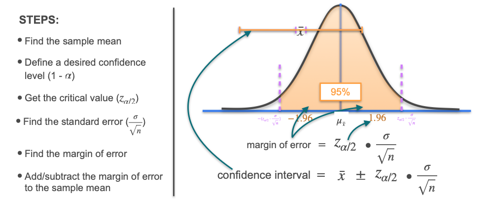

# Confidence Intervals: Calculation Steps and an Example

The steps to calculate a confidence interval are:

1. Find the sample mean ($\bar{x}$).

2. Choose a desired confidence level (e.g., 95%).

3. Find the critical value ($z_{1-\alpha/2}$) for the chosen confidence level (e.g., 1.96 for 95%).

4. Calculate the standard error (standard deviation of the sample mean):  

$$
\text{Standard Error} = \frac{\sigma}{\sqrt{n}}
$$

5. Compute the margin of error:  

$$
\text{Margin of Error} = z_{1-\alpha/2} \times \text{Standard Error}
$$

6. Construct the confidence interval:  

$$
\bar{x} \pm \text{Margin of Error}
$$

## Assumptions for Valid Confidence Intervals
Be sure to check the follwoing assumptions when applying confidence intervals in practice:

- The sample is random.
- The sample size is greater than 30, **or** the population is approximately normal (In illustrations, smaller sample sizes may be used, but for real applications, these assumptions should be met).

## Example

Let's go back to our running example: estimating the average height of the world's population. Suppose you take a small random sample and calculate the average height. Let's see how to construct a 95% confidence interval for the mean.

Imagine we're on the island of Statistopia, which has 6,000 adults. We want to estimate the average height of all adults, but we can't measure everyone. Instead, we randomly select 49 adults. The sample mean height is 170 cm, and the population standard deviation is known to be 25 cm.

Let's find a 95% confidence interval for the average height:

- **Sample mean ($\bar{x}$):** 170 cm  
- **Population standard deviation ($\sigma$):** 25 cm  
- **Sample size ($n$):** 49  
- **Critical value for 95% confidence ($z_{1-\alpha/2}$):** 1.96

**Step 1: Calculate the standard error**
$$
\text{Standard Error} = \frac{\sigma}{\sqrt{n}} = \frac{25}{\sqrt{49}} = \frac{25}{7} \approx 3.57
$$

**Step 2: Calculate the margin of error**
$$
\text{Margin of Error} = 1.96 \times 3.57 \approx 7
$$

**Step 3: Construct the confidence interval**
$$
170 \pm 7
$$
So, the 95% confidence interval is **[163 cm, 177 cm]**.

> **Interpretation:**  We are 95% confident that the true average height of adults in Statistopia lies between 163 cm and 177 cm.

