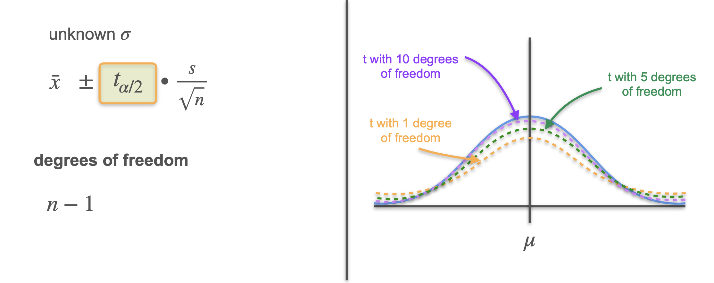

# Unknown Standard Deviation

In previous examples, we assumed the population standard deviation ($\sigma$) was known.

In practice, $\sigma$ is often **unknown**. Instead, we use the **sample standard deviation** ($s$).

## What Changes?

- When $\sigma$ is unknown, we substitute $s$ for $\sigma$ in our calculations.
- The sampling distribution of the sample mean is **no longer normal**; it follows the **Student's t distribution**.

## The Student's t Distribution

- The t distribution looks similar to the normal distribution but has **fatter tails** (more probability in the extremes).
- This means sample means are more likely to be further from the center compared to the normal distribution.
- As the sample size increases, the t distribution approaches the normal distribution.

## Adjusting the Confidence Interval Formula

With known $\sigma$ (normal distribution), we use the **z-score** for the margin of error:  

$$
\text{Margin of Error} = z_{1-\alpha/2} \cdot \frac{\sigma}{\sqrt{n}}
$$

With unknown $\sigma$ (t distribution), we use the **t-score** and sample standard deviation:  

$$
\text{Margin of Error} = t_{1-\alpha/2,\,df} \cdot \frac{s}{\sqrt{n}}
$$

... where $df = n - 1$ is the **degrees of freedom**.

## Degrees of Freedom

The **degrees of freedom** for the t distribution is $n - 1$ (where $n$ is the sample size).

The shape of the t distribution depends on the degrees of freedom:
- **Small $n$ (low $df$):** fatter tails, more variability.
- **Large $n$ (high $df$):** t distribution becomes closer to the normal distribution.

## Summary

- If $\sigma$ is **known**, use the normal distribution and z-scores.
- If $\sigma$ is **unknown** (most common), use the sample standard deviation, the t distribution, and t-scores.
- As your sample size increases, the difference between the t and normal distributions becomes negligible.

---

**Next:** [Confidence Intervals for Proportion](./08_confidence_intervals_for_proportion.md)