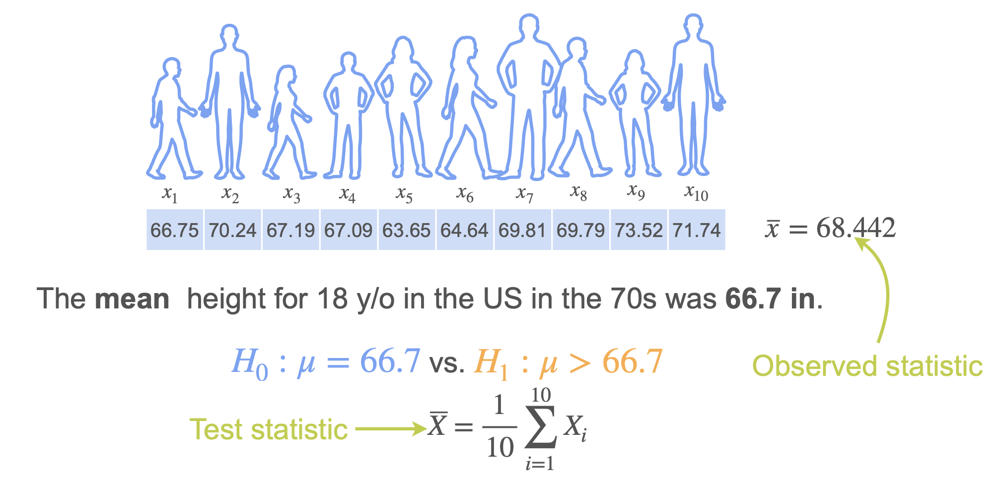
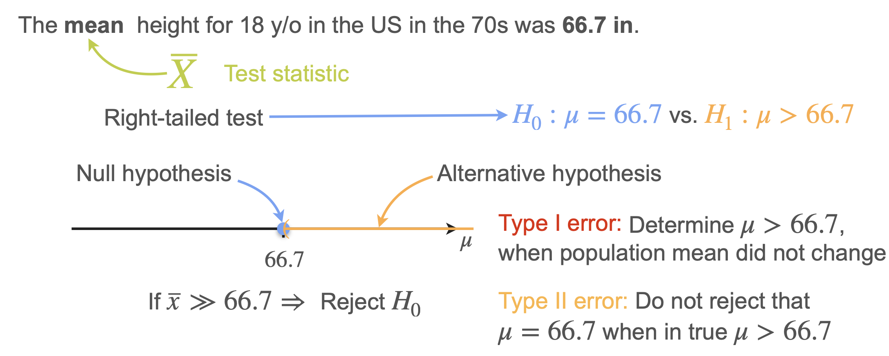
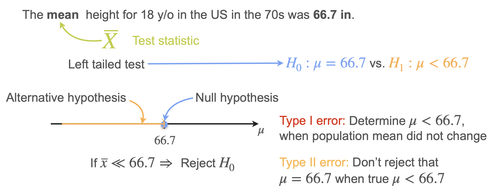
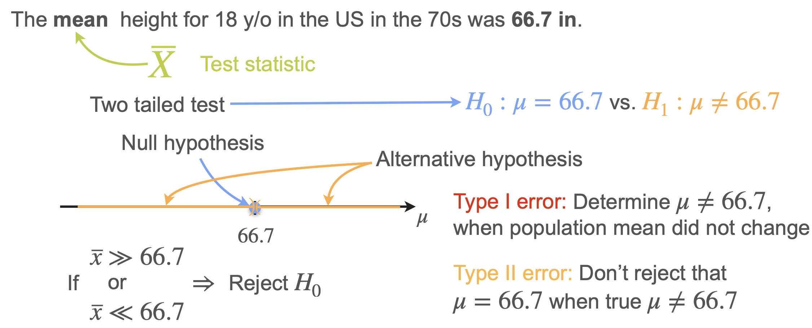

# Right-Tailed, Left-Tailed, and Two-Tailed Tests

Now that we understand the basics of hypothesis testing, let's apply it to testing a population mean. We'll cover both cases:
1. When the population standard deviation is **known** (use normal distribution)
2. When the population standard deviation is **unknown** (use Student's t-distribution)

We'll also introduce the important concept of the **p-value**.

## Example: Average Height of 18-Year-Olds

Let's use a concrete example to understand different types of hypothesis tests.

**Scenario:** You want to test the average height of 18-year-olds in the US. You have a sample of 10 people with heights measured in inches. The sample mean is **68.442 inches**.

Historical data shows that the mean height of 18-year-olds in the US in the 1970s was **66.7 inches**.

**Question:** Based on your sample data, can you confirm that the mean height has changed?

## Data Quality Considerations

Before performing any hypothesis test, ensure your data is reliable:
- **Representative sampling:** Avoid bias (e.g., don't sample only basketball players when studying general population height)
- **Random sampling:** Each sample should be randomly selected
- **Adequate sample size:** A good rule of thumb is **n ≥ 30** for reliable results

## Formulating Hypotheses

Hypotheses are always formulated in terms of **population parameters** (not sample statistics).

- **Test Statistic:** The sample mean ($\bar{x}$) - this is a random variable
- **Observed Statistic:** 68.442 inches - this is the specific value from your data

## Three Types of Hypothesis Tests

Depending on what you want to prove, there are three types of tests:

### 1. Right-Tailed Test

**Question:** Has the population height **increased** over the last 50 years?

- **H₀ (Null):** $\mu = 66.7$ (no change)
- **H₁ (Alternative):** $\mu > 66.7$ (height increased)

**Decision Rule:** If the sample mean is much greater than 66.7, reject H₀.

**Errors:**
- **Type I Error:** Conclude height increased when it actually stayed the same
- **Type II Error:** Conclude no change when height actually increased

### 2. Left-Tailed Test

**Question:** Has the population height **decreased** over the last 50 years?

- **H₀ (Null):** $\mu = 66.7$ (no change)
- **H₁ (Alternative):** $\mu < 66.7$ (height decreased)

**Decision Rule:** If the sample mean is much less than 66.7, reject H₀.

**Errors:**
- **Type I Error:** Conclude height decreased when it actually stayed the same
- **Type II Error:** Conclude no change when height actually decreased

### 3. Two-Tailed Test

**Question:** Has the population height **changed at all** (either increased or decreased)?

- **H₀ (Null):** $\mu = 66.7$ (no change)
- **H₁ (Alternative):** $\mu ≠ 66.7$ (height changed in either direction)

**Decision Rule:** If the sample mean deviates significantly from 66.7 in either direction, reject H₀.
- We can use $|\bar{x} - 66.7|$ to measure deviation in either direction.

**Errors:**
- **Type I Error:** Conclude height changed when it actually stayed the same
- **Type II Error:** Conclude no change when height actually changed

## Summary

- **Right-tailed:** Test if parameter **increased** (H₁: μ > μ₀)
- **Left-tailed:** Test if parameter **decreased** (H₁: μ < μ₀)  
- **Two-tailed:** Test if parameter **changed** (H₁: μ ≠ μ₀)

The choice depends on your research question and what you want to prove with your alternative hypothesis.

---

**Next:** [p-Value](./04_p-value.md)