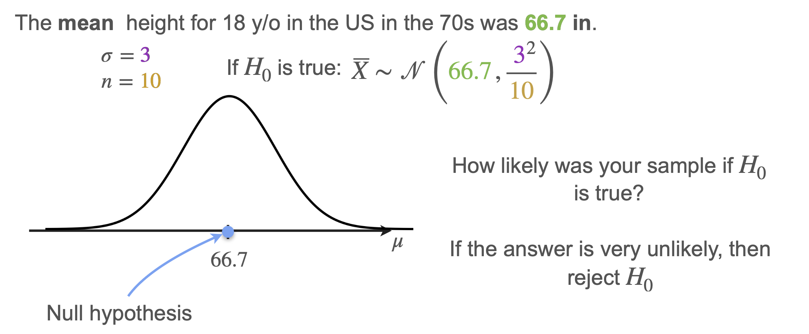
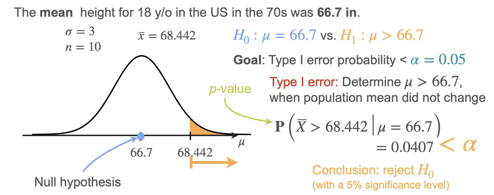
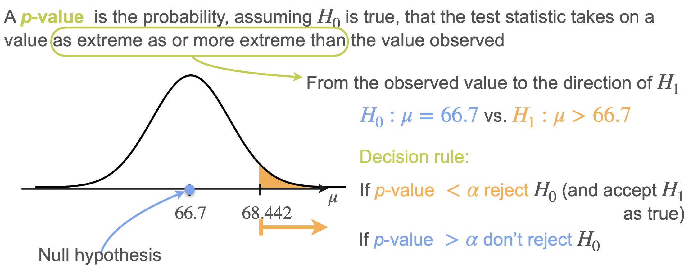
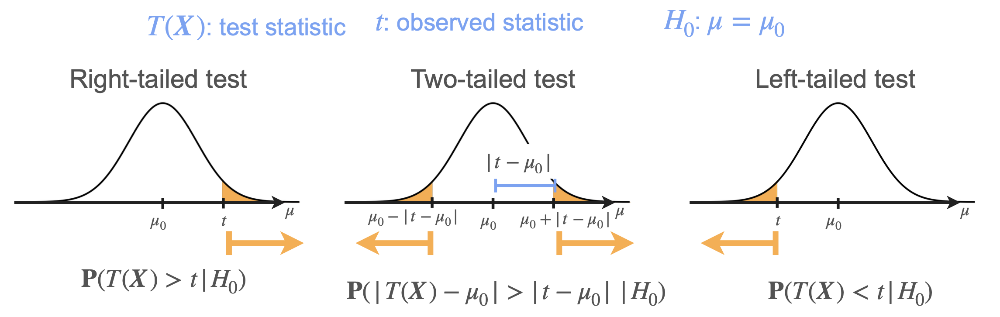
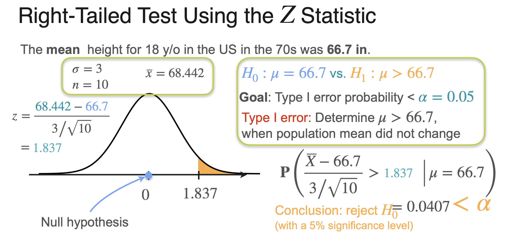

# p-Value

So far, we've established that if your sample mean falls "too far" from the null hypothesis, you reject H₀. But what does "too far" mean exactly?

Let's return to our height example:
- **H₀:** μ = 66.7 inches (population mean hasn't changed)
- **Sample data:** n = 10, sample mean = 68.442 inches
- **Population standard deviation:** σ = 3 inches (assumed known)
- **Significance level:** α = 0.05

## The Sampling Distribution Under H₀

If H₀ is true (μ = 66.7), then the sample mean follows a normal distribution:

$$
\bar{X} \sim N\left(66.7, \frac{3^2}{10}\right) = N(66.7, 0.9)
$$

This allows us to answer: **How likely was our sample if H₀ is true?**

## Calculating the p-Value

The **p-value** is the probability, assuming H₀ is true, that the test statistic takes on a value as extreme as or more extreme than the observed value.

### Right-Tailed Test Example

For our observed sample mean of 68.442:
- We want: P(X̄ ≥ 68.442 | μ = 66.7)
- This probability = **0.0332** (the shaded area in the right tail)

Since 0.0332 < 0.05 (our significance level), we **reject H₀**.

## Formal Definition of p-Value and Decision Rule

> **p-Value:** The probability, assuming H₀ is true, that the test statistic takes on a value as extreme as or more extreme than the observed value, in the direction of H₁.

A small p-value indicates that our sample result would be very unlikely if H₀ were true, providing evidence against H₀.

- **If p-value ≤ α:** Reject H₀ (evidence against null hypothesis)
- **If p-value > α:** Fail to reject H₀ (insufficient evidence against null hypothesis)

## p-Values for Different Test Types

Let t_observed be the observed test statistic and μ₀ be the hypothesized population mean.

### 1. Right-Tailed Test (H₁: μ > μ₀)  

$$
\text{p-value} = P(T \geq t_{\text{observed}} | H_0 \text{ is true})
$$

### 2. Left-Tailed Test (H₁: μ < μ₀)  

$$
\text{p-value} = P(T \leq t_{\text{observed}} | H_0 \text{ is true})
$$

### 3. Two-Tailed Test (H₁: μ ≠ μ₀)  

$$
\text{p-value} = 2 \times P(T \geq |t_{\text{observed}}| | H_0 \text{ is true})
$$

## Examples for All Three Test Types

Using our height data (observed sample mean = 68.442):

### Two-Tailed Test
- **p-value** = P(|X̄ - 66.7| ≥ |68.442 - 66.7| | μ = 66.7) = 0.0663
- Since 0.0663 > 0.05, we **fail to reject H₀**

### Left-Tailed Test (hypothetical sample mean = 64.252)
- **p-value** = P(X̄ ≤ 64.252 | μ = 66.7) = 0.0049
- Since 0.0049 < 0.05 (and even < 0.01), we **reject H₀**

## Alternative Approach: Using the z-Statistic

Instead of working with the sample mean directly, we can standardize it using the **z-statistic**:

$$
z = \frac{\bar{x} - \mu_0}{\sigma/\sqrt{n}}
$$

For our right-tailed test:
- **Observed z-statistic:** $z = \frac{68.442 - 66.7}{3/\sqrt{10}} = 1.837$
- **p-value:** P(Z ≥ 1.837) = 0.0332 (same result!)

Under H₀, the z-statistic follows a **standard normal distribution** N(0,1), making calculations easier.

## Key Takeaways

- The p-value measures how compatible your sample data is with H₀
- Smaller p-values provide stronger evidence against H₀
- The decision threshold is determined by your chosen significance level (α)
- The same test can be performed using either the original statistic or its standardized version

---

**Next:** [Critical Values](./05_critical_values.md)