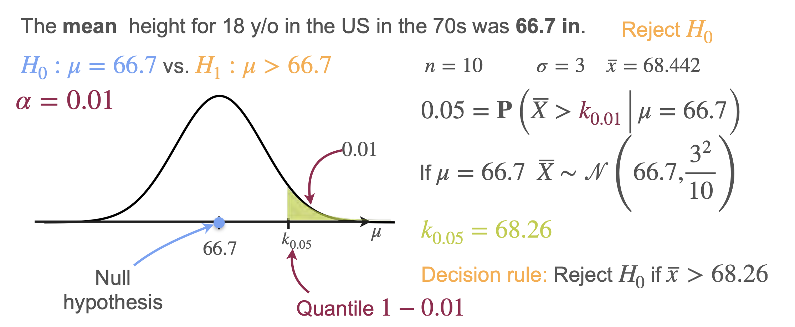
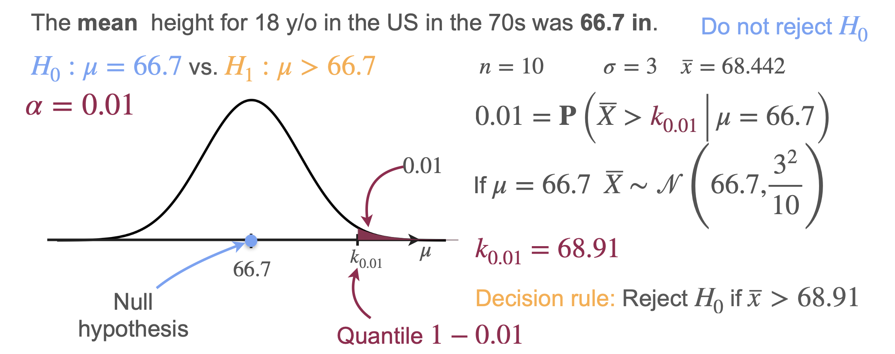
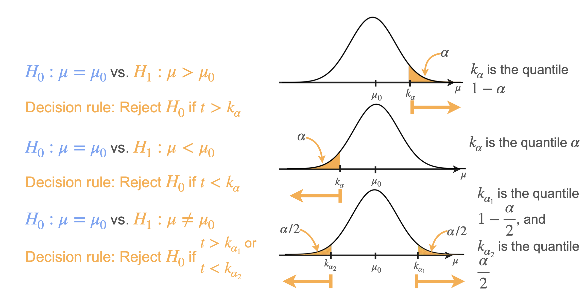

# Critical Values

So far, you've learned to make decisions based on the p-value of the observed statistic. If the p-value is smaller than the significance level $\alpha$, then you reject the null hypothesis and accept the alternative hypothesis as true.

But what is the most extreme sample you could get so that you would still **just** reject $H_0$? This is the sample that has a p-value exactly equal to $\alpha$. Anything less extreme would not satisfy the condition. This threshold is called the **critical value** (often denoted $k_\alpha$ or $c_\alpha$).

- The **critical value** depends on the significance level $\alpha$ you choose.
- For a given test, any observed statistic more extreme than the critical value will have a p-value of $\alpha$ or less.
- You can create a decision rule based on the critical value:  
  - **Reject $H_0$ if the observed statistic is more extreme than $K_\alpha$.**

## Formulas

#### Right-Tailed Test:  

| Test Type        | Critical Value Formula                                                    | Standard $z$ Notation         | Notes                                   |
|------------------|--------------------------------------------------------------------------|-------------------------------|-----------------------------------------|
| Right-tailed     | $k_\alpha = \mu_0 + z_\alpha \cdot \frac{\sigma}{\sqrt{n}}$              | $z_\alpha$                    | Area $\alpha$ to the right              |
| Left-tailed      | $k_\alpha = \mu_0 - z_\alpha \cdot \frac{\sigma}{\sqrt{n}}$              | $-z_\alpha$ or $z_{1-\alpha}$ | Area $\alpha$ to the left               |
| Two-tailed (L)   | $k_{\alpha/2} = \mu_0 - z_{1-\alpha/2} \cdot \frac{\sigma}{\sqrt{n}}$    | $-z_{1-\alpha/2}$             | Area $\alpha/2$ in each tail            |
| Two-tailed (R)   | $k_{1-\alpha/2} = \mu_0 + z_{1-\alpha/2} \cdot \frac{\sigma}{\sqrt{n}}$  | $z_{1-\alpha/2}$              | Area $\alpha/2$ in each tail            |

## Example: Right-Tailed Test

Let's revisit the right-tail test for the mean height of 18-year-olds:

- **$H_0$:** Population mean is 66.7
- **$H_1$:** Population mean is greater than 66.7
- **Sample size:** $n = 10$
- **Population standard deviation:** $\sigma = 3$
- **Significance level:** $\alpha = 0.05$

To find the critical value $K_{0.05}$:
- It is the value that leaves an area of 0.05 to the right under the null hypothesis distribution.
- For the sampling distribution $N(66.7, 3^2/10)$, the critical value is **68.26**.

**Decision rule:**  
- Reject $H_0$ if the observed sample mean is greater than 68.26.

In our example, the observed sample mean is 68.442, which is greater than 68.26, so we **reject $H_0$** at $\alpha = 0.05$.

## Changing the Significance Level

If you change $\alpha$ to 0.01:
- The critical value $K_{0.01}$ moves further to the right (requires more evidence to reject $H_0$).
- For this example, $K_{0.01} = 68.91$.
- Now, you would **only** reject $H_0$ if the observed mean is greater than 68.91.
- With our data, we **cannot** reject $H_0$ at $\alpha = 0.01$.

## Critical Values for Different Test Types

- **Right-tailed test:** $K_\alpha$ is the value with area $\alpha$ to its right.  
  - Reject $H_0$ if the observed statistic $T > K_\alpha$.
- **Left-tailed test:** $K_\alpha$ is the value with area $\alpha$ to its left.  
  - Reject $H_0$ if the observed statistic $T < K_\alpha$.
- **Two-tailed test:**  
  - Find two critical values: $K_{\alpha/2}$ (left) and $K_{1-\alpha/2}$ (right).
  - Reject $H_0$ if $T < K_{\alpha/2}$ or $T > K_{1-\alpha/2}$.

## Why Use Critical Values?

- You can define your decision rule **before** collecting any data, based only on your design conditions (sample size, distribution, $\alpha$).
- The p-value method and the critical value method **must always lead to the same conclusion**.
- With a clear decision rule, you can also calculate the probability of a type II error (more on this in the next lesson).

---

**Next:** [Power of a Test](./06_power_of_a_test.md)