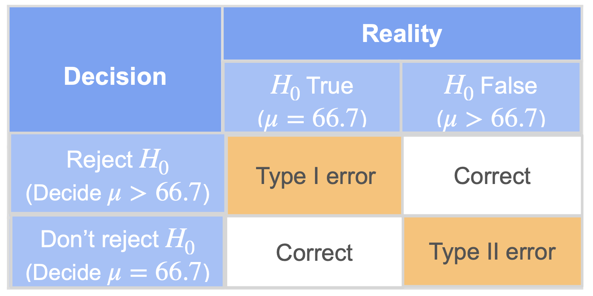
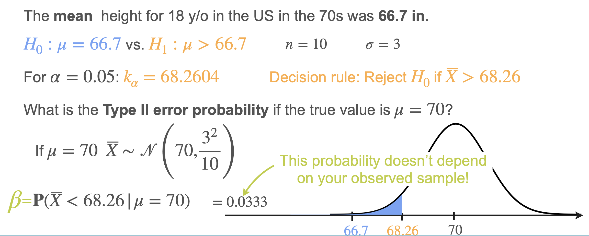
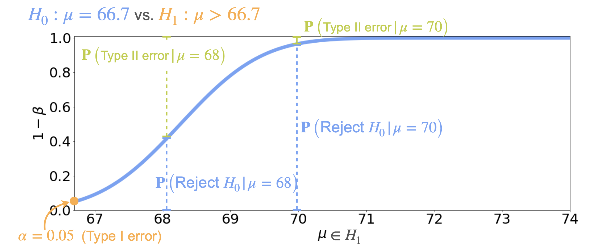
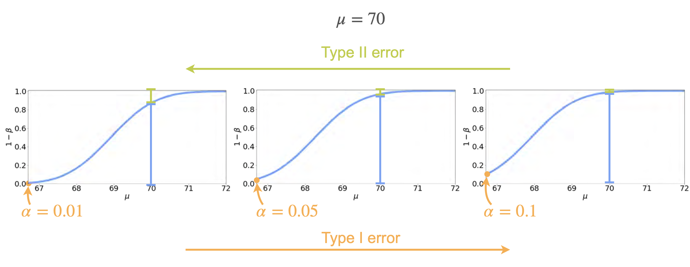

# Power of a Test

So far, we've focused on **type I errors** (false positives) through the significance level $\alpha$. Now let's turn our attention to **type II errors** (false negatives) and the concept of **power** in hypothesis testing.

## Type I and Type II Errors Recap

- **Type I error ($\alpha$):** Rejecting $H_0$ when it is actually true.
- **Type II error ($\beta$):** Failing to reject $H_0$ when it is actually false.

In our running example (testing if the mean height of 18-year-olds in the US has increased from 66.7 inches):

- **Type I error:** Conclude the mean has increased when it actually hasn't.
- **Type II error:** Fail to detect an increase when the mean has actually increased.

## Calculating Type II Error Probability ($\beta$)

| Test Type      | Type II Error Formula                                                                                              |
|----------------|-------------------------------------------------------------------------------------------------------------------|
| Right-tailed   | $\beta = P\left( Z < \frac{k - \mu_1}{\sigma/\sqrt{n}} \right)$                                                   |
| Left-tailed    | $\beta = P\left( Z > \frac{k - \mu_1}{\sigma/\sqrt{n}} \right)$ or $1 - P\left( Z < \frac{k - \mu_1}{\sigma/\sqrt{n}} \right)$ |
| Two-tailed     | $\beta = P\left( \frac{k_L - \mu_1}{\sigma/\sqrt{n}} < Z < \frac{k_R - \mu_1}{\sigma/\sqrt{n}} \right)$           |

Suppose:
- Sample size $n = 10$
- Standard deviation $\sigma = 3$
- Significance level $\alpha = 0.05$
- Critical value for rejecting $H_0$: $\bar{x} > 68.26$

If the true population mean is **70** (not 66.7), the probability of not rejecting $H_0$ (i.e., $\bar{x} < 68.26$) is the **type II error probability** for $\mu = 70$.

- Under $H_0$: $\bar{X} \sim N(66.7, 3^2/10)$
- Under $H_1$ (e.g., $\mu = 70$): $\bar{X} \sim N(70, 3^2/10)$

For $\mu = 70$, the probability that $\bar{x} < 68.26$ is $\beta = 0.33$.

**Note:** $\beta$ depends on the true value of $\mu$ in the alternative hypothesis, not just on the observed sample.

## Power of a Test

The **power** of a test is the probability of correctly rejecting $H_0$ when it is false (i.e., making the right decision).

$$
\text{Power} = 1 - \beta
$$

- For each possible value of $\mu$ in $H_1$, the power is $1 -$ (probability of type II error at that $\mu$).
- The power function shows, for each alternative value, the probability of detecting a true effect.

## Visualizing Power

- At $\mu = 66.7$ (null hypothesis), the probability of rejecting $H_0$ is $\alpha$ (e.g., 0.05).
- For $\mu > 66.7$, the power increases as $\mu$ increases.
- The higher the true mean, the more likely we are to detect the effect (reject $H_0$).

If you plot power for different values of $\alpha$:
- **Higher $\alpha$** (e.g., 0.1) increases power but also increases type I error.
- **Lower $\alpha$** (e.g., 0.01) decreases power but reduces type I error.

## Trade-Off Between Type I and Type II Errors

- For a fixed sample size, **reducing $\alpha$** (type I error) **increases $\beta$** (type II error), and vice versa.
- **Larger sample sizes** allow you to reduce both $\alpha$ and $\beta$.

## Summary

- **Power** is the probability of detecting a true effect (rejecting $H_0$ when it is false).
- **Power = 1 - \beta**
- There is always a trade-off between type I and type II errors for a fixed sample size.
- Increasing sample size improves power without increasing type I error.

---

**Next:** [Interpreting Results](./07_interpreting_results.md)