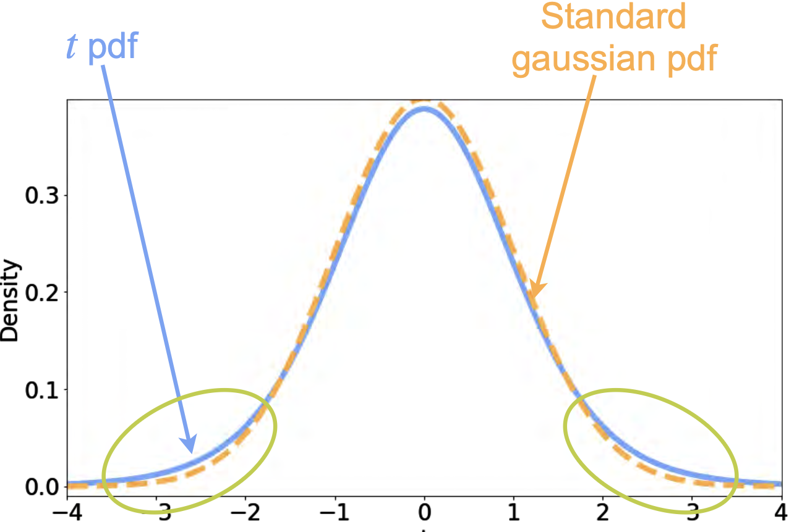
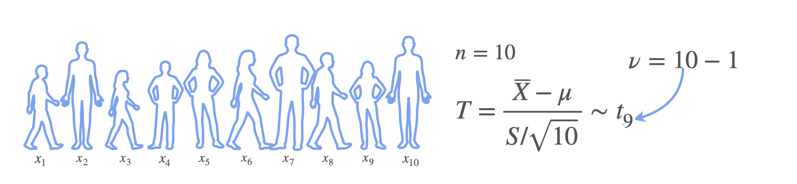

# The t-Distribution in Hypothesis Testing

Remember that you learned about the t-distribution in the context of confidence intervals. Now let's review how the t-distribution plays a role in hypothesis testing.

Suppose you sample the heights of 10 18-year-olds. Heights can be modeled as a Gaussian (normal) distribution with mean $\mu$ and standard deviation $\sigma$. The sample mean $\bar{x}$ will also be normally distributed, with mean $\mu$ and standard deviation $\sigma/\sqrt{n}$, **if $\sigma$ is known**.

**If $\sigma$ is known**, the standardized statistic ...  

$$
z = \frac{\bar{x} - \mu}{\sigma/\sqrt{n}}
$$

... follows a **standard normal distribution** $N(0,1)$. This is called the **z-statistic**.

**If $\sigma$ is unknown (the usual case)**, we estimate $\sigma$ with the sample standard deviation $s$. The statistic...  

$$
t = \frac{\bar{x} - \mu}{s/\sqrt{n}}
$$

... is called the **t-statistic**.

## The t-Distribution

- The t-statistic does **not** follow a standard normal distribution.
- Instead, it follows the **Student's t-distribution** (or simply, the t-distribution).
- The t-distribution is bell-shaped like the normal, but has **heavier tails** (more probability in the extremes).
- This accounts for the extra uncertainty from estimating $\sigma$ with $s$.

## Degrees of Freedom

- The t-distribution has one parameter: **degrees of freedom** ($\nu$), usually $n-1$ (sample size minus one).
- As the degrees of freedom increase, the t-distribution approaches the normal distribution.
- For $n \geq 30$, the t and normal distributions are nearly identical. **That’s why, in practice, many textbooks and statisticians recommend using the z-distribution for large samples (n≥30).**

**Example:** If you have $n = 10$ samples, the degrees of freedom $\nu = 10 - 1 = 9$.

## Summary

- Use the **z-distribution** when the population standard deviation $\sigma$ is known.
- Use the **t-distribution** when $\sigma$ is unknown and estimated from the sample.
- The t-distribution is determined by the degrees of freedom ($n-1$).
- As sample size increases, the t-distribution becomes more like the normal distribution.

---

**Next:** [t-Tests](./09_t-tests.md)