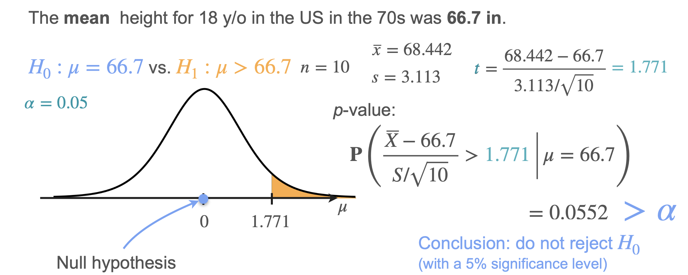
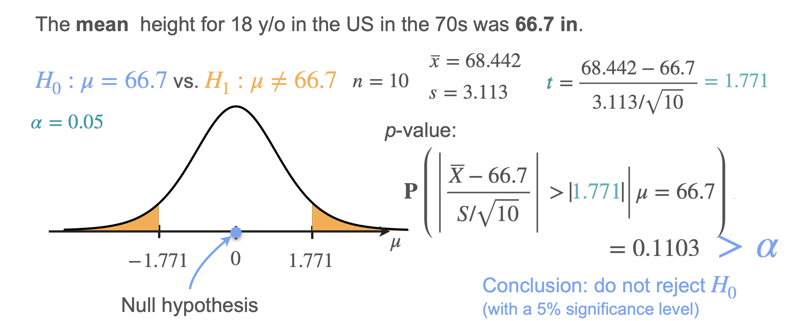
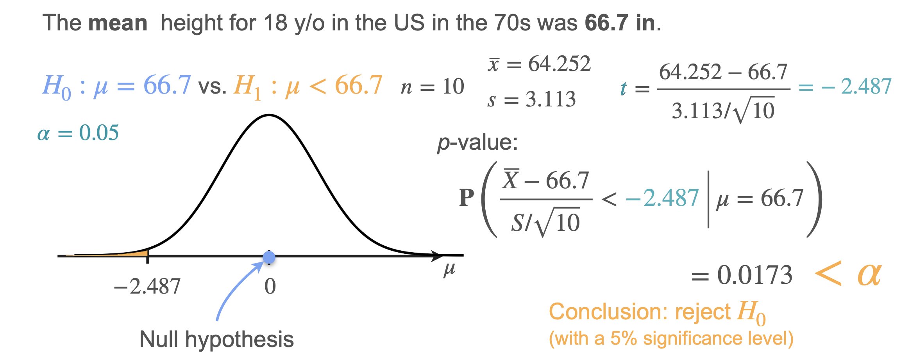

# t-Tests

Let's revisit the example of the heights of 10 18-year-olds, where the sample mean is 68.442. Previously, we assumed the population standard deviation ($\sigma$) was known, but now let's consider the more realistic case where $\sigma$ is **unknown**.

With $\sigma$ unknown, we use the **t-statistic** instead of the z-statistic.

The t-statistic is calculated as:  

$$
t = \frac{\bar{x} - \mu_0}{s / \sqrt{n}}
$$

... where $s$ is the sample standard deviation.

Under $H_0$, this statistic follows a **t-distribution** with $n-1$ degrees of freedom.

## Example Data

- $n = 10$
- Sample mean $\bar{x} = 68.442$
- Sample standard deviation $s = 3.113$
- Null hypothesis mean $\mu_0 = 66.7$

## Right-Tailed Test

- **Hypotheses:**  
  $H_0$: $\mu = 66.7$  
  $H_1$: $\mu > 66.7$

- **Observed t-statistic:**  
  $$
  t = \frac{68.442 - 66.7}{3.113 / \sqrt{10}} = 1.771
  $$

- **p-value:** Probability that $t$ is greater than 1.771 under $H_0$ (with 9 degrees of freedom):  
  $$
  p = 0.0552
  $$

- **Conclusion:** $p = 0.0552 > 0.05$  
  **Do not reject $H_0$.**

  > *Notice: This is the opposite result from the right-tailed test when $\sigma$ was known. The extra uncertainty from estimating $\sigma$ makes the evidence insufficient to reject $H_0$.*

## Two-Tailed Test

- **Hypotheses:**  
  $H_0$: $\mu = 66.7$  
  $H_1$: $\mu \neq 66.7$

- **p-value:** Probability that $|t|$ is greater than 1.771 (both tails):  
  $$
  p = 0.1103
  $$

- **Conclusion:** $p = 0.1103 > 0.05$  
  **Do not reject $H_0$.**

## Left-Tailed Test

- **Suppose** the sample mean is $\bar{x} = 64.252$ (with $s$ unchanged).

- **Observed t-statistic:**  
  $$
  t = \frac{64.252 - 66.7}{3.113 / \sqrt{10}} = -2.487
  $$

- **p-value:** Probability that $t$ is less than $-2.487$ under $H_0$:  
  $$
  p = 0.0173
  $$

- **Conclusion:** $p = 0.0173 < 0.05$  
  **Reject $H_0$ and accept that the population mean has decreased.**

---

**Next:** [Test for Proportions](./10_test_for_proportions.md)