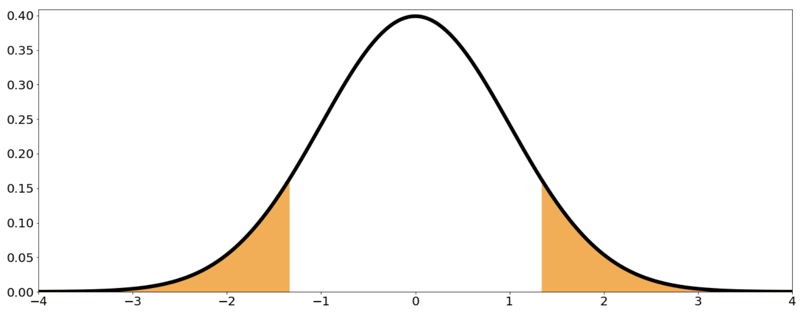

# Test for proportions

In the videos, you learned how to perform hypothesis testing for the mean of a Gaussian population. Another very useful example is testing for a population proportion $p$.

Imagine that you have a coin, but you don't know whether it's fair or not. The proportion you are interested in is $p = P(H)$, where $H$ denotes getting heads. A possible set of hypotheses for this problem is:

$$
\begin{align*}
H_0 &: p = 0.5 \quad \text{(the coin is fair)} \\
H_1 &: p \neq 0.5 \quad \text{(the coin is not fair)}
\end{align*}
$$

Imagine you toss the coin $20$ times, and $7$ of those tosses result in heads. Your random sample consists of a single random variable $X$, where $X = $ "number of heads in $20$ coin flips". This variable follows a Binomial distribution: $X \sim \mathrm{Binomial}(20, p)$.

A good estimate for the population proportion $p$ is the relative frequency of heads observed in your sample:

$$
\hat{p} = \frac{X}{20}
$$

In this example, $\hat{p} = \frac{7}{20} = 0.35$.

Remember that under certain conditions, the Central Limit Theorem states that  

$$
\hat{p} \sim N\left(p, \sqrt{\frac{p(1-p)}{20}}\right)
$$

or equivalently,  

$$
Z = \frac{\frac{X}{20} - p}{\sqrt{\frac{p(1-p)}{20}}} \sim N(0, 1)
$$

$Z$ will be your test statistic. If $H_0$ is true ($p = 0.5$), then your test statistic becomes  

$$
Z = \frac{\frac{X}{20} - 0.5}{\sqrt{\frac{0.5(1-0.5)}{20}}} = \frac{\frac{X}{20} - 0.5}{0.5/\sqrt{20}} \sim N(0, 1)
$$

Consider a significance level $\alpha = 0.05$. To make a decision, you need to get the p-value for your observed statistic. With the observed sample $x = 7$, the observed statistic is  

$$
z = \frac{\frac{7}{20} - 0.5}{0.5/\sqrt{20}} = -1.3416
$$

The p-value is then the probability that $|Z| > |z|$:  

$$
\text{p-value} = P(|Z| > |z|) = P(|Z| > 1.3416) = 0.1797
$$

**Conclusion:** Since the p-value is bigger than the significance level of 0.05, you do not have enough evidence to reject the null hypothesis that $p = 0.5$.

---

**Next:** [Two Sample t-Test](./11_two_sample_t-test.md)