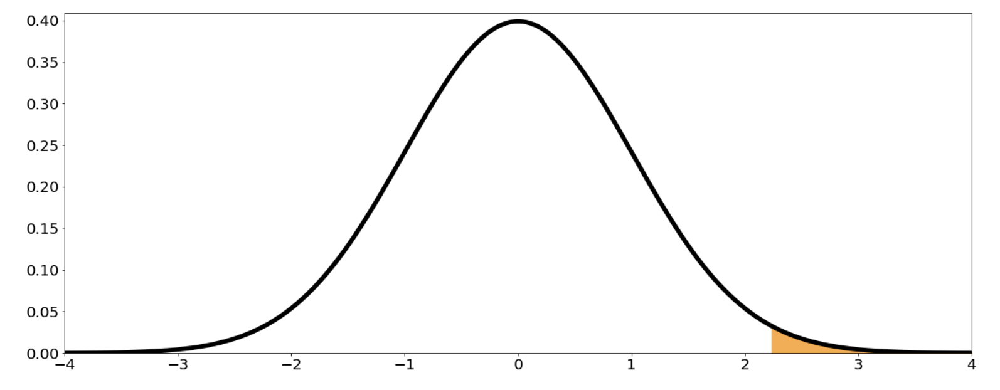
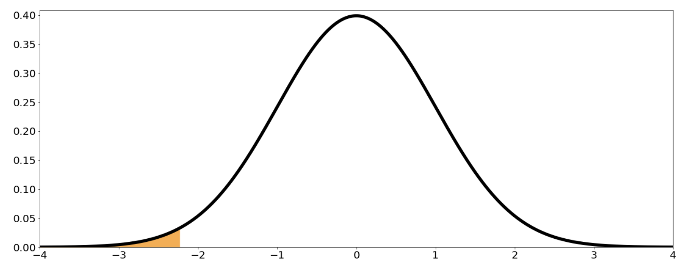

# Two Sample Test for Proportions

Previously, you learned how to test if the means from two populations were different from one another. In this lesson, you'll see a similar test but for comparing proportions from two different populations. A common application of the two-sample test for proportions is in A/B testing.

Suppose you want to compare the proportion of households that own a car in Chicago ($p_1$) with the proportion in New York ($p_2$). Here, $p_1$ and $p_2$ are population proportions.

A possible set of hypotheses for this problem is:

$$
H_0: p_1 = p_2 \quad \text{vs.} \quad H_1: p_1 \neq p_2
$$

Consider a significance level of 0.05.

Suppose you randomly sample $n_1 = 100$ households from Chicago, 62 of which own a car, and $n_2 = 120$ households from New York, 58 of which own a car.

Let $X =$ number of households that own a car in Chicago, and $Y =$ number of households that own a car in New York. Good approximations for $p_1$ and $p_2$ are:

$$
\hat{p}_1 = \frac{X}{100}, \quad \hat{p}_2 = \frac{Y}{120}
$$

A good approximation for $\Delta = p_1 - p_2$ is:

$$
\hat{\Delta} = \hat{p}_1 - \hat{p}_2
$$

If $n_1$ and $n_2$ are large enough (which they are here):

$$
\hat{p}_1 = \frac{X}{100} \sim N\left(p_1, \frac{p_1(1-p_1)}{100}\right)
$$
$$
\hat{p}_2 = \frac{Y}{120} \sim N\left(p_2, \frac{p_2(1-p_2)}{120}\right)
$$

So,

$$
\hat{\Delta} = \hat{p}_1 - \hat{p}_2 \sim N\left(p_1 - p_2, \frac{p_1(1-p_1)}{100} + \frac{p_2(1-p_2)}{120}\right)
$$

If $H_0$ is true, then $p_1 = p_2 = p$, so:

$$
\hat{\Delta} \sim N\left(0, \; p(1-p)\left(\frac{1}{100} + \frac{1}{120}\right)\right)
$$

Standardizing:

$$
\frac{\frac{X}{100} - \frac{Y}{120} - 0}{\sqrt{p(1-p)\left(\frac{1}{100} + \frac{1}{120}\right)}} \sim N(0,1)
$$

Since $p$ is unknown, estimate it using the pooled sample proportion:

$$
\hat{p} = \frac{X + Y}{100 + 120} = \frac{X + Y}{220}
$$

The test statistic becomes:

$$
Z = \frac{\frac{X}{100} - \frac{Y}{120}}{\sqrt{\hat{p}(1-\hat{p})\left(\frac{1}{100} + \frac{1}{120}\right)}} \sim N(0,1)
$$

Or, simplifying further:

$$
Z = \frac{\frac{X}{100} - \frac{Y}{120}}{\sqrt{\frac{(X+Y)}{220}\left(1 - \frac{X+Y}{220}\right)\left(\frac{1}{100} + \frac{1}{120}\right)}}
$$

Since $\frac{1}{100} + \frac{1}{120} = \frac{220}{100 \cdot 120}$, you can write:

$$
Z = \frac{\frac{X}{100} - \frac{Y}{120}}{\sqrt{\frac{(X+Y)}{220}\left(1 - \frac{X+Y}{220}\right) \cdot \frac{220}{100 \cdot 120}}}
$$

With the observed values ($x = 62$, $y = 58$), the observed statistic is $z = 2.0271$. For a two-sided test, the p-value is:

$$
\text{p-value} = P(|Z| > 2.0271) = 0.04265
$$

**Conclusion:** Since the p-value is smaller than the significance level (0.05), you have enough evidence to reject the null hypothesis and conclude that the two population proportions are different.

### General Case

Suppose you have two groups:

- $p_1 - p_2$: difference in population proportions
- $x$: observed count in group 1
- $y$: observed count in group 2
- $n_1$: sample size for group 1
- $n_2$: sample size for group 2

The test statistic is:

$$
Z = \frac{\frac{X}{n_1} - \frac{Y}{n_2}}{\sqrt{\frac{X+Y}{n_1 + n_2}\left(1 - \frac{X+Y}{n_1 + n_2}\right)\left(\frac{1}{n_1} + \frac{1}{n_2}\right)}} \sim N(0,1)
$$

Or, equivalently:

$$
Z = \frac{\frac{X}{n_1} - \frac{Y}{n_2}}{\sqrt{\frac{X+Y}{n_1 + n_2}\left(1 - \frac{X+Y}{n_1 + n_2}\right) \cdot \frac{n_1 + n_2}{n_1 n_2}}}
$$

The observed statistic is:

$$
z = \frac{\frac{x}{n_1} - \frac{y}{n_2}}{\sqrt{\frac{x+y}{n_1 + n_2}\left(1 - \frac{x+y}{n_1 + n_2}\right)\left(\frac{1}{n_1} + \frac{1}{n_2}\right)}}
$$

#### p-value Calculation

- **Right-tailed test:** $H_0: p_1 - p_2 = 0$ vs. $H_1: p_1 - p_2 > 0$
    $$
    \text{p-value} = P(Z > z)
    $$

- **Left-tailed test:** $H_0: p_1 - p_2 = 0$ vs. $H_1: p_1 - p_2 < 0$
    $$
    \text{p-value} = P(Z < z)
    $$

- **Two-tailed test:** $H_0: p_1 - p_2 = 0$ vs. $H_1: p_1 - p_2 \neq 0$
    $$
    \text{p-value} = P(|Z| > |z|)
    $$

    ### Assumptions and Conditions

    For these results to be valid, the following conditions must be satisfied:

    1. **Independent Random Samples:** You have two simple random samples that are independent of each other. Each sample comes from a different population, and the samples do not influence one another.
    2. **Population Size:** Each population should be at least 20 times larger than its corresponding sample. This helps ensure the independence of observations.
    3. **Binary Outcomes:** Each individual in the samples can be classified into one of two categories: either they belong to the specified group or they do not.
    4. **Sample Size:** Both sample sizes should be at least 10. This is necessary for the normal approximation to be valid when the null hypothesis ( $H_0$ ) holds.

**Next:** [Paired t-Test](./13_paired_t-test.md)