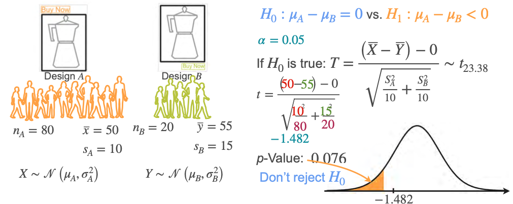
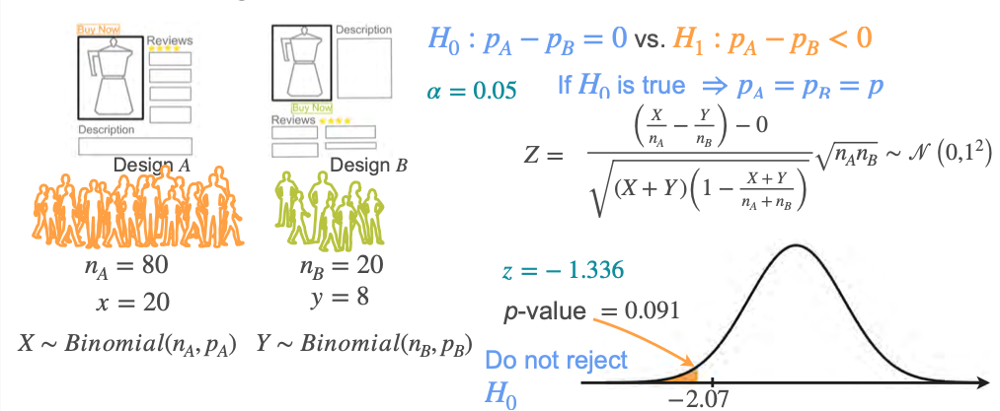

# ML Application: A/B Testing

A/B testing is a practical application of two-sample hypothesis testing, commonly used to compare two versions of a product, website, or process.

## What is A/B Testing?

- **A/B testing** compares two groups (A and B) to determine if a change (e.g., a new website design) leads to a significant difference in a key metric (e.g., conversion rate, average purchase).
- Subjects are randomly assigned to either group A (control) or group B (variation).

## Example 1: Comparing Mean Purchases

- **Scenario:** Test if moving the "Buy Now" button increases purchase amounts.
- **Design:** 80 customers see design A, 20 see design B. (_A common rule is to assign fewer users to design B (the variation) and more to design A (the control). This minimizes potential negative impact on users if the new design performs worse, while still allowing for statistical comparison._)
- **Results:** (_in dollars_)
  - Group A: $\bar{x}_A = 50 $, $s_A = 10$
  - Group B: $\bar{x}_B = 55$, $s_B = 15$
- **Hypotheses:**
  - $H_0$: Mean purchase for A and B are the same ($\mu_A = \mu_B$)
  - $H_1$: Mean purchase for B is higher ($\mu_B > \mu_A$)
- **Test:** Two-sample t-test (assume normality or large $n$)
- **Observed statistic:** $t = -1.414$, degrees of freedom $\approx 23.38$
- **p-value:** $0.085$
- **Decision:** Since $p > 0.05$, do not reject $H_0$ (no significant difference).

## A/B Testing vs. T-tests

- **A/B testing** is a methodology: it includes experiment design, randomization, measurement, and statistical analysis.
- **T-tests** (and other statistical tests) are tools used within A/B testing to compare means, proportions, etc.
- The choice of test depends on the metric and data type (means, proportions, etc.).

## Example 2: Comparing Conversion Rates (Proportions)

- **Scenario:** You want to test if a new website design (group B) increases the conversion rate compared to the current design (group A).
- **Design:** Randomly assign 80 users to group A and 20 users to group B.
    - Group A: 20 conversions out of 80 ($x_A = 20$, $n_A = 80$)
    - Group B: 8 conversions out of 20 ($x_B = 8$, $n_B = 20$)
- **Sample Proportions:**
    - $\hat{p}_A = \frac{20}{80} = 0.25$
    - $\hat{p}_B = \frac{8}{20} = 0.40$
- **Hypotheses:**
    - $H_0$: Conversion rates are equal ($p_A = p_B$)
    - $H_1$: Conversion rate for B is higher ($p_B > p_A$)
- **Test:** Two-proportion z-test (appropriate for comparing proportions between two independent groups).
- **Test Statistic Calculation:**
    - Compute the pooled proportion: $\hat{p} = \frac{x_A + x_B}{n_A + n_B} = \frac{20 + 8}{80 + 20} = 0.28$
    - Standard error: $SE = \sqrt{\hat{p}(1 - \hat{p})\left(\frac{1}{n_A} + \frac{1}{n_B}\right)}$
    - Plug in values: $SE = \sqrt{0.28 \times 0.72 \left(\frac{1}{80} + \frac{1}{20}\right)} \approx 0.106$
    - $z = \frac{\hat{p}_B - \hat{p}_A}{SE} = \frac{0.40 - 0.25}{0.106} \approx 1.415$
- **Observed statistic:** $z \approx 1.415$
- **p-value:** $0.079$ (one-sided test)
- **Decision:** Since $p > 0.05$, do not reject $H_0$ (no significant difference in conversion rates).

**Interpretation:**  
Although group B had a higher observed conversion rate, the difference is not statistically significant at the 0.05 level. This means there is not enough evidence to conclude that the new design improves conversion rates.

## Key Steps in A/B Testing

1. **Propose a variation** to test (e.g., new design).
2. **Randomly assign** subjects to groups.
3. **Measure outcomes** (e.g., mean purchase, conversion rate).
4. **Choose appropriate metrics** and statistical tests.
5. **Analyze results** and make a decision.

## Summary

- A/B testing is a structured approach to comparing two versions of a product or process.
- It uses statistical tests (t-tests, z-tests, etc.) to determine if observed differences are significant.
- The methodology includes experiment design, randomization, measurement, and statistical inference.

