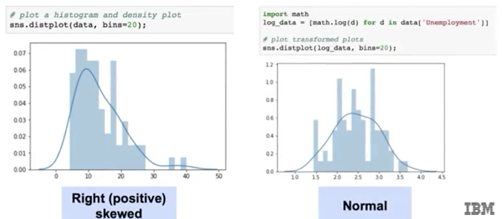
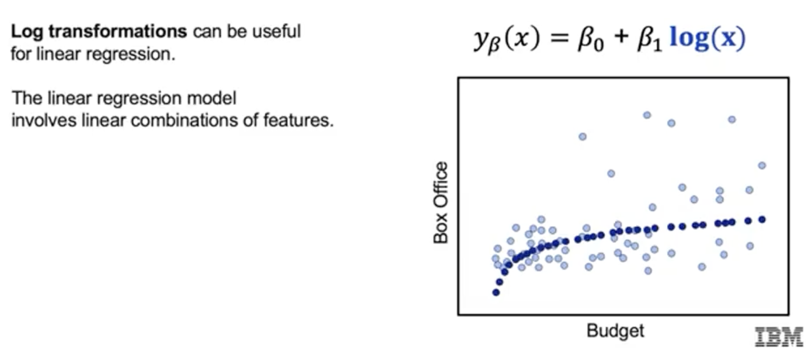
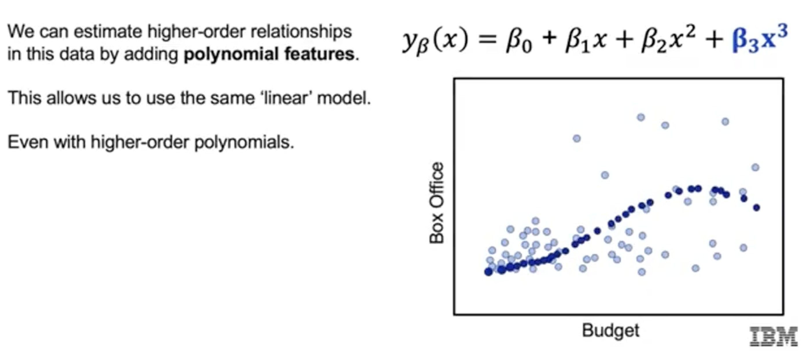

# Variable Transformation

## Why Transform Variables?

- **Linear regression** assumes that residuals are normally distributed.
- Real-world data (features and targets) are often skewed (positively or negatively).
- **Data transformations** help achieve normality and linear relationships, improving model performance.

## Common Transformations

### Log Transformation

- Useful for positively skewed data.
- `np.log1p(x)` is used instead of `np.log(x)` to handle zeros (log1p computes log(1 + x)).
- Example:
    ```python
    import numpy as np
    data['log_feature'] = np.log1p(data['feature'])
    ```
- Log transformation can turn a skewed distribution into a more normal one.



- Also helps linearize relationships with diminishing returns (e.g., budget vs. box office).




### Box-Cox Transformation

- More flexible than log; finds the best transformation to normalize data.
- Requires strictly positive values.

### Polynomial Features

- Capture higher-order (nonlinear) relationships while keeping the model linear in parameters.
- Add features like $x^2$, $x^3$, etc., to the model.
- Example with scikit-learn:
    ```python
    from sklearn.preprocessing import PolynomialFeatures

    polyFeat = PolynomialFeatures(degree=2)
    X_poly = polyFeat.fit_transform(X_data)
    ```
- Allows the model to fit curves (e.g., diminishing returns, inflection points).



## Key Takeaways

- Transformations (log, Box-Cox, polynomial) help meet model assumptions and capture complex relationships.
- Even after transformation, the model remains linear in its parameters.
- Use these techniques to improve model fit and predictive power.

---

**Next:** [Feature Encoding](./06_feature_encoding.md)