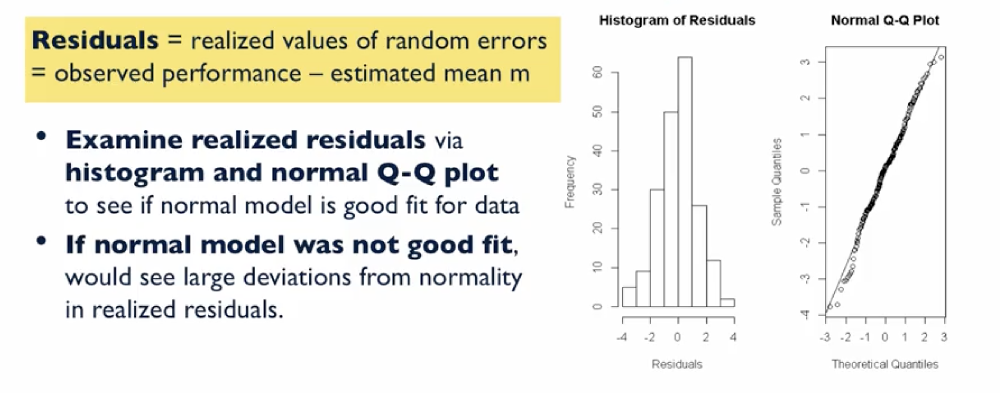
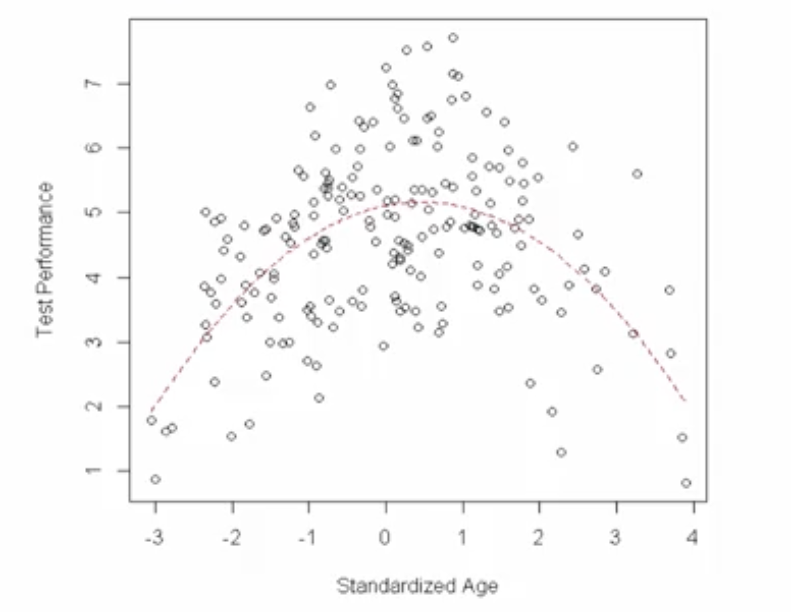
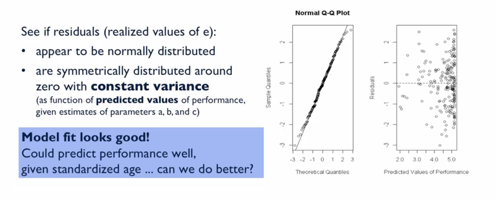
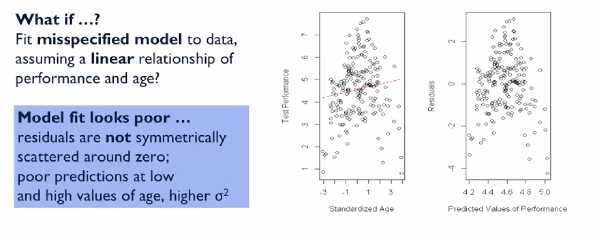

# What Do We Mean by Fitting Models to Data?

## Introduction
*   **Goal:** To fit statistical models to collected data in order to answer research questions.
*   **Key Distinction:** We are **fitting models to data**, not fitting data to models.
*   **Process:**
    1.  We specify models based on theory or subject matter knowledge.
    2.  We then fit these specified models to our collected data.
*   **Purpose of Models:** Models describe the distributions of variables or the relationships between them in our dataset.

## Why Do We Fit Models to Data?

1.  **Estimation:** To estimate distributional properties of variables (e.g., means, variances, quantiles), potentially conditional on other variables.
2.  **Summarization & Inference:** To concisely summarize relationships between variables and make inferential statements about those relationships (e.g., the relationship between a predictor and a dependent variable).
3.  **Prediction:** To predict values of variables of interest based on other predictor variables and to characterize the uncertainty in those predictions.

## Focus on Parametric Models

*   This course focuses on **parametric models**.
*   **Definition:** Models where we estimate **parameters** that describe the distributions of the variables we are interested in.
*   **Example:** Assuming a continuous variable (e.g., blood pressure, exam scores) follows a **normal distribution**.
    *   The normal distribution is defined by its **parameters**: the mean (µ) and the variance (σ²).
    *   We estimate these parameters from the data.
*   **Inference:** We will use techniques from [Probability and Statistics](../../../01_math/04_probability_and_statistics_for_ml_and_ds/) course (confidence intervals, hypothesis testing) to make inferences about these model parameters.

## Key Concepts Introduced

*   **Specifying a Probability Model:** Defining a model based on a research question.
*   **Estimating Model Parameters:** Using data to find the values of a model's parameters.
*   **Assessing Model Fit:** Evaluating how well a model summarizes the observed data and relationships.

## Example: Test Performance vs. Age

### Research Question & Theory

*   **Variable of Interest:** Test performance (0-8 points).
*   **Predictor:** Standardized age.
*   **Theoretical Relationship:** A **curvilinear (quadratic) relationship** is hypothesized. Performance is expected to be best at moderate ages and worse at very low or very high ages.

### Modeling Goals

1.  **Descriptive:** Estimate the marginal (overall) mean of test performance.
2.  **Conditional:** Estimate the mean performance conditional on age (i.e., the relationship between age and performance).

### Modeling Approach 1: Mean Only Model

*   **Model:** Assumes test performance follows a normal distribution defined by an overall mean ($M$) and variance ($\sigma^2$).
*   **Regression Equation:** $Performance = M + E$
    *   $E$ (error) is assumed to be normally distributed with mean 0 and variance $\sigma^2$.
*   **Parameters to Estimate:** $M$ (mean) and $\sigma^2$ (variance).
*   **Results from Example:**
    *   Estimated Mean ($\hat{M}$): **4.57**
    *   Estimated Variance ($\hat{\sigma}^2$): **1.82**
*   **Assessing Fit:** Check if the residuals (observed - predicted) are normally distributed.

### Modeling Approach 2: Conditional Model (Quadratic)

*   **Model:** Assumes test performance follows a normal distribution where the **mean is a quadratic function of age**.
*   **Regression Equation:** $Performance = a + b \cdot Age + c \cdot Age^2 + E$
*   **Parameters to Estimate:**
    *   $a$, $b$, $c$ (regression coefficients defining the quadratic relationship).
    *   $\sigma^2$ (variance of the errors).
*   **Results from Example:**
    *   $\hat{a} = 5.11$ (Intercept)
    *   $\hat{b} = 0.24$ (Linear coefficient)
    *   $\hat{c} = -0.26$ (Quadratic coefficient)
    *   $\hat{\sigma}^2 = 1.29$
*   **Visualizing the Fit:** The fitted quadratic curve should capture the curvilinear pattern in the scatter plot.

*   **Assessing Fit:** Check the residuals.
    *   **Q-Q Plot:** Should show points on a straight line, supporting the normality assumption.
    *   **Residuals vs. Predicted Plot:** Residuals should be symmetrically scattered around zero with constant variance.

## Example of a Poorly Fitting (Misspecified) Model

*   **Scenario:** Fitting a **linear model** ($Performance = a + b \cdot Age + E$) when the true relationship is curvilinear.
*   **Indicators of Poor Fit:**
    *   The fitted line does not follow the data pattern.
    *   **Residuals show a systematic pattern** (e.g., a curvilinear trend) instead of being randomly scattered around zero.
    *   Predictions are poor, especially at low and high ages.

---

**Next:** [Types of Variables in Statistical Modeling](./02_types_of_variables_in_statistical_modeling.md)