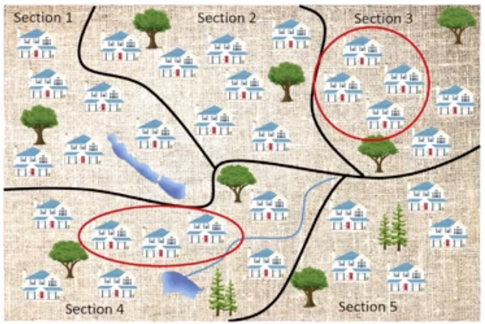
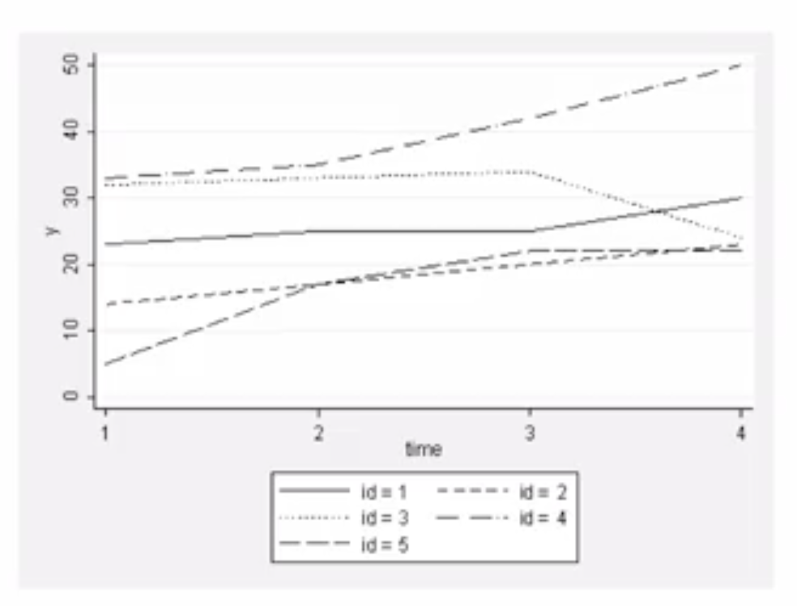

# Different Study Designs Generate Different Types of Data: Implications for Modeling

## Core Principle

**Different study designs generate different types of data**, and this has **critical implications** for the models we fit.

> Understanding **how data were generated** is essential before fitting statistical models.

## Common Study Designs and Their Modeling Implications

### Simple Random Samples (SRS)

* **Key Property:** Observations are **Independent and Identically Distributed (i.i.d.)**
* **Characteristics:**
  - All values are independent of each other
  - All values arise from identical distribution
  - Zero correlation between any two randomly selected observations

**Example:** Measuring happiness scale in SRS
- Assume happiness $\sim N(\mu, \sigma^2)$ with independent observations
- Standard error calculations assume independence

**Advantage:** More unique statistical information → **Smaller standard errors** → More precise estimates

**Modeling Approach:** Can model differences between groups (e.g., different means by gender) while maintaining independence assumption **within groups**

### Clustered Samples

* **Examples:** Hospitals, clinics, schools, neighborhoods
* **Key Property:** Observations **within clusters are correlated**
  - Observations from same cluster tend to be similar

**Example:** Happiness measurements from selected neighborhoods
- Observations within same neighborhood are correlated
- Must account for within-cluster correlation in models

**Implication:** Less unique independent information → **Higher standard errors**

**Modeling Approach:** Include additional parameters to capture within-cluster correlation

### Longitudinal Studies

* **Key Property:** Repeated measures from **same units over time** are correlated
* **Characteristics:**
  - Within-unit correlation across time points
  - Values for same individual tend to be consistently high/low
**Modeling Approach:** Must account for within-unit correlation, similar to clustered samples

## Critical Dichotomy in Modeling

### Independent Data
* Observations completely independent of each other
* May or may not arise from common distribution
* **Examples:** Simple random samples

### Dependent Data
* Observations correlated due to study design features
* **Examples:** Clustered samples, longitudinal measurements
* **Requires:** Special modeling approaches to account for correlation

## Modeling Philosophy

> The **best possible model** should reflect important study design features that affect the distributional properties of our variables of interest.

**Key considerations when specifying models:**
1. Were observations generated independently?
2. Is there natural clustering in the data?
3. Are there repeated measurements over time?
4. How do these features affect correlation structure?

---

**Next:** [Objectives of Model Fitting: Inference vs. Prediction](./04_objectives_of_model_fitting--inference_vs_prediction.md)