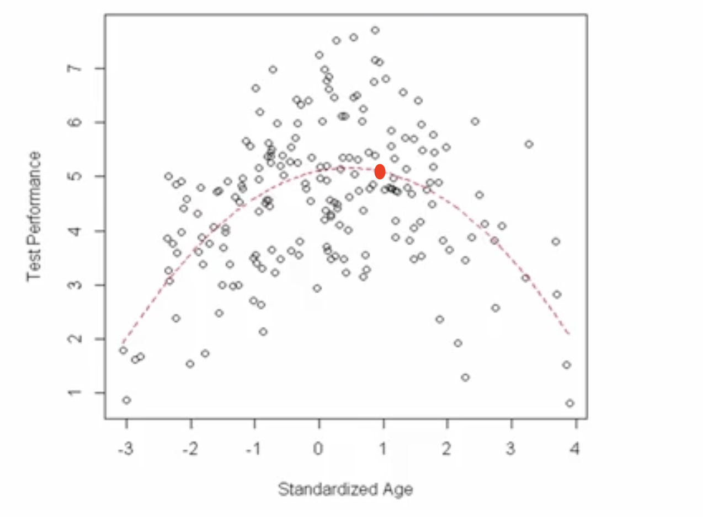

# Objectives of Model Fitting: Inference vs. Prediction

## 1. The Intuitive Idea: Two Sides of the Same Coin

When we fit a statistical model, we are typically pursuing one of two primary objectives: **Inference** or **Prediction**. While they use the same underlying model, their goals are fundamentally different.

*   **Inference is about *understanding*.** It's like a detective trying to understand the relationship between clues. The goal is to open up the "black box" of the model, examine its internal wiring (the parameters), and make statements about how the predictors relate to the outcome in the real world.
*   **Prediction is about *forecasting*.** It's like a meteorologist using a model to forecast tomorrow's weather. The main goal is to get an accurate guess for a new, unseen data point. The internal workings of the model are less important than the accuracy of its output.

Let's use our ongoing example of test performance and age to explore these two objectives.

## 2. Objective 1: Inference (Understanding the Relationship)

When our goal is inference, we are focused on the **model parameters**. We want to estimate them, test hypotheses about them, and interpret their meaning.

Our fitted quadratic model is:  

$$
\text{Performance}_i = a + b(\text{age}_i) + c(\text{age}_i^2) + e_i
$$

The software provides estimates for the parameters and their standard errors:
*   $\hat{a} = 5.11$ (SE = 0.10)
*   $\hat{b} = 0.24$ (SE = 0.06)
*   $\hat{c} = -0.26$ (SE = 0.03)

Our inferential task is to interpret what these numbers tell us about the age-performance relationship.

### Hypothesis Testing: Are the Predictors Important?

For each parameter, we ask: "Is this parameter's contribution statistically significant, or is it likely just zero?" We answer this with a **t-test**.

The test statistic is calculated as:  

$$
t = \frac{\text{Parameter Estimate} - 0}{\text{Standard Error}}
$$

This tells us how many standard errors away from the "no effect" null hypothesis (zero) our estimate is.

Let's test parameter `b`:  

$$
t_b = \frac{0.24}{0.06} = 4.0
$$

An estimate that is 4.0 standard errors away from zero is highly unlikely to occur by chance. We **reject the null hypothesis** and conclude that `b` is a significant parameter in our model.

The test statistics for all three parameters are large:
*   $t_a \approx 51.1$
*   $t_b = 4.0$
*   $t_c \approx -8.7$

### Interpretation: What Do the Parameters Mean?

Since all parameters are significant, we can interpret their roles in the relationship:

*   **Parameter `a` (Intercept):** The estimate $\hat{a} = 5.11$ is the predicted test performance for a student of average age (since `age` was standardized). We are confident this is significantly different from zero.
*   **Parameter `b` (Linear Term):** The estimate $\hat{b} = 0.24$ represents the initial rate of increase in performance at the average age. It's positive and significant, indicating that performance is initially rising as age increases from the mean.
*   **Parameter `c` (Quadratic Term):** The estimate $\hat{c} = -0.26$ controls the curvature. Because it is negative and significant, it confirms the "inverted U-shape." After the initial increase (driven by `b`), this term causes the relationship to bend downwards, so that performance decreases at older ages.

**Crucial Inferential Point:** If `c` had *not* been significantly different from zero, we would have concluded that the relationship is purely linear. The significance of `c` is our statistical evidence for the curvilinear theory.

## 3. Objective 2: Prediction (Forecasting an Outcome)

When our goal is prediction, we treat the fitted model as a formula for generating a forecast. The parameters are simply the numbers we plug into that formula.

Our prediction equation is:  

$$
\text{Predicted Performance} = 5.11 + 0.24(\text{age}) - 0.26(\text{age}^2)
$$

Let's predict the performance for a new student whose standardized age is `+1`. We simply plug this value into our equation:

$$
\text{Predicted Performance} = 5.11 + 0.24(1) - 0.26(1^2)
$$  

$$
\text{Predicted Performance} = 5.11 + 0.24 - 0.26 = 5.09
$$

Our model predicts a score of 5.09 for this student. This corresponds to a specific point on the red fitted line in our graph.

### The Importance of Uncertainty

A prediction is never just a single number. The model's error term ($e_i$) reminds us that real-world observations will bounce around the predicted value. A responsible prediction must also characterize this **uncertainty**.

*   Including good predictors (like `age` and `age^2`) reduces the model's error variance and shrinks the uncertainty around our predictions, making them more precise.
*   If we had used a simple mean-only model, we would predict the same average score for everyone, and the uncertainty around that prediction would be much larger.

When making predictions, we often provide a **prediction interval** (e.g., "we are 95% confident that this student's actual score will be between 4.1 and 6.1"). This is more honest and useful than just providing the single point estimate of 5.09.

## 4. Summary: Inference vs. Prediction

| | **Inference** | **Prediction** |
| :--- | :--- | :--- |
| **Primary Goal** | Understand the relationship between variables. | Forecast outcomes for new data. |
| **Key Question** | How is X related to Y? Is the effect significant? | What will Y be for a new value of X? |
| **Focus** | Model parameters ($\hat{a}, \hat{b}, \hat{c}$) and their statistical significance. | The final predicted value ($\hat{Y}$) and its accuracy. |
| **Output** | Parameter estimates, standard errors, p-values, confidence intervals. | Point predictions, prediction intervals. |
| **Model Complexity**| Prefer simpler, interpretable models that align with theory. | May use complex "black box" models if they provide higher accuracy. |

---

**Next:** [Plotting Predictions and Prediction Uncertainty](./05_plotting_predictions_and_prediction_uncertainty.md)