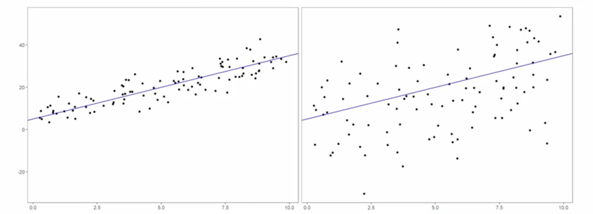
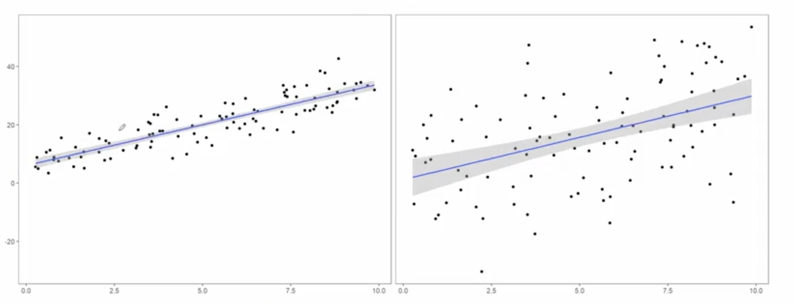

# Plotting Predictions and Prediction Uncertainty

## 1. The Intuitive Idea: The Dangers of a "Point Estimate" Mindset

Imagine your boss gives you a dataset showing a relationship between two variables. It looks pretty linear, so you fit a simple linear model and find the line of best fit.

**The Model:** `y = 5.43 + 2.97x`

You're about to go home when your boss brings you a *second* dataset from a different source. You plot it, and it looks much noisier, but you fit a linear model anyway as requested.

**The Second Model:** `y = 5.43 + 2.97x`

You get the **exact same equation**.

This is a classic trap. If you only look at the parameter estimates (the intercept and slope), you would conclude the models are identical. But a quick look at the plots tells you they are completely different stories.

*   **Model 1:** The data points are tightly clustered around the line. The relationship is clear and strong.
*   **Model 2:** The data points are widely scattered. The linear trend is weak and noisy.

**The Core Question:** If you had to use one of these models to make a critical business prediction, which would you trust more?

You would trust Model 1. Even though the "best guess" line is the same in both, your confidence in that guess is much, much higher for Model 1. This is the difference between just getting a prediction and understanding the **uncertainty** around that prediction.

## 2. Visualizing Uncertainty: Confidence Bands

The best way to represent this uncertainty is to plot it directly on the graph. We do this by adding a **confidence band** (often a gray shaded area) around our fitted line.

*   This band represents the uncertainty in our estimates of the slope and intercept. You can think of it as a "region of plausible lines."
*   A **narrow band** means we are very confident that our estimated line is close to the true, underlying relationship.
*   A **wide band** means we are very uncertain. The true relationship could be quite different from the line we estimated.

| Model 1 (Low Variance) | Model 2 (High Variance) |
| :---: | :---: |
| **Interpretation:** The data is tight, the band is narrow. We have high confidence in our fitted line. | **Interpretation:** The data is noisy, the band is wide. We should be very cautious about trusting this fitted line. |

## 3. Quantifying Uncertainty: Standard Errors (SE)

While plotting is ideal, we also need a numerical way to measure uncertainty. This is the job of the **standard error (SE)**.

*   **Definition:** The standard error of a parameter estimate (like a slope or intercept) tells us, on average, how far we expect our estimate to be from the true, unknown value of that parameter.
*   **Analogy:** Think of it as the "resolution" on a camera.
    *   **Low SE:** High resolution. We have a sharp, clear picture of our parameter. We are confident in our estimate.
    *   **High SE:** Low resolution. We have a fuzzy, blurry picture. Our estimate could be far from the truth; we are mostly modeling noise, not signal.

### Comparing the Two Models Numerically

Let's look at the parameter estimates and their standard errors for our two models.

| Parameter | Model 1 (Low Variance) | Model 2 (High Variance) |
| :--- | :---: | :---: |
| **Intercept ($\hat{a}$)** | 5.43 | 5.43 |
| **SE of Intercept** | **0.92** | **1.84** |
| **Slope ($\hat{b}$)** | 2.97 | 2.97 |
| **SE of Slope** | **0.15** | **0.30** |

This table confirms what our eyes told us. Even though the point estimates are identical, the standard errors for Model 2 are **twice as large** as for Model 1. This numerically proves that we have much less certainty—much lower resolution—in the parameter estimates for Model 2.

## 4. Key Takeaways and Best Practices

1.  **Never Trust Point Estimates Alone:** The slope and intercept are only part of the story. Without understanding their uncertainty, they can be dangerously misleading.
2.  **Plot Your Data and Uncertainty:** Always visualize your data. Whenever possible, plot the confidence bands around your fitted line. This is the most intuitive way to assess the certainty of your model.
3.  **Inspect the Standard Errors:** When you can't plot, or in addition to plotting, always examine the standard errors of your parameter estimates. They are your numerical guide to the model's reliability.
4.  **Use Caution with High Variance:** If a model produces estimates with high standard errors, be very cautious about using it for prediction. It's a sign that your model may be fitting noise rather than a true signal. Your predictions could be unreliable.

The ultimate goal of modeling isn't just to find a signal in the noise, but to understand how much noise is left over. This is what allows us to make responsible, trustworthy, and defensible data-driven decisions.

---

**Next:** [Getting Started with Modeling in Python](./06_getting_started_with_modeling_in_python.ipynb)