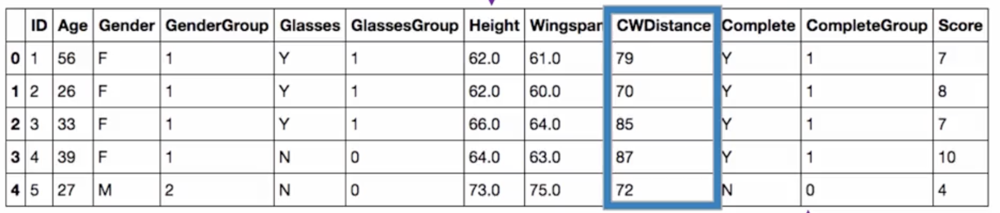
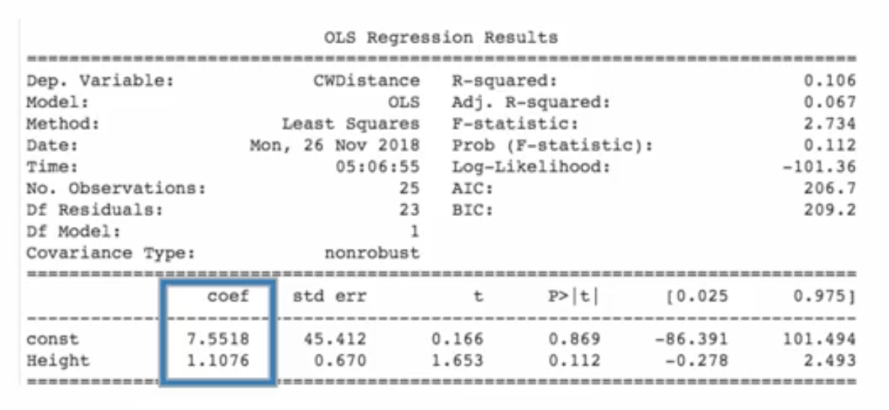

# Linear Regression: Introduction

## Study Overview

### Research Context
- **Dataset:** Cartwheel study with 25 adult team members
- **Primary Response Variable:** Cartwheel distance (inches) - distance traveled from start to end
- **Potential Predictors:** Height, completion status (whether feet went over head and landed on feet)

### Research Goals
1. Develop a model to predict average cartwheel distance for adults
2. Determine if height is a useful predictor for cartwheel distance
3. Assess whether completion status affects average cartwheel distance

## Initial Data Exploration

### Summary Statistics
- **Mean cartwheel distance:** 82.48 inches
- **Distribution:** Shows reasonable normality based on histogram and Q-Q plot

### Baseline Prediction
Without any predictors, best estimate for next adult's cartwheel distance = 82.48 inches (sample mean)

## Examining Height as a Predictor

### Theoretical Relationship
**Hypothesis:** Taller people might generally have larger cartwheel distances

### Visual Assessment: Scatter Plot

**Scatter Plot Interpretation Framework:**
- **Form:** Approximately linear
- **Direction:** Positive relationship
- **Strength:** Weak to moderate
- **Outliers:** No substantial outliers observed

### Quantitative Measures
- **Correlation coefficient ($r$):** 0.33 (positive, weak to moderate)
- **Coefficient of determination ($r^2$):** 0.11
  - Only 11% of variability in cartwheel distances explained by linear relationship with height
  - Substantial remaining variability unexplained

## Linear Regression Model

### Model Equation (Estimate Regression Line)

$$
\hat{y} = b_0 + b_1 x
$$

...where:  

- $\hat{y}$ = predicted cartwheel distance
- $b_0$ = y-intercept
- $b_1$ = slope coefficient
- $x$ = height

### Parameter Interpretation
- **Intercept ($b_0$):** Estimated response when $x = 0$ (may not be meaningful in context)
- **Slope ($b_1$):** Estimated change in response when $x$ increases by 1 unit

### Best Fit Criteria: Least Squares
- **Residuals:** Observed error = $y - \hat{y}$
- **Objective:** Minimize $\sum (y - \hat{y})^2$ (sum of squared residuals)

## Fitted Model and Predictions

### Estimated Coefficients

- **Intercept ($b_0$):** 7.55
- **Slope ($b_1$):** 1.1

### Final Model

$$
\hat{y} = 7.55 + 1.1\ x
$$

...where $x$ is the height (in inches).

### Interpretation
An adult who is one inch taller than another is estimated to have a cartwheel distance about **1.1 inches longer** on average.

### Example Prediction
For a 64-inch tall adult:  

$$
\hat{y} = 7.55 + 1.1 \times 64 = 78.4 \text{ inches}
$$

**Note:** This represents the estimated mean cartwheel distance for **all** adults who are 64 inches tall.

## Residual Analysis

### Example Calculation
- **Observed:** 64-inch adult with 87-inch cartwheel distance
- **Predicted:** 78.4 inches
- **Residual:** $87 - 78.4 = 8.6$ inches

### Residual Definition  

$$
\text{Residual} = y - \hat{y}
$$

## Important Considerations

### Extrapolation Warning
- Only make predictions within the range of the original height data
- Predictions outside observed range may be unreliable

### Model Limitations
- $r^2 = 0.11$ indicates height explains only a small portion of variability
- Other factors likely influence cartwheel distance

## Next Steps in Analysis

1. **Inference:** Assess statistical significance of the relationship
2. **Assumption Checking:** Verify regression assumptions are met
3. **Model Extension:** Consider adding more predictor variables
4. **Residual Analysis:** Use residuals for model diagnostics

## Key Takeaways
- Linear regression provides a framework for modeling relationships between quantitative variables
- Always visualize relationships before modeling
- Consider both the strength ($r^2$) and practical significance of relationships
- Residuals are crucial for model checking and validation

---

**Next:** [Linear Regression: Inference](./02_linear_regression--inference.md)