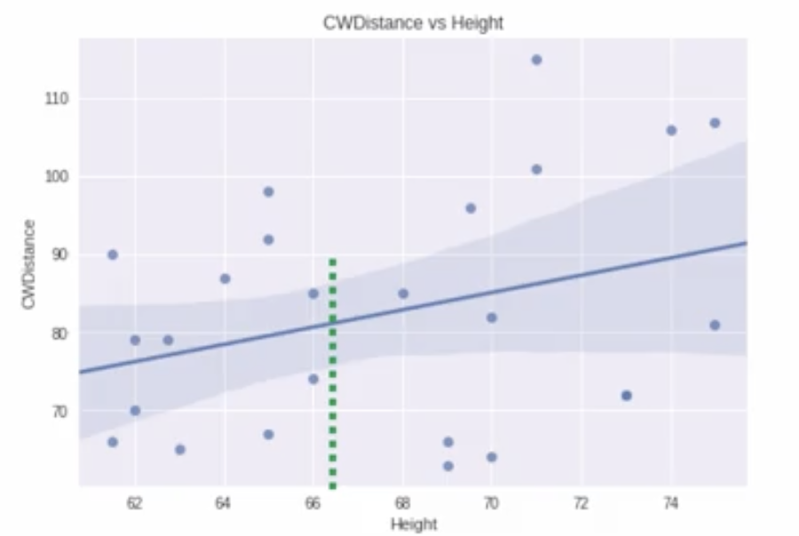
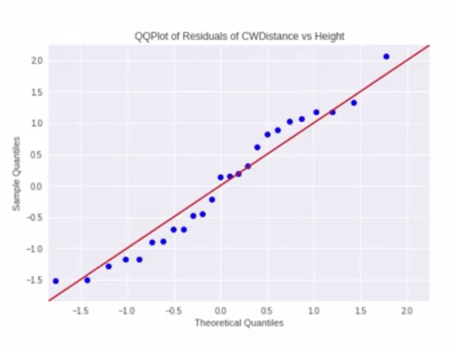
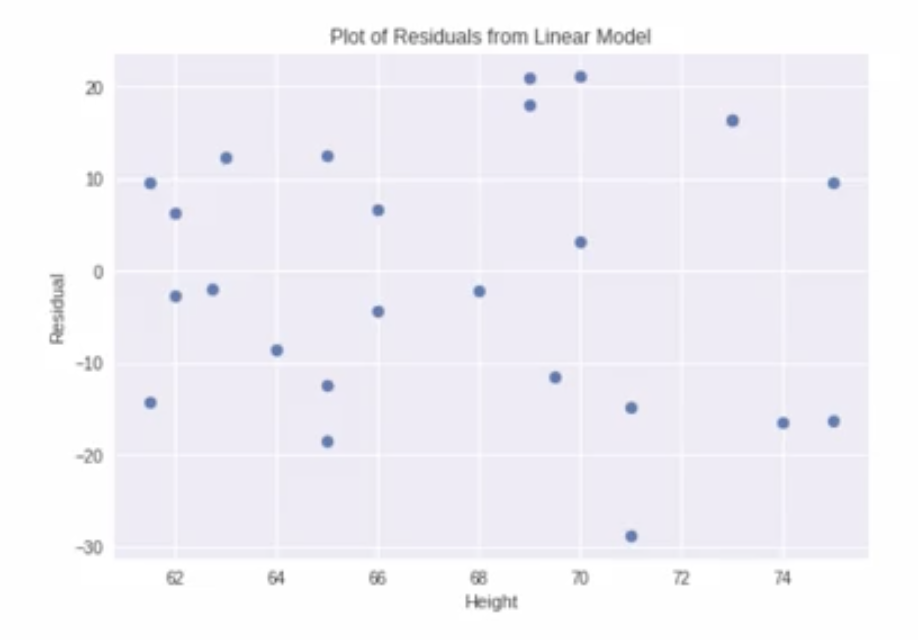
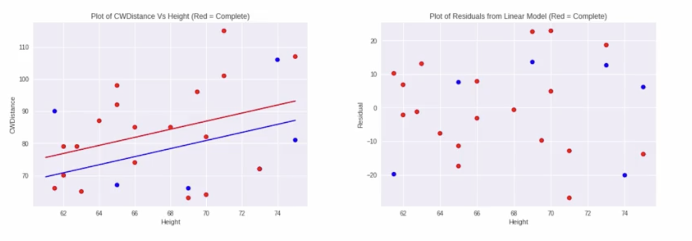

# Linear Regression: Inference

## Hypothesis Testing for Regression Slope

### Research Question
Is there a significant positive linear relationship between cartwheel distance and height?

### Key Concept: Slope Significance
- **Null hypothesis ($H_0$):** True slope (_slope of the regression line fitted to the entire population_) $\beta_1 = 0$ (no relationship)
- **Alternative hypothesis ($H_a$):** True slope $\beta_1 > 0$ (positive relationship)

### If Slope Were Zero
- Flat regression line
- Knowing height wouldn't help predict cartwheel distance
- All predictions would equal the overall mean

## Inference Output Interpretation

### Regression Results for Height
| Parameter | Estimate | Standard Error | t-statistic | p-value (two-sided) |
|-----------|----------|----------------|-------------|---------------------|
| Slope ($b_1$) | 1.1 | 0.67 | 1.65 | 0.112 |

### Statistical Interpretation
- **Estimated slope:** 1.1 inches per inch of height
- **Standard error:** 0.67 (measures variability of slope estimates - _how far away our estimated slopes are from the true slope on average_)
- **t-statistic:** 1.65 (1.65 standard errors above zero)
- **Two-sided p-value:** 0.112

### One-sided Test for Positive Relationship
- **One-sided p-value:** $0.112 / 2 = 0.056$
- **Interpretation:** Marginally significant at 10% level ($p = 0.056$)
- Not statistically significant at 5% level

## Confidence Intervals

### 95% Confidence Interval for Slope
- **Range:** -0.278 to 2.493 inches
- **Interpretation:** With 95% confidence, the true change in cartwheel distance for a one-inch height increase is between 0.2 inches shorter and 2.5 inches longer

## Two Types of Intervals

### Confidence Interval for Mean Response
- Estimates the **average** cartwheel distance for all adults at a specific height
- **Narrowest** at the mean height (67.6 inches)
- **Wider** further from the mean (due to increased uncertainty)

### Prediction Interval for Individual Response
- Estimates range for an **individual's** cartwheel distance at a specific height
- **Always wider** than confidence intervals for the mean
- Accounts for both estimation uncertainty and individual variability

## Regression Assumptions

### Model Equation  

$$
y = \beta_0 + \beta_1x + \epsilon
$$

...where $\epsilon \sim N(0, \sigma^2)$

### Key Assumptions
1. **Linearity:** Relationship between variables is linear
2. **Normality:** Errors are normally distributed around zero
3. **Constant Variance:** Error variance doesn't depend on x (homoscedasticity)
4. **Independence:** Observations are independent

### Checking Assumptions
- **Normality:** Q-Q plot of residuals should show points along straight line

- **Constant Variance:** Residual plot should show random scatter around zero

### Estimated Standard Deviation
- $\hat{\sigma} = 14.5$ inches
- Represents typical distance between observed and predicted values

## Multiple Regression: Adding Completion Status

### Extended Model

$$
\hat{y} = b_0 + b_1 \times \text{height} + b_2 \times \text{complete}
$$

...where `complete` is an indicator variable (1 = completed cartwheel, 0 = did not complete)

### Coefficient Interpretation
| Parameter | Estimate | Interpretation |
|-----------|----------|----------------|
| Height | 1.2557 | Comparing adults with **same completion status**, a one-inch height difference predicts 1.26-inch cartwheel distance difference |
| Complete | 6.0190 | Comparing adults with **same height**, completers average 6 inches longer cartwheel distance |

### Visual Representation

### Inference Results
- **Height coefficient:** 1.26 (SE = 0.7)
- **Two-sided p-value:** 0.085
- **One-sided p-value:** 0.0425
- **Conclusion:** Significant positive association between height and cartwheel distance **after adjusting for completion status**

## Key Takeaways

### Multiple Regression Interpretation
- Each coefficient represents the relationship **holding other variables constant**
- Crucial for comparing groups while controlling for confounding factors

### Model Comparison
- Single predictor: Height explains limited variability ($p = 0.056$)
- Multiple predictors: Height significant after accounting for completion status ($p = 0.0425$)
- Residual standard deviation remains ~14.5 inches

---

**Next:** [Linear Regression: Further Reading](./03_linear_regression--further_reading.pdf)