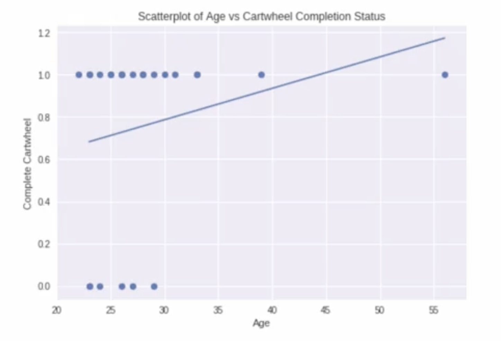
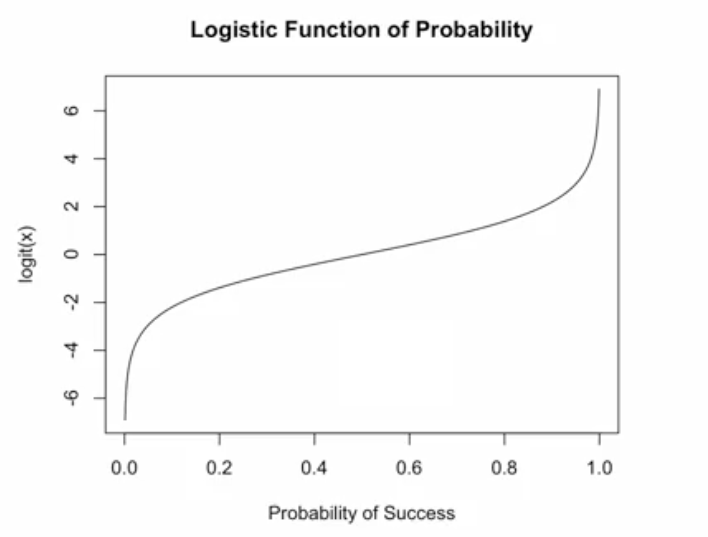
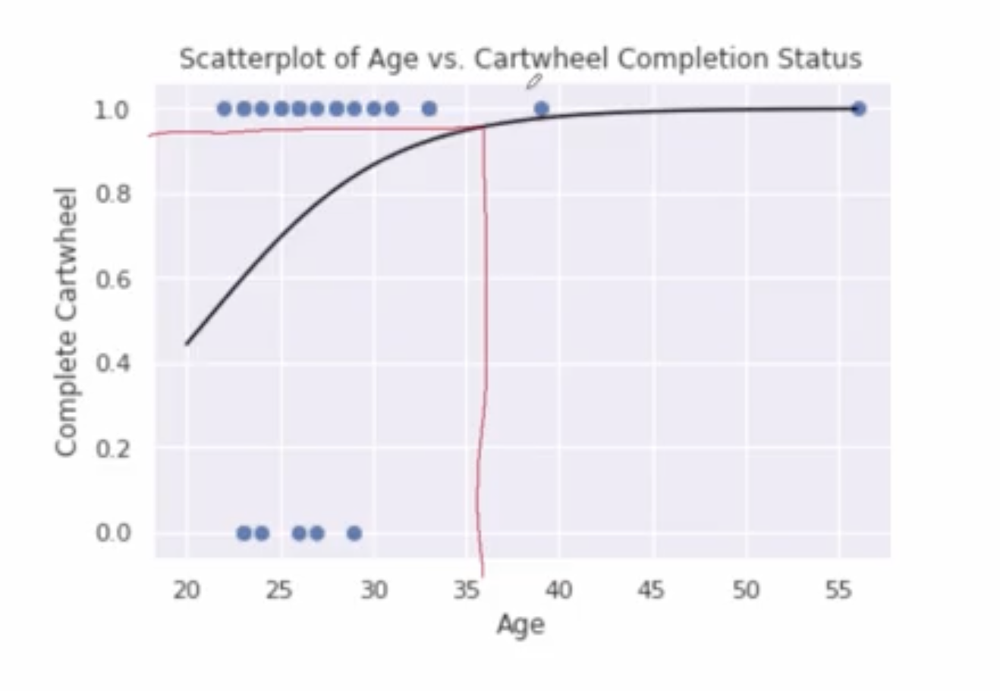
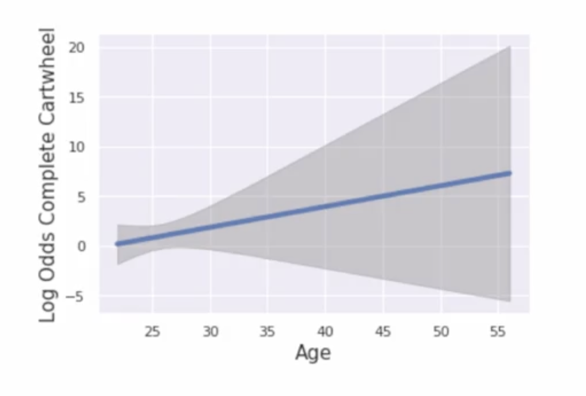

# Logistic Regression: Introduction

## Study Context and Research Question

### Data Overview
- **Sample:** 25 adults attempting cartwheels
- **Response Variable:** Completion status (binary: 0 = failed, 1 = successful)
- **Predictor Variable:** Age
- **Research Question:** Is there a relationship between age and probability of successfully completing a cartwheel?

## The Problem with Linear Regression for Binary Outcomes

### Initial Scatter Plot

### Limitations of Linear Regression
- **Problem:** Linear regression predicts probabilities outside [0,1] range
- **Example:** For age 50, predicted probability ≈ 110% (impossible)
- **Equation:** $\hat{y} = 0.34 + 0.015 \times \text{age}$

## Logistic Regression: The Solution

### Key Transformation: Logit Function

$$
\text{logit}(p) = \ln\left(\frac{p}{1-p}\right)
$$

...where $p$ = probability of success

### Properties of Logit Transformation
- **Symmetry:** logit(p) = -logit(1-p)
- **Range:** $(-\infty, +\infty)$ (unbounded)
- **Interpretation:**
  - logit(p) = 0 → p = 0.5 (equal odds)
  - logit(p) > 0 → p > 0.5
  - logit(p) < 0 → p < 0.5

### Logistic Regression Model

$$
\text{logit}(\hat{p}) = b_0 + b_1 \times \text{age}
$$

## Visualizing Logistic Regression

### Characteristic S-Shaped Curve

**Key Features:**
- Asymptotically approaches 0 and 1
- Monotonic (always increasing or decreasing)
- Inflection point at p = 0.5

### Extrapolation Warning
- **Youngest observed age:** 22 years
- **Caution:** Predicting for age 15 involves extrapolation
- **Best practice:** Restrict predictions to observed age range

## Model Output and Interpretation

### Python Output Summary
- **Model family:** Binomial
- **Link function:** Logit
- **Coefficients:**
  - Intercept: -4.42
  - Age: 0.2096

### Logistic Regression Equation

$$
\text{logit}(\hat{p}) = -4.42 + 0.2096 \times \text{age}
$$

## Interpreting Coefficients

### Slope Interpretation (Two Ways)

**1. Log-Odds Scale:**
- For each 1-year increase in age, log-odds of success increases by 0.2096

**2. Odds Ratio Scale:**

$$
\text{Odds Ratio} = e^{0.2096} = 1.23
$$

- For each 1-year increase in age, odds of success multiply by 1.23
- **Interpretation:** 23% increase in odds per year

### Example Prediction: Age 36

**Step 1: Calculate log-odds**

$$
\text{logit}(\hat{p}) = -4.42 + 0.2096 \times 36 = 3.13
$$

**Step 2: Convert to probability**
- Log-odds of 3.13 → probability ≈ 95%

## Uncertainty and Prediction Intervals

### Confidence Bands

**Key Observations:**
- Narrowest bands near mean age (26 years)
- Widest bands at extremes (fewer data points)
- Reflects uncertainty in parameter estimates

### Transformed Uncertainty

- Confidence bands on probability scale show asymmetric uncertainty
- Maximum uncertainty occurs near p = 0.5

## Model Assumptions and Diagnostics

### Primary Assumption
- **Linearity:** Log-odds are linearly related to predictors
- Must assume model specification is correct

### Residual Analysis Challenges
- **Limited residual values:** Only two possible residuals for each x (1-$\hat{p}$ or 0-$\hat{p}$)
- **More informative when:** 
  - X takes wide range of values
  - Multiple covariates included
  - Larger sample sizes

### Improving Diagnostics
- Include additional predictors
- Collect data across broader age range
- Larger sample sizes provide more residual information

## Key Takeaways

### Advantages of Logistic Regression
- Predicts probabilities within [0,1] range
- Handles binary outcome data appropriately
- Provides interpretable odds ratios

### Interpretation Guidelines
- **Coefficients:** Represent changes in log-odds
- **Odds ratios:** Multiplicative changes in odds
- **Predictions:** Always check for extrapolation

### Practical Considerations
- Assess linearity assumption carefully
- Be cautious with predictions outside observed range
- Consider sample size limitations for reliable inference

---

**Next:** [Logistic Regression: Inference](./06_logictic_regression--inference.md)