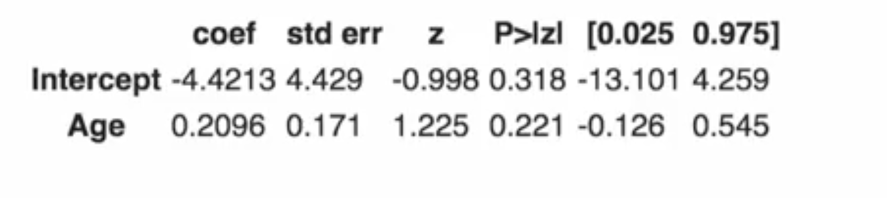
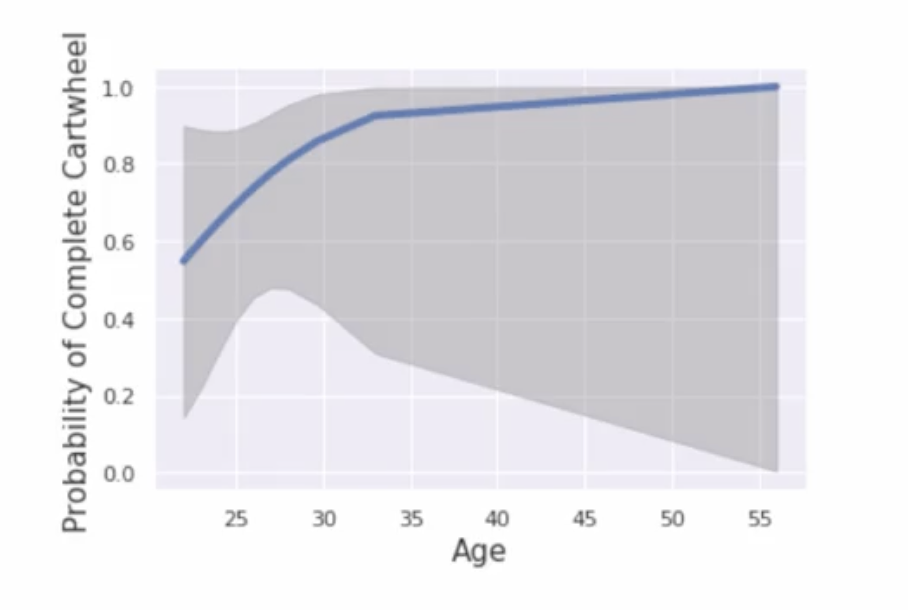

# Logistic Regression: Inference

## Study Context Recap

### Research Setup
- **Sample:** 25 adults attempting cartwheels
- **Response:** Binary completion status (0 = failed, 1 = successful)
- **Predictor:** Age
- **Model:** Logistic regression relating age to probability of cartwheel completion

### Previous Results
- **Logistic regression equation:**

$$
\text{logit}(\hat{p}) = -4.42 + 0.2096 \times \text{age}
$$

- **Odds ratio:** $e^{0.2096} = 1.23$ (23% increase in odds per year)

## Confidence Interval for Slope Coefficient

### General Formula

$$
b_1 \pm z^* \times SE(b_1)
$$

### Application to Cartwheel Data
- **Estimated slope ($b_1$):** 0.2096
- **Standard error ($SE(b_1)$):** 0.171
- **Critical value ($z^*$):** 1.96 (for 95% confidence)

### Calculation

$$
0.2096 \pm 1.96 \times 0.171 = 0.2096 \pm 0.335
$$

$$
\text{0.95 CI} = (-0.126, 0.545)
$$

### Python Output Confirmation

## Hypothesis Testing

### Research Question
Is there a significant relationship between age and the probability of successfully completing a cartwheel?

### Hypothesis Setup
- **Null hypothesis ($H_0$):** $\beta_1 = 0$ (no relationship)
- **Alternative hypothesis ($H_a$):** $\beta_1 \neq 0$ (two-sided test)

### Test Statistic Calculation

$$
z = \frac{b_1 - 0}{SE(b_1)} = \frac{0.2096}{0.171} = 1.225
$$

### P-value and Decision
- **P-value:** 0.221
- **Significance level ($\alpha$):** 0.05
- **Decision:** Fail to reject $H_0$ (p-value > $\alpha$)

## Interpreting the Results

### Confidence Interval Interpretation
- **95% CI for slope:** (-0.126, 0.545)
- **Contains zero?:** Yes → Zero is a plausible value for the true slope
- **Interpretation:** We cannot be confident that the true slope differs from zero

### Hypothesis Test Interpretation
- **Conclusion:** No significant evidence of a linear relationship between age and log-odds of cartwheel completion
- **Practical meaning:** Age does not appear to be a statistically significant predictor of cartwheel success in this sample

### Consistency Check
- Both confidence interval and hypothesis test lead to the same conclusion
- CI contains zero ↔ Fail to reject $H_0$

## Visualizing the Uncertainty

### Logistic Curve with Confidence Bands

**Interpretation:**
- Wide confidence bands reflect substantial uncertainty
- Consistent with non-significant slope
- Small sample size (n=25) contributes to uncertainty

## 6. Key Formulas Summary

### Confidence Interval

$$
b_1 \pm z_{\alpha/2} \times SE(b_1)
$$

### Test Statistic
$$
z = \frac{b_1 - \beta_{1,0}}{SE(b_1)}
$$

### P-value Interpretation
- Small p-value (< 0.05): Evidence against null hypothesis
- Large p-value (≥ 0.05): Insufficient evidence to reject null

## Important Distinctions from Linear Regression

### Test Statistic Distribution
- **Logistic regression:** Uses z-distribution
- **Linear regression:** Uses t-distribution

### Interpretation Scale
- **Coefficients:** Represent changes in log-odds
- **Inference:** Conducted on log-odds scale
- **Predictions:** Converted to probability scale for interpretation

## Practical Considerations

### Sample Size Impact
- Small sample (n=25) → Large standard errors → Wide confidence intervals
- Difficult to detect effects without larger samples

### Effect Size vs. Statistical Significance
- **Odds ratio:** 1.23 suggests potential practical effect
- **Statistical test:** Non-significant due to limited power
- **Interpretation:** "No evidence of effect" ≠ "No effect exists"

### Model Assumptions
- Linear relationship between log-odds and predictor
- Independent observations
- Adequate sample size for reliable inference

## Key Points

- Logistic regression inference follows similar framework to linear regression
- Always consider both statistical significance and confidence intervals
- Small samples limit ability to detect effects
- Interpretation requires careful consideration of log-odds scale

