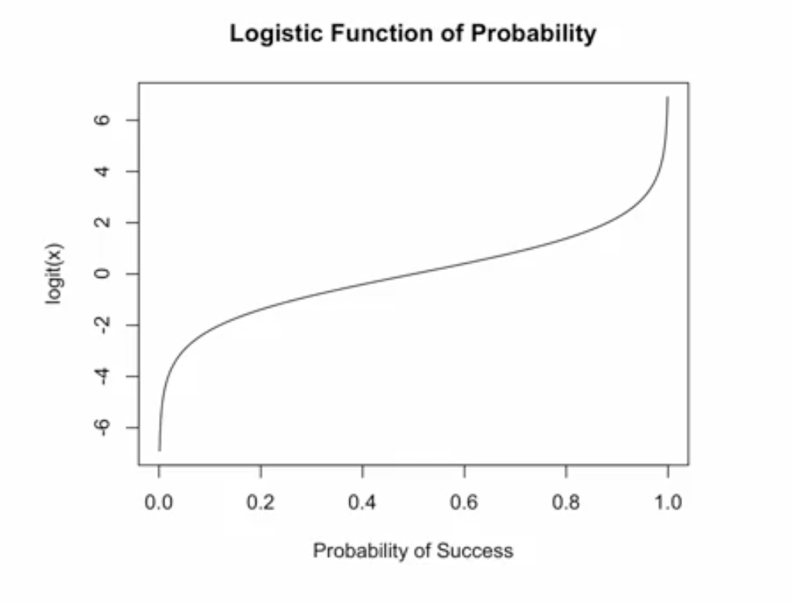
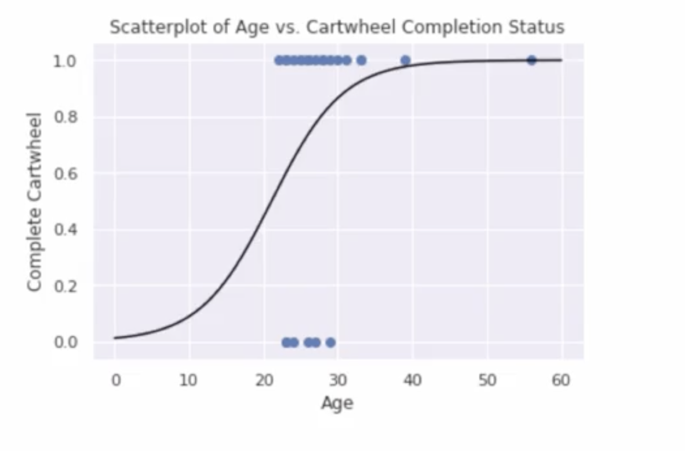
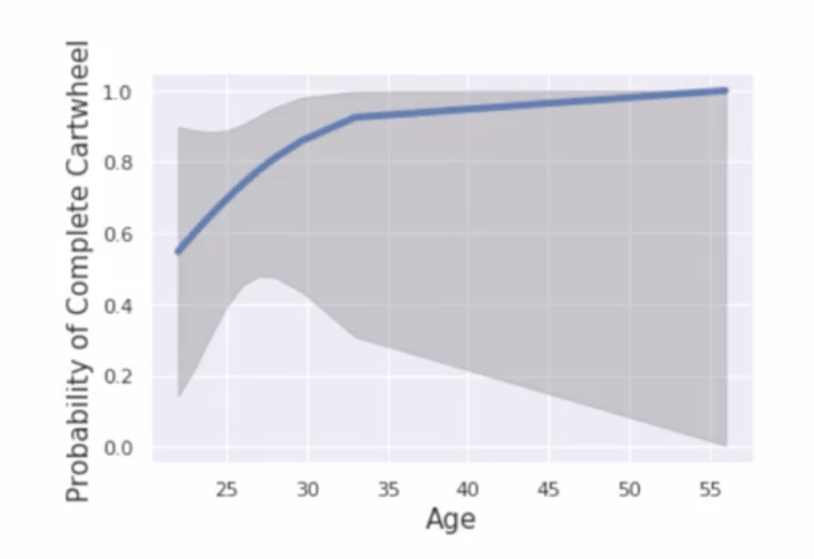

# Logistic Regression: Introduction

## 1. The Intuitive Idea: Why Linear Regression Fails for Yes/No Outcomes

In the last lectures, we used linear regression to predict a continuous outcome (`Cartwheel Distance`). But what if our outcome of interest is binary—a "yes" or "no" question? For our cartwheel data, a great example is: "Did the person successfully complete the cartwheel?" This is a 1 (Yes) or 0 (No) variable.

Our research question is: "Is there a relationship between a person's age and the *probability* of them completing a cartwheel?"

Let's start by seeing what happens if we naively apply the tool we already know: linear regression.

We immediately see several problems:
1.  **Nonsensical Predictions:** The fitted line extends above 1 and below 0. The model might predict a 110% probability of success for an older person or a -10% probability for a younger person. Probabilities, by definition, must be between 0 and 1 (or 0% and 100%).
2.  **Incorrect Model Form:** The data points only exist at `Y=0` and `Y=1`. A straight line is clearly not the right shape to model this reality.

We need a new approach. Instead of modeling the probability directly, we need to model a *transformation* of the probability that doesn't have the 0-to-1 boundary.

## 2. The Theoretical Framework: From Probability to Log-Odds

The solution is to use a **link function** to transform our binary outcome into something that can range from negative infinity to positive infinity, just like a continuous Y variable. For logistic regression, this transformation is the **logit function**.

The logit function converts a probability into **log-odds**. Let's break that down.

1.  **Probability (P):** The probability of success (e.g., P = 0.80).
2.  **Odds:** The ratio of the probability of success to the probability of failure.  

$$
\text{Odds} = \frac{P}{1 - P}
$$

  If P=0.80, the odds are `0.80 / 0.20 = 4`, or "4 to 1". Odds can range from 0 to infinity.

3.  **Log-Odds (Logit):** The natural logarithm of the odds.  

$$
\text{logit}(P) = \ln\left(\frac{P}{1 - P}\right)
$$

  This is the key transformation. It takes a probability (bounded between 0 and 1) and maps it onto the entire number line (from $-\infty$ to $+\infty$).

*   A probability of 0.5 (even odds) maps to a log-odds of 0.
*   Probabilities > 0.5 map to positive log-odds.
*   Probabilities < 0.5 map to negative log-odds.

### The Logistic Regression Model
Now we can build a model that looks very similar to linear regression, but with our transformed outcome. This is a type of **Generalized Linear Model (GLM)**.

$$
\text{logit}(\hat{P}) = b_0 + b_1X
$$

Or, written out fully:  

$$
\ln\left(\frac{\hat{P}}{1 - \hat{P}}\right) = b_0 + b_1X
$$

*   The model is **linear on the log-odds scale**.
*   When we transform the predictions back to the probability scale, we get the characteristic **S-shaped curve** (a sigmoid curve). This curve is perfect for our needs because it is always bounded between 0 and 1.

## 3. Interpreting the Model: The Challenge of Log-Odds

We fit our model to the cartwheel data and get the following coefficients from the software output:
*   $b_0 = -4.42$ (Intercept)
*   $b_1 = 0.2096$ (Slope for Age)

Our fitted model is:  

$$
\text{logit}(\hat{P}) = -4.42 + 0.2096 \times (\text{Age})
$$

Interpreting the slope ($b_1$) is trickier than in linear regression.

*   **Direct (but less intuitive) Interpretation:** "For each one-year increase in age, the **log-odds** of successfully completing a cartwheel is estimated to increase by 0.2096, on average." This is mathematically correct but hard to explain.

*   **Odds Ratio Interpretation (More common):** To make it more intuitive, we exponentiate the slope to get an **odds ratio (OR)**.  

$$
\text{Odds Ratio} = e^{b_1} = e^{0.2096} \approx 1.23
$$

  **Interpretation:** "For each one-year increase in age, the **odds** of a successful cartwheel are estimated to be **multiplied by 1.23** (or increase by 23%), on average."
  *   An OR > 1 means the odds increase as X increases.
  *   An OR < 1 means the odds decrease as X increases.
  *   An OR = 1 means X has no effect on the odds.

## 4. Using the Model for Prediction

Let's predict the outcome for someone who is 36 years old.

**Step 1: Predict the log-odds.**
Plug the age into our fitted equation:  

$$
\text{logit}(\hat{P}) = -4.42 + 0.2096 \times (36) \approx 3.13
$$

**Step 2: Convert the log-odds back to a probability.**
The inverse of the logit function is the logistic function:  

$$
\hat{P} = \frac{e^{\text{log-odds}}}{1 + e^{\text{log-odds}}}
$$

$$
\hat{P} = \frac{e^{3.13}}{1 + e^{3.13}} \approx \frac{22.87}{23.87} \approx 0.958
$$

**Conclusion:** We predict that a 36-year-old has about a **96% probability** of successfully completing a cartwheel.

## 5. Model Assumptions and Uncertainty

*   **Primary Assumption:** The core assumption of logistic regression is that the relationship between the predictors and the **logit of the probability** is linear. Checking this can be challenging, especially with small sample sizes, as residual plots are not as informative as they are in linear regression.

*   **Uncertainty:** Just like with linear regression, our fitted S-curve has uncertainty. We can plot confidence bands around it. These bands will be narrowest where we have the most data and wider in the tails of the data distribution. Because we only have 25 observations, the uncertainty in our model is quite high, especially for the oldest individuals.

---

**Next:** [Logistic Regression: Inference](./07_logictic_regression--inference.md)