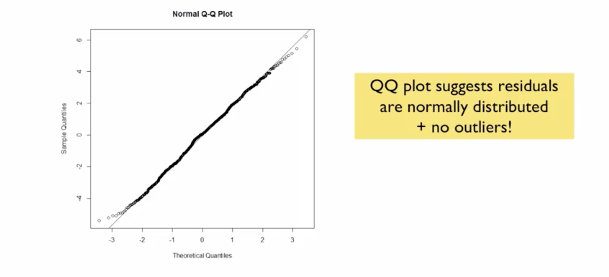
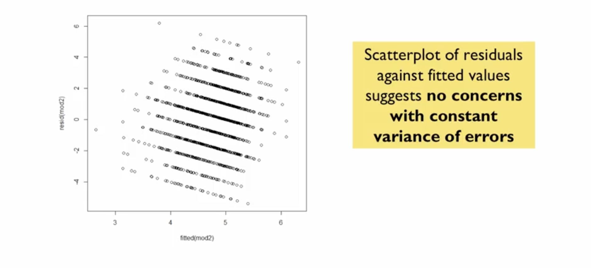
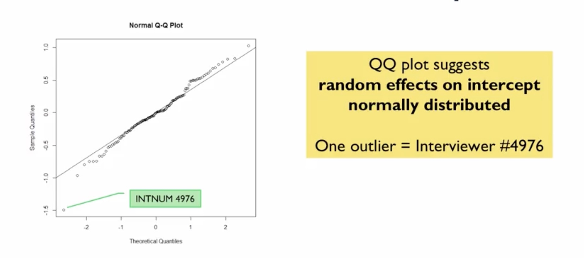
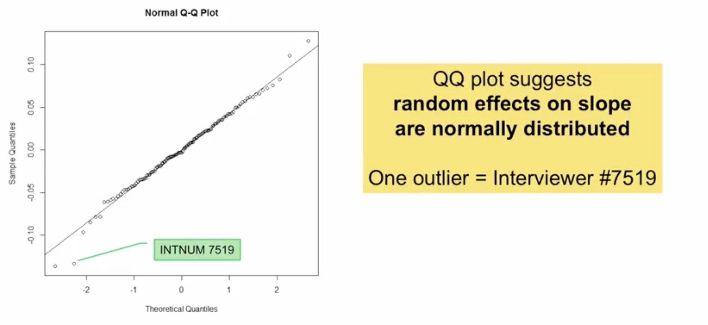

# Multilevel Linear Regression Models

## Study Context: European Social Survey (ESS)

### Data Overview
- **Sample:** 1,703 adults in Belgium
- **Design:** Face-to-face survey interviews with complex sampling
- **Key Variables:**
  - Respondent ID, interviewer ID
  - 22 attitude/opinion variables
  - Respondent weights (accounting for complex design)
  - Interviewer-specific response rates

### Research Focus
- **Interviewer effects** on data collection
- Variability among interviewers in how they ask questions or recruit respondents
- Modeling **between-interviewer variance**

## Multilevel Model Terminology

### Alternative Names
- **Random coefficient models** (coefficients vary across clusters)
- **Varying coefficient models**
- **Subject-specific models** (longitudinal context)
- **Hierarchical linear models** (social sciences)
- **Mixed effects models** (statistics - mix of fixed and random effects)

## Mathematical Specification

### Combined Model Equation

$$
y_{ij} = \underbrace{\beta_0 + \beta_1 x_{ij}}_{\text{Fixed effects}} + \underbrace{u_{0j} + u_{1j}x_{1ij} + e_{ij}}_{\text{Random effects}}
$$

...where:  
- $y_{ij}$: Continuous dependent variable for person $i$ in cluster $j$
- $x_{ij}$: Predictor variable measured at person level
- $\beta_0, \beta_1$: **Fixed effects** (overall parameters)
- $u_{0j}, u_{1j}$: **Random effects** (cluster-specific deviations)
- $e_{ij}$: Residual error

### Distributional Assumptions

**Random Effects:**  

$$
\begin{pmatrix} u_{0j} \\ 
u_{1j} \end{pmatrix} \sim N\left( \begin{pmatrix} 0 \\ 
0 \end{pmatrix}, \begin{pmatrix} \sigma_0^2 & \sigma_{01} \\ 
\sigma_{01} & \sigma_1^2 \end{pmatrix} \right)
$$

**Residual Errors:**  

$$
e_{ij} \sim N(0, \sigma^2)
$$

### Variance Components
- $\sigma_0^2$: Variance of random intercepts (between-cluster)
- $\sigma_1^2$: Variance of random slopes (between-cluster)
- $\sigma_{01}$: Covariance between intercept and slope random effects
- $\sigma^2$: Residual variance (within-cluster)

## Multilevel Model Formulation

Combining levels gives the same model as above.

## Explaining Between-Cluster Variance

### Adding Cluster-Level Predictors

Extended level 2 equation is now:

$$
\beta_{0j} = \beta_{0} + \beta_{2}T_j + u_{0j}
$$

...where $T_j$ is a cluster-level predictor (e.g., gender).

If $T_j$ is a good predictor, we expect the variability of $u_{0j}$ to go down. In our hypothetical scenario:

- **Initial model:** $\hat{\sigma}_0^2 = 2$
- **After adding predictor:** $\hat{\sigma}_0^2 = 1$
- **Interpretation:** 50% of between-cluster variance in intercepts explained by the predictor

## Estimation and Inference

### Maximum Likelihood Estimation (MLE)
- Finds parameter values that make observed data most likely
- Estimates both fixed effects and variance components
- Computes standard errors for all parameters

### Hypothesis Testing
1. **Fixed effects:** Test $H_0: \beta_k = 0$ using t-tests
2. **Variance components:** Test $H_0: \sigma^2 = 0$ using **Likelihood Ratio Tests (LRT)**
   - Compares models with and without random effects
   - Assesses if removing parameters significantly worsens model fit

**Note:** _The LRT will be covered in detail._

## ESS Example Application

### Research Question
Do ESS interviewers introduce variability in the relationship between trust in police and perceived helpfulness?

### Model Results

**Fixed Effects:**
- **Intercept ($\beta_0$):** 3.89 (significant, p < 0.001)
- **Slope ($\beta_1$):** 0.14 (significant, p < 0.001)

**Interpretation:** Higher trust in police associated with higher perceived helpfulness

**Variance Components:**
- **Random intercept variance ($\sigma_0^2$):** 0.696 (significant via LRT)
- **Random slope variance ($\sigma_1^2$):** 0.012 (significant via LRT)

**Interpretation:** Significant variability among interviewers in both intercepts and slopes.

## 8. Model Diagnostics

### Residual Analysis

- **Normality:** Residuals normally distributed
- **Constant variance:** No heteroscedasticity concerns

### Random Effects Diagnostics

#### EBLUPs for Random Intercepts

#### EBLUPs for Random Slopes

- **EBLUPs (Empirical Best Linear Unbiased Predictors):** Predicted random effects
- **Q-Q plots** should show normal distribution
- **Outlier detection:** Identify unusual clusters

### Case Study: Interviewer Outliers
**Interviewer 4976:**
- Unusually low intercept
- Many responses < 4 on helpfulness scale
- Possible question-asking bias

**Interviewer 7519:**
- Unusual slope due to **data coding error**
- Value 88 (missing code) treated as real data
- **Lesson:** Always check descriptive statistics and handle missing data properly

## Practical Implications

### Interviewer Effects Matter
- Interviewers introduce non-negligible variability
- Affects precision of parameter estimates
- Should be accounted for in analysis

### Next Steps
1. **Address data quality issues** (recode missing values)
2. **Add interviewer-level predictors** to explain variance
3. **Re-evaluate model** after corrections

## Key Takeaways

### Multilevel Modeling Advantages
- Accounts for **cluster-induced correlation**
- Estimates **between-cluster variance** components
- Enables **variance explanation** with cluster-level predictors
- Provides more **accurate inference** for clustered data

### Best Practices
1. **Always check assumptions:** Residual normality, constant variance
2. **Examine random effects:** Identify unusual clusters
3. **Verify data quality:** Handle missing values appropriately
4. **Consider cluster-level predictors:** Explain between-cluster variance

---

**Next:** [Likelihood Ratio Tests for Fixed Effects and Variance Components](./04_lrt_for_fixed_effects_and_variance_components.md)