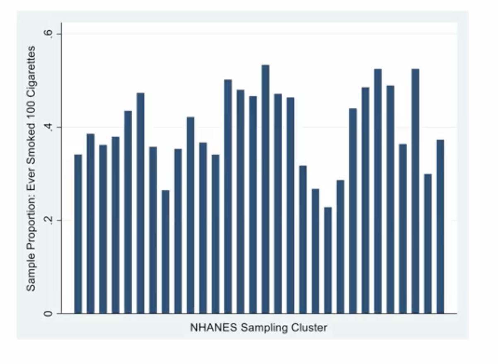
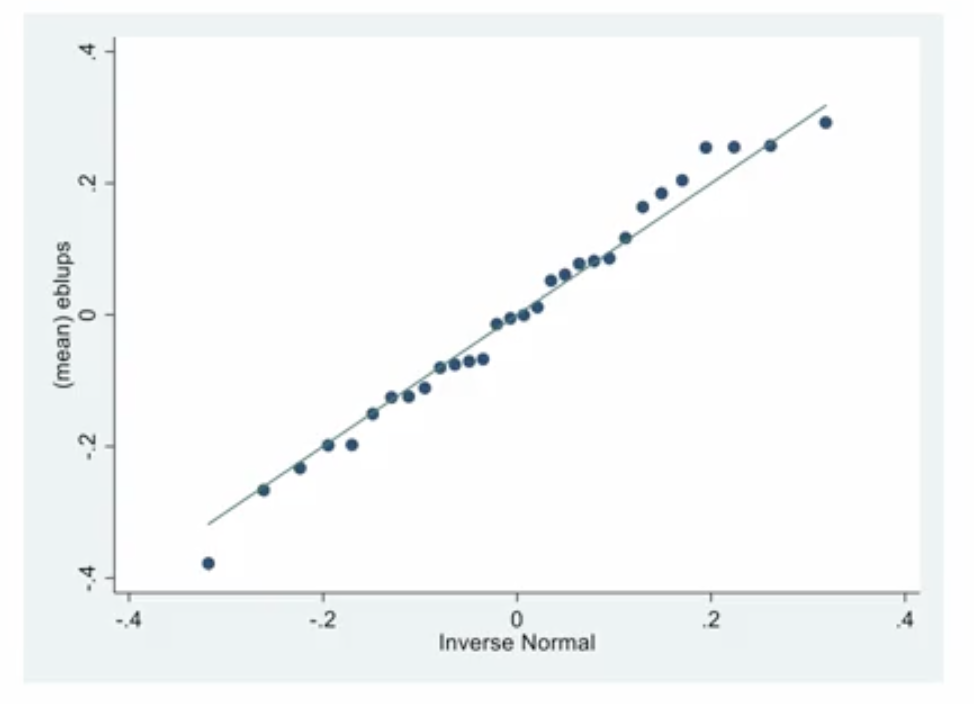

# Multilevel Logistic Regression Models

## 1. The Intuitive Idea: Group Effects for Yes/No Questions

We've learned about two powerful concepts:
1.  **Logistic Regression:** How to model a binary (Yes/No) outcome.
2.  **Multilevel Models:** How to handle data that is "clustered" or "grouped," where observations within a group are correlated.

**Multilevel Logistic Regression** simply combines these two ideas. It's the tool we use when we want to predict a binary outcome for data that is grouped into clusters.

The core idea is the same as with multilevel *linear* regression: instead of fitting one "one-size-fits-all" logistic (S-shaped) curve for the entire dataset, we allow each cluster to have its own unique curve. We then model how these individual curves vary around an overall average curve.

This is essential when we have a reason to believe that the probability of a "Yes" outcome might systematically differ from one group to another, even after accounting for individual-level predictors.

## 2. The Theoretical Framework: Adding Random Effects to the Logit

We start with the logistic regression model from Week 2, which models the log-odds of success:  

$$
\text{logit}(P_{ij}) = \ln\left(\frac{P_{ij}}{1 - P_{ij}}\right)
$$

Where $P_{ij}$ is the probability of success for individual `i` in cluster `j`.

Now, we build a multilevel model for these log-odds, incorporating both fixed and random effects. A common model is the **random intercept model**:

$$
\text{logit}(P_{ij}) = \underbrace{(\gamma_{00} + \gamma_{10}X_{ij})}_\text{Fixed Part} + \underbrace{(u_{0j} + e_{ij})}_\text{Random Part}
$$

Let's break this down:
*   **Fixed Part:** This is the average S-shaped curve across all clusters.
    *   $\gamma_{00}$: The average log-odds when the predictor `X` is zero.
    *   $\gamma_{10}$: The average change in log-odds for a one-unit change in `X`.
*   **Random Part:**
    *   $u_{0j}$: The **random intercept** for cluster `j`. This is the key multilevel component. It represents how much cluster `j`'s baseline log-odds deviates from the overall average. It allows each cluster's curve to shift up or down.
    *   $e_{ij}$: The individual-level error (inherent in a binary outcome).

The assumptions about the random effects ($u_{0j}$) are the same as in the linear case: we assume they are normally distributed with a mean of 0 and a variance ($\sigma^2_{u0}$) that we want to estimate.

### A Note on Estimation
Fitting these models is computationally much more difficult than linear models. Because we're not working with a simple normal distribution, the model's likelihood function often can't be written down in a simple form. The software must use advanced numerical approximation methods (like **Adaptive Gaussian Quadrature**) to find the parameter estimates. This means these models can take significantly longer to run.

## 3. Case Study: Revisiting the NHANES Smoking Data

In Week 2, we modeled the probability of a person ever smoking based on predictors like age and gender. We treated every person as an independent observation.

*   **The Problem:** This was a "naive" analysis. The NHANES study uses a complex, multistage sampling design. It randomly samples geographic areas (clusters) and then samples people *within* those areas. People from the same geographic cluster are likely more similar to each other than to people from a different cluster (due to shared culture, environment, socioeconomic status, etc.). This introduces correlation that our original model ignored.
*   **The Consequence:** Ignoring this clustering leads to **understated standard errors**. Our p-values will be too small, and our confidence intervals too narrow. We might conclude a predictor is significant when it's really not. We are being overconfident.

### The Multilevel Solution
We will now fit a **multilevel logistic regression model** to account for this clustering.

1.  **The Model:** We'll fit a random intercept model, allowing the baseline probability of smoking to vary across the different NHANES sampling clusters.
2.  **The Research Question:** Besides correcting our standard errors, we can also ask a new, interesting question: "How much does the prevalence of smoking vary between different geographic areas, even after accounting for individual demographics?" We can estimate the variance of the random intercepts ($\sigma^2_{u0}$) to answer this.

This plot clearly shows that the proportion of smokers varies substantially from one cluster to another, confirming that a multilevel approach is appropriate.

### Key Findings
1.  **Predictors:** The same predictors that were significant in the naive Week 2 model (like age and gender) remain significant. The overall story about *what* predicts smoking doesn't change much.
2.  **Standard Errors:** The standard errors for the fixed effects are now **larger** than they were in the naive model. This is the correction we were looking for. The model now provides a more honest and accurate assessment of the uncertainty in our estimates.
3.  **Random Intercept Variance:** The estimated variance of the random intercepts was `0.046`. A Likelihood Ratio Test (LRT) confirmed that this variance is statistically significant (p < 0.05).
    *   **Conclusion:** This is a crucial finding. It means there is significant, unexplained variability in smoking rates between geographic clusters. The random effects were necessary and improved the model fit.

## 4. Model Diagnostics and Next Steps

*   **Diagnostics:** We can check the assumption that our random effects are normally distributed by creating a Q-Q plot of their predicted values (the EBLUPs). For the NHANES data, the plot looks good, with no major outliers.

    

*   **Next Steps:** Since we found significant unexplained variance between clusters, a logical next step would be to try to *explain* that variance. We could add cluster-level predictors to the model, such as the average income or education level of each geographic area, to see if they can account for why smoking rates are higher in some areas than others.

---

**Next:** [Practice with Multilevel Modeling: The Cal Poly App](./06_practice_with_multilevel_modeling.md)