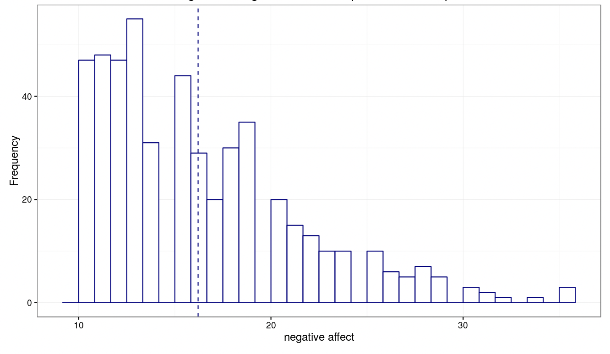
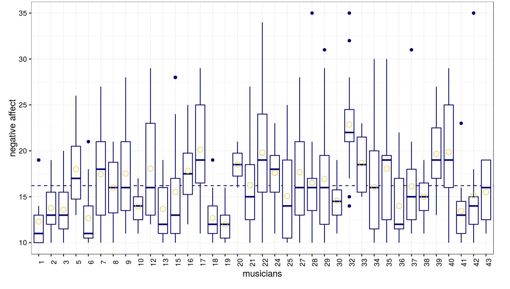
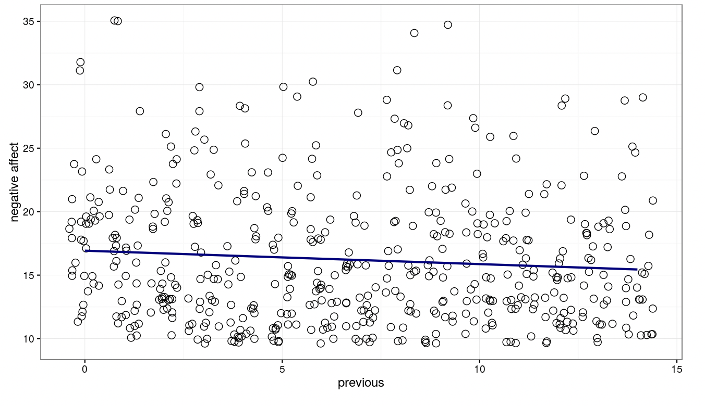
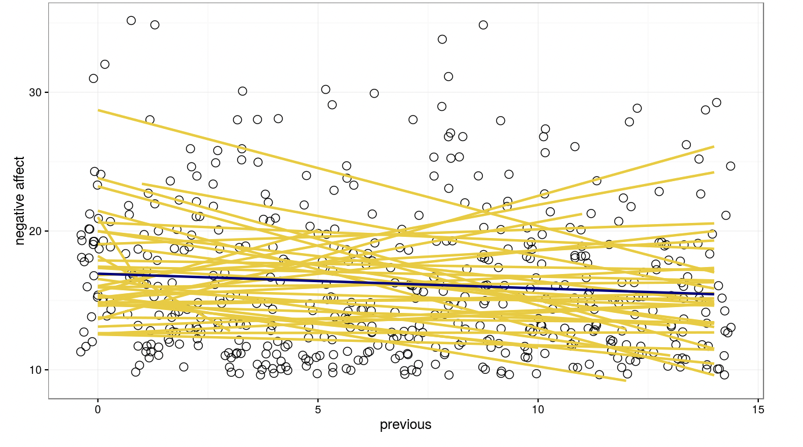

# Practice with Multilevel Modeling: The Cal Poly App

This lecture is a hands-on walkthrough of an interactive web application designed to help visualize and understand the core concepts of multilevel (or hierarchical) models.

**The Tool:** Cal Poly Hierarchical Models App
*   **URL:** [https://calpolystat3.shinyapps.io/Hierarchical_Models/](https://calpolystat3.shinyapps.io/Hierarchical_Models/)
*   **Created by:** Jimmy Wong and the Cal Poly Statistics Department.

## 1. The Intuitive Idea: Three Ways to Model Grouped Data

The app brilliantly illustrates the three main philosophical approaches to handling clustered data. Multilevel modeling is presented as the "smart compromise" between two extreme, and often flawed, alternatives.

1.  **The Pooled Method ("One Size Fits All"):**
    *   **What it is:** This approach completely **ignores the clustering**. It throws all the data into one big "pool" and fits a single model (e.g., one overall mean or one regression line) for everyone.
    *   **The Flaw:** It violates the independence assumption and fails to recognize that individuals within a group might be more similar to each other.

2.  **The Unpooled Method ("A Separate Model for Everyone"):**
    *   **What it is:** This approach goes to the opposite extreme. It fits a completely separate model for *each and every cluster*.
    *   **The Flaw:** This is inefficient, especially with many clusters. It doesn't learn from the overall patterns in the data. Small clusters can have very unreliable, noisy estimates. It misses the forest for the trees.

3.  **The Multilevel / Hierarchical Method ("The Smart Compromise"):**
    *   **What it is:** This is the approach we've been studying. It estimates an overall average relationship (like the pooled model) but also allows each cluster to have its own specific deviation from that average.
    *   **The Power:** It "borrows strength" across clusters. Estimates for smaller, less reliable clusters are "shrunk" towards the overall average, making them more stable. It models both the individual-level and group-level variation simultaneously.

## 2. The Case Study: The Musician Data

The app uses a built-in dataset to illustrate these concepts.
*   **The Data:** A longitudinal study of 37 undergraduate music majors.
*   **Level 2 Units (The Clusters):** The individual musicians (ID).
*   **Level 1 Units (The Observations):** Multiple diary entries from each musician before a performance.
*   **Dependent Variable:** `Negative Affect` (a measure of performance anxiety).
*   **Goal:** To model a musician's anxiety as a function of various predictors.

## 3. Walkthrough 1: The Random Intercept Model

This is the simplest multilevel model, where we only allow the baseline level of anxiety (the intercept) to vary between musicians.

### Visualizing the Approaches in the App:

*   **Pooled View:** The app shows a single histogram of `Negative Affect` for all observations combined, with one dashed line representing the overall mean (16.2). This is the "one size fits all" prediction.

    

*   **Unpooled View:** The app shows a series of boxplots, one for each of the 37 musicians. We immediately see huge variability: some musicians consistently have high anxiety, some have low anxiety, and some have wide-ranging anxiety. This visual strongly suggests that the pooled approach is wrong and that a multilevel model is needed.
    
    

*   **Hierarchical Model View:** This is the core of the app.
    *   **Model Equation:** It clearly displays the Level 1 and Level 2 equations for the random intercept model, helping to connect the theory to the application.
    *   **Intraclass Correlation (ICC):** The app calculates the ICC (0.181). This means that about **18.1% of the total variance in anxiety is due to differences *between* musicians**. This is a quantitative measure of how much clustering matters.
    *   **HLM Output:** It provides the actual model output, showing the estimated fixed effect (the overall mean anxiety) and, most importantly, the estimated variances for the two levels:
        *   Variance of the random musician effects (between-musician variance).
        *   Variance of the residuals (within-musician variance).

## 4. Walkthrough 2: The Random Intercept and Random Slope Model

This more complex model allows both the baseline anxiety (intercept) and the relationship with a predictor (slope) to vary across musicians. Here, the predictor is `Previous` (experience).

### Visualizing the Approaches:

*   **Pooled View:** The app shows a single scatter plot of `Negative Affect` vs. `Previous` for all data points, with one single regression line fitted through them. This represents the average, pooled relationship.

    

*   **Unpooled View:** This is a powerful visualization. The app shows **37 separate regression lines**, one for each musician. We can see that the relationship between experience and anxiety is different for different people—some lines are steep, some are flat, some are even positive. This provides strong visual motivation for needing a random slope.

    

*   **Hierarchical Model View:**
    *   **Model Equation:** The app updates the equations to show that now *both* the intercept and the slope have their own Level 2 equations with random effects.
    *   **HLM Output:** The output now includes estimates for the fixed effects (average intercept and average slope) and the variance components for the random intercepts, random slopes, and their covariance.

## 5. Summary and Key Features

The Cal Poly app is an invaluable tool for building intuition about multilevel models. Its key strengths are:

*   **Visual Comparison:** It makes the abstract concepts of "pooled," "unpooled," and "hierarchical" concrete by visualizing them side-by-side.
*   **Connecting Theory and Practice:** It displays the mathematical equations right next to the data visualizations and model output, bridging the gap between theory and application.
*   **Interactivity:** Users can upload their own data or modify the built-in models by adding predictors, allowing for hands-on exploration and learning.
*   **Clear Output:** It provides standard model output, including parameter estimates and variance components, in a clear format.

By playing with this app, you can develop a much deeper and more intuitive understanding of why and how multilevel models work.

---

**Next:** 