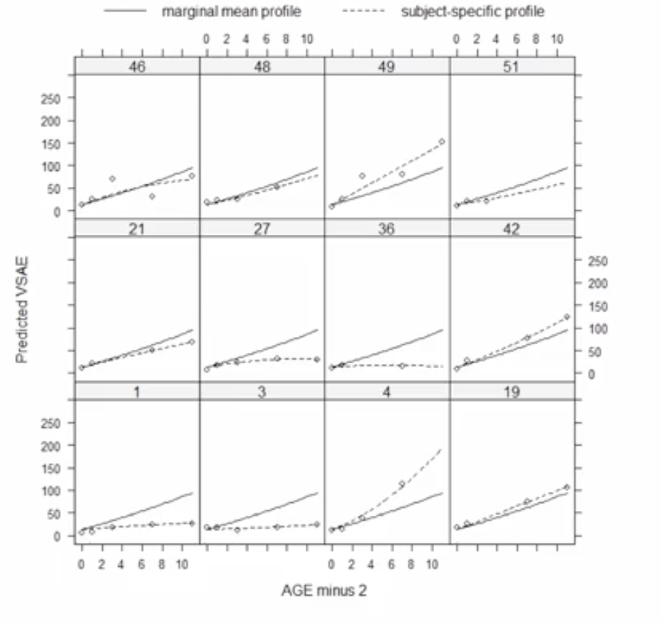

# What are Marginal Models and Why Do We Need Them?

## 1. The Intuitive Idea: Shifting the Research Question

So far, we have learned to handle dependent (clustered or longitudinal) data using **multilevel models (MLMs)**. The core idea of an MLM is to ask a *conditional* or *cluster-specific* question:
*   "Controlling for the fact that this student is in School A, what is the effect of studying?"
*   "For this specific patient, what is their personal health trajectory over time?"

MLMs do this by including **random effects**, allowing each cluster (school, patient) to have its own unique intercept and/or slopes. This is powerful, but it requires us to estimate the variance of those random effects.

**Marginal Models** offer an alternative approach by asking a different, simpler question—a *population-average* question:
*   "Averaged across all schools, what is the overall effect of studying?"
*   "What is the average health trajectory for the entire population of patients?"

Marginal models are not interested in estimating *why* or *how much* clusters vary from each other. They have one primary goal: to get a correct estimate of the overall, population-average relationship while properly accounting for the fact that the data is clustered to produce accurate standard errors.

### The Key Visual Distinction

This plot shows the fundamental difference between the two approaches for longitudinal data from several children.

*   **Multilevel Model Fit (Dashed Lines):** Each child gets their own unique trajectory line. The model captures the variability *between* children.
*   **Marginal Model Fit (Solid Line):** There is only **one single line** representing the average trajectory for the entire population. This same line is plotted for every child because the model is not estimating child-specific effects.

## 2. The Theoretical Framework: Separating Mean and Variance

The key difference in a marginal model is that it does **not** include random effects. Instead, it tackles the problem in two distinct steps:

#### Step 1: Model the Mean Structure
This part is exactly the same as any other regression model. We specify how the average of the dependent variable is related to our predictors.  

$$
\text{Mean of } Y = \beta_0 + \beta_1X_1 + \beta_2X_2 + \dots
$$

This gives us the population-average regression coefficients ( $\beta$s ) that we want to make inferences about.

#### Step 2: Model the Variance-Covariance Structure
This is where the magic happens. After accounting for the predictors in the mean structure, we are left with residuals (errors). Because our data is clustered, these residuals are not independent. We must explicitly tell the model what we think the pattern of correlation among the residuals looks like *within* a cluster. This is called specifying the **"working" correlation structure**.

Two common choices are:

*   **Exchangeable (or Compound Symmetry) Structure:**
    *   **Best for:** Clustered data where there is no sense of ordering (e.g., students within a school, people within a neighborhood).
    *   **Assumption:** The correlation between any two observations within the same cluster is constant. The correlation between person 1 and person 2 in a school is the same as between person 1 and person 3.

*   **Autoregressive (AR) Structure:**
    *   **Best for:** Longitudinal data where observations are ordered by time.
    *   **Assumption:** The correlation between observations depends on how far apart in time they are. Observations closer in time are more strongly correlated than observations further apart in time. The correlation between measurements at Week 1 and Week 2 will be stronger than between Week 1 and Week 5.

By correctly specifying this structure, the model can produce **robust standard errors** that accurately reflect the uncertainty in our coefficient estimates, even without using random effects.

## 3. When and Why Should We Fit Marginal Models?

### When to Use Them:
1.  You have **dependent data** (clustered or longitudinal).
2.  Your primary interest is in estimating the **overall, population-average relationship** between your predictors and the outcome.
3.  You have **no scientific interest in estimating the amount of between-cluster variance**. You don't need to know *how much* schools vary, you just want to control for the fact that they do.

### Why Use Them (Advantages over MLMs):
1.  **Computationally Faster & Simpler:** Because they don't involve the complex estimation of random effects, marginal models are often much faster to fit, especially for non-normal outcomes (like binary or count data).
2.  **Robustness:** They are often considered more "robust" because the estimates of the regression coefficients ( $\beta$'s) are generally reliable even if you slightly mis-specify the correlation structure. The standard errors will adjust accordingly.
3.  **Easier for Non-Normal Outcomes:** Fitting a multilevel logistic model can be very computationally intensive. A marginal logistic model (often fit using a technique called **Generalized Estimating Equations, or GEE**) is much more straightforward.

### The Main Disadvantage:
The trade-off is clear: **You cannot make any inference about between-cluster variance.** If your research question involves understanding why some clusters have higher outcomes than others, a marginal model is the wrong tool; you must use a multilevel model.

## 4.Key Takeaways

| Feature | **Multilevel Models (MLMs)** | **Marginal Models (e.g., GEE)** |
| :--- | :--- | :--- |
| **Primary Goal** | Model cluster-specific effects and estimate between-cluster variance. | Estimate population-average effects. |
| **Key Component** | Random Effects | "Working" Correlation Structure |
| **Interpretation** | Conditional ("For a given cluster...") | Marginal ("Averaged across all clusters...") |
| **Inference on Variance** | Yes, a primary goal. | No. |
| **Computational Cost**| Higher, especially for non-normal outcomes. | Lower, generally faster. |

