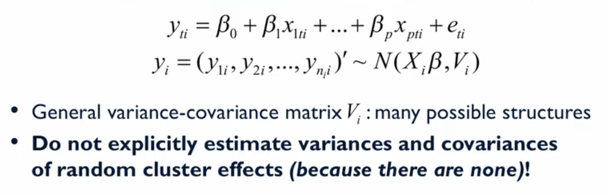
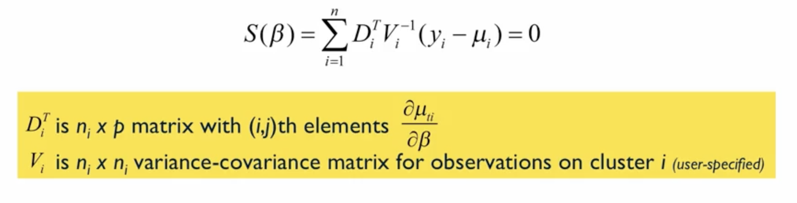
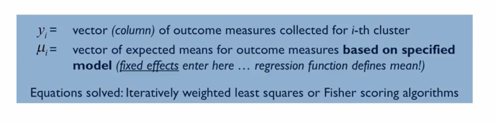

# Marginal Linear Regression Models

## 1. The Intuitive Idea: A Refresher on the Marginal Approach

In the last lecture, we introduced the concept of **marginal models** as an alternative to multilevel models (MLMs) for handling dependent data. It's crucial to remember the fundamental difference in the research question they answer:

*   **Multilevel Model (MLM):** Asks a *conditional* or *cluster-specific* question. It estimates cluster-specific effects (e.g., a unique line for each interviewer) and is interested in the variance *between* those clusters.
*   **Marginal Model:** Asks a *population-average* question. It estimates one single, overall relationship averaged across all clusters and is **not** interested in estimating the variance between them. Its main goal is to get this average effect right while correctly adjusting the standard errors for the clustered nature of the data.

Today, we focus on applying this marginal philosophy to **continuous** outcomes using a technique called **Generalized Estimating Equations (GEE)**.

## 2. The Theoretical Framework: Generalized Estimating Equations (GEE)

GEE is the primary computational engine used to fit marginal models. Let's look under the hood.

### The Marginal Model Equation
The equation for a marginal linear model looks deceptively simple, very much like a standard linear regression model. The key is what's *missing*.  

$$
Y_{ij} = \beta_0 + \beta_1X_{ij} + e_{ij}
$$

Notice the complete absence of any random effect terms (like $u_{0j}$). The model only contains **fixed effects** ($\beta_0, \beta_1$) which represent the population-average intercept and slope.

The dependency in the data isn't modeled via random effects; it's handled by specifying the correlation structure of the error terms ($e_{ij}$) within each cluster.

    

### How GEE Finds the Coefficients
Instead of maximizing a likelihood function (like in MLM), GEE works by solving a complex equation called a **score function** or an **estimating equation**. The goal is to find the values for the $\beta$ coefficients that make this equation balance out to zero.

    
    

While the math is complex, involving matrix algebra and derivatives, the core idea is that the algorithm iteratively searches for the population-average coefficients while accounting for the specified within-cluster correlation.

### The "Working" Correlation Matrix: The User's Job
The most important choice a user makes when fitting a GEE model is selecting a **"working" correlation structure**. This is your best guess about the pattern of correlation among observations within a cluster. Common choices include:

1.  **Independence:** Assumes zero correlation. (This defeats the purpose of GEE but can be a useful baseline for comparison).
2.  **Exchangeable:** Assumes a single, constant correlation between any two observations in the same cluster. Best for clustered data without a time element (e.g., students in a school).
3.  **Autoregressive (AR-1):** Assumes observations closer in time are more strongly correlated than those further apart. Best for longitudinal data.
4.  **Unstructured:** Makes no assumptions. It estimates a unique correlation for every possible pair of observations within a cluster. This is the most flexible but requires the most data.

### The "Magic" of GEE: Robustness
A fantastic feature of GEE is its **robustness**.
*   The estimates of the regression coefficients ( $\beta$'s) are **consistent** (they get closer to the true population value as sample size increases) **even if you choose the wrong working correlation structure!**
*   However, a poor choice of correlation structure will affect the **standard errors**. Choosing a structure that fits the data well leads to more efficient and reliable standard errors.

## 3. Comparing Models and Making Inferences

*   **Inference:** Hypothesis tests for the $\beta$ coefficients are typically done using **Wald tests**. The standard errors used in these tests are calculated using a special **"sandwich estimator"** which is robust to the clustering.
*   **Model Comparison:** To help choose the best working correlation structure, we can use an information criterion similar to AIC, but adapted for GEE. The most common one is the **QIC (Quasi-Information Criterion)**. Just like with AIC, the model with the **lower QIC value** is preferred.

## 4. Application: Revisiting the European Social Survey (ESS) Data

Let's re-analyze the ESS data using a marginal model to see how the results and interpretation differ from our previous MLM analysis.

*   **Goal:** Estimate the population-average relationship between `Trust in Police` and `Perceived Helpfulness`.
*   **Clustering:** Account for the fact that observations are clustered by `Interviewer`.
*   **GEE Setup:** We'll fit a marginal linear model using GEE with an **exchangeable** working correlation structure (since there is no time ordering of respondents within an interviewer).

### The Results

| Parameter | GEE (Marginal) Estimate | MLM (Conditional) Estimate |
| :--- | :---: | :---: |
| **Slope for Trust in Police** | **0.04** | **0.12** |
| p-value | 0.054 | < 0.05 (was significant) |

### The Interpretation: This is the Critical Part

The estimates (0.04 vs. 0.12) are very different! This is not a mistake; it's because they are answering different questions.

*   **MLM Interpretation (Conditional):** "For a **given, specific interviewer**, a one-unit increase in a respondent's trust in police is associated with a **0.12-unit** increase in their perceived helpfulness, on average." This is a *within-interviewer* effect.

*   **GEE Interpretation (Marginal):** "**Averaged across all interviewers in the population**, a one-unit increase in a respondent's trust in police is associated with a **0.04-unit** increase in their perceived helpfulness, on average." This is the *population-average* effect.

In this case, the marginal, population-average relationship is weaker and not statistically significant at the 0.05 level.

### Model Diagnostics
*   We can compare the fit of our chosen `exchangeable` structure to a simple `independence` structure.
    *   QIC (Exchangeable): 6790.61
    *   QIC (Independence): 6791.55
*   The QIC for the exchangeable model is slightly lower, providing evidence that accounting for the correlation within interviewers did improve the model fit, justifying the use of GEE over a simple linear regression.

## 5. Key Takeaways

Marginal models, fit via GEE, provide a powerful, fast, and robust alternative to MLMs when the research question is about the **population-average effect**. The key is to correctly specify the mean structure and make a reasonable choice for the working correlation structure to get accurate standard errors.

---

**Next:** [Marginal Logistic Regression](./09_marginal_logistic_regression.md)