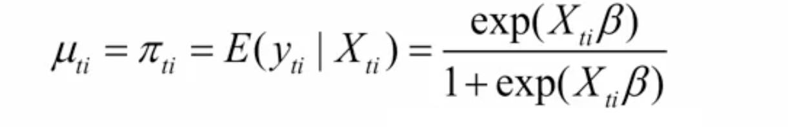
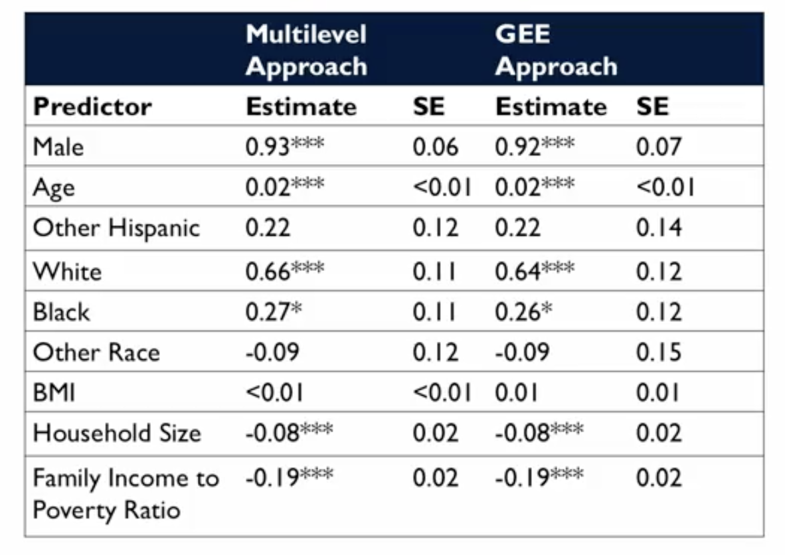

# Marginal Logistic Regression

## 1. The Intuitive Idea: A Population-Average View for Yes/No Questions

We've established that for dependent data, we have two main philosophical approaches:
*   **Multilevel Models (MLMs):** Give a *cluster-specific* answer.
*   **Marginal Models (via GEE):** Give a *population-average* answer.

In this lecture, we apply the marginal modeling philosophy to **binary (Yes/No) outcomes**. This is the direct counterpart to the multilevel logistic regression we covered earlier.

The research question remains the same—we want to understand the relationship between predictors and a binary outcome—but our perspective shifts. Instead of asking "For a specific geographic area, how does age affect the odds of smoking?", we now ask, "**Averaged across all geographic areas in the population**, how does age affect the odds of smoking?"

We are no longer trying to estimate *how much* smoking rates vary between areas; we simply want to get the correct overall, population-average relationships while properly adjusting our standard errors for the fact that the data is clustered.

## 2. The Theoretical Framework: GEE for Binary Outcomes

The Generalized Estimating Equations (GEE) framework was specifically designed to handle non-normal longitudinal or clustered data, making it a natural fit for binary outcomes.

### Modeling the Mean and Variance
Recall that for a binary variable, the **mean** is simply the probability of success, `P(Y=1)`. In logistic regression, we model this mean using the logit link function:  

$$
\text{logit}(P) = \ln\left(\frac{P}{1 - P}\right) = \beta_0 + \beta_1X_1 + \dots
$$

    

A unique feature of binary data is that its **variance is determined by its mean**:  

$$
\text{Variance}(Y) = P \times (1 - P)
$$

This simplifies things for us. Once we have specified the model for the mean (the logistic regression part), the model for the variance is automatically defined. The only remaining task for the user is to specify the **working correlation structure** for the observations within each cluster.

## 3. Application: Revisiting the NHANES Smoking Data with GEE

Let's re-analyze the NHANES smoking data using a marginal logistic regression model and compare the results to our previous multilevel logistic regression analysis.

*   **Goal:** Estimate the population-average relationships between demographic predictors and the probability of ever smoking.
*   **Clustering:** Account for the fact that observations are clustered by geographic sampling area.
*   **GEE Setup:** We fit a marginal logistic model using GEE, specifying an `exchangeable` working correlation structure as our initial guess.

### The Results: A Surprising Similarity

The table below compares the estimated coefficients (on the log-odds scale) and standard errors from the two different approaches.

**Key Observation:** The results from the two methods are remarkably similar.
*   **Coefficients:** The estimated effects for predictors like `Male`, `Age`, and `Family Income` are nearly identical in both models.
*   **Standard Errors:** The standard errors are also very similar.
*   **Inference:** The same predictors are found to be statistically significant in both analyses. For example, being male and older are associated with higher odds of smoking, while having a larger household size or higher income-to-poverty ratio is associated with lower odds.

#### Why are they so similar here?
While the *interpretation* is always different (conditional vs. marginal), the numerical results of MLMs and GEEs can be very close, especially when the amount of between-cluster variance is small. In this specific case, the dependency introduced by the clustering was not strong enough to create a large divergence between the two types of estimates.

#### The Crucial Difference Remains Interpretation:
*   **MLM:** The coefficient for `Male` represents the effect of being male *within a given geographic cluster*.
*   **GEE:** The coefficient for `Male` represents the effect of being male *averaged across all geographic clusters in the population*.

### Model Diagnostics for GEE
We need to check if our choice of the `exchangeable` working correlation structure was reasonable. We do this by comparing its QIC value to a model with an `independence` structure.

*   **QIC (Exchangeable):** 628.534
*   **QIC (Independence):** 628.054

**Conclusion:** The QIC for the `independence` model is slightly **lower** (better). This suggests that the within-cluster correlation is very weak, and a model that assumes independence is just as good, if not slightly better, in this specific case. This aligns with the "nuisance" correlation estimate from the exchangeable model, which was only 0.01.

This is an interesting finding because our MLM analysis *did* find the random intercept variance to be statistically significant. This highlights a subtle point: MLMs and GEEs conceptualize and test for dependency in different ways, and they can occasionally lead to slightly different conclusions about the importance of that dependency, even while giving similar results for the fixed effects.

## 4. Summary

*   Marginal logistic regression, fit via GEE, is the primary alternative to multilevel logistic regression for clustered binary data.
*   It provides **population-average** estimates of the predictor effects, which can be easier to interpret and communicate than the cluster-specific estimates from an MLM.
*   The GEE approach is computationally efficient and robust. The user's main job is to specify the mean model (the logistic regression equation) and a working correlation structure.
*   In the NHANES smoking example, the GEE and MLM approaches yielded very similar numerical results for the fixed effects, though their interpretation remains fundamentally different.
*   Model selection in GEE, using tools like QIC, can help determine the most appropriate working correlation structure and assess the strength of the dependency.

## 5. What's Next?
You will now have the opportunity to get hands-on practice fitting both marginal linear (GEE) and marginal logistic (GEE) models using Python in a Jupyter Notebook, allowing you to interpret the results and compare different modeling choices for yourself.