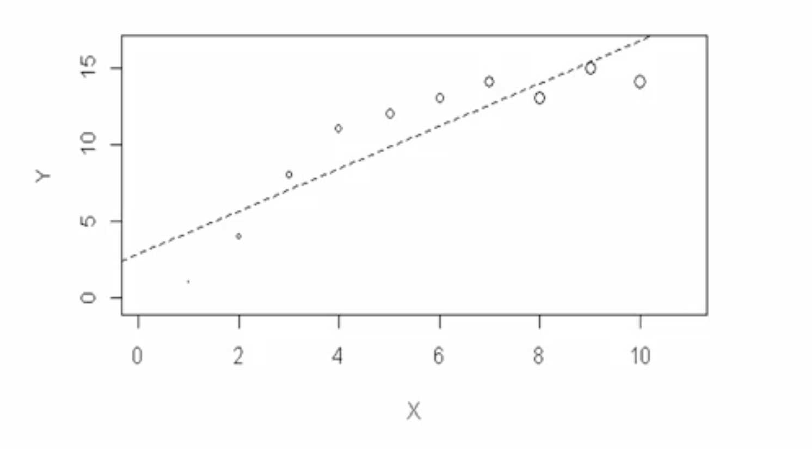
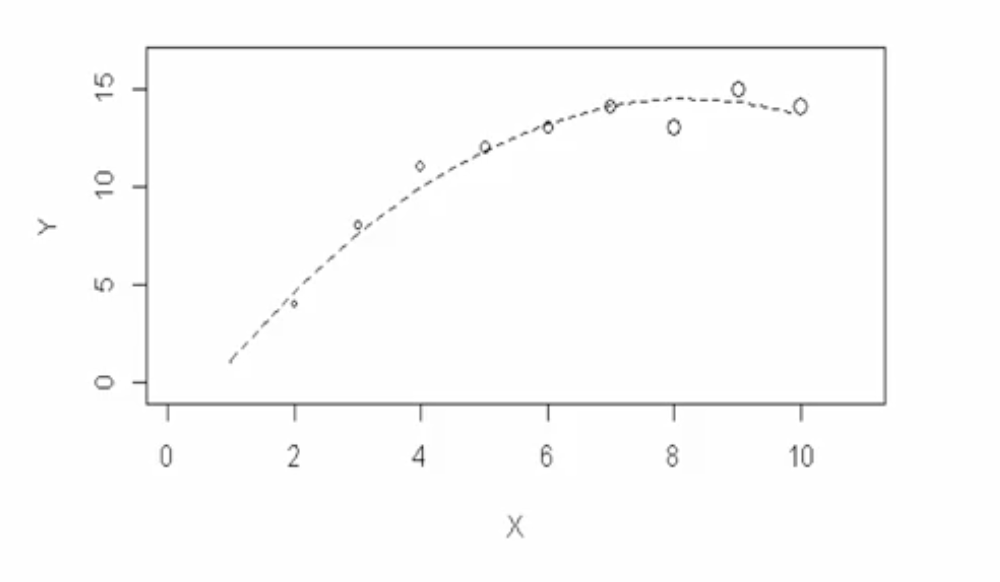
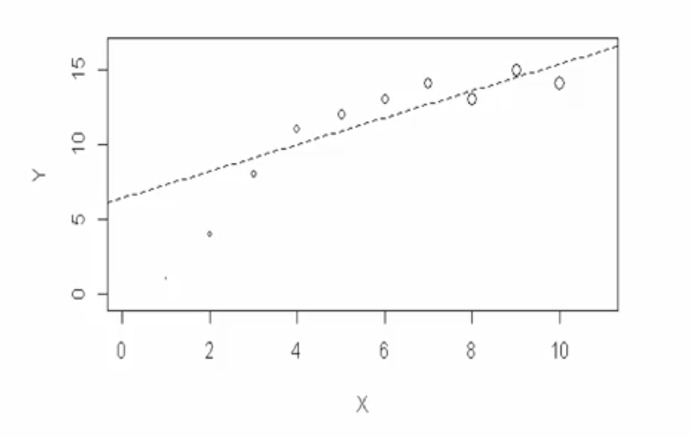
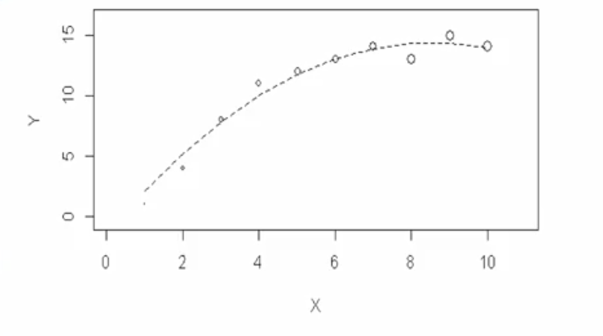

# Should We Use Survey Weights When Fitting Models?

## 1. The Intuitive  Idea: Correcting for a "Warped" Sample

Imagine you want to understand the average height of people in your country. If your sample accidentally includes too many professional basketball players, your sample average will be way too high. **Survey weights** are the statistical tool to fix this. They give a "smaller voice" (lower weight) to the overrepresented basketball players and a "louder voice" (higher weight) to the underrepresented shorter people, so your final estimate is an **unbiased** reflection of the true population.

This is straightforward for calculating a mean. But the question becomes much more complex when fitting a **regression model**.

The central tension is this:
* **The Argument FOR Weights:** They ensure your model's coefficients (slopes, intercepts) are unbiased estimates of the *true population relationships*.
* **The Argument AGAINST Weights:** If your model is **well-specified** -meaning it already includes the very factors that make the sample unrepresentative (e.g., you've included "age" as a predictor, and your sample is skewed by age)- then the model _itself_ is already making the correction. Adding weights on top might be unnecessary and could even harm your analysis by inflating standard errors, making it harder to detect real effects.

This lecture explores the trade-offs in four key scenarios.

## 2. The Four Scenarios: A 2x2 Guide to Weights and Model Specification
The decision of whether to use weights interacts critically with how well your model is specified. Let's visualize the four possible outcomes. In the plots below, the size of each dot represents its survey weight.

| | **Poorly Specified Model** (e.g., fitting a straight line to a curve) | **Well-Specified Model** (e.g., fitting a curve to a curve) |
| :--- | :--- | :--- |
| **Weights IGNORED** |    **The Worst Case.** The line is biased towards the low-weight points (the crowd) and misses the true population relationship. It's a biased estimate of a wrong model. **(BAD, BAD)** |    **The Model-Based Ideal.** The curved line fits the data well. Because the model correctly captures the relationship, it inherently accounts for why different points behave differently, potentially making weights unnecessary. **(GOOD)** |
| **Weights USED** |    **The "Correct Estimate of the Wrong Thing" Case.** The line is correctly pulled towards the high-weight points. You get an unbiased estimate of the best *wrong* (linear) model for the population. You've precisely estimated a flawed relationship. **(GOOD, BAD)** |    **The Safest Approach.** The curved line fits the data well and is guaranteed to be an unbiased estimate for the population. The only potential downside is that using weights might have unnecessarily inflated your standard errors. **(GOOD, GOOD-ish)** |

## 3. Practical Recommendations for Your Analysis

Since we can never be 100% certain that our model is "perfectly specified" (as George Box said, "All models are wrong, but some are useful"), we need a practical strategy.

#### Step 1: Focus on Model Specification First
Before even thinking about weights, do your best to build a good model. Use your subject matter knowledge, look at scatterplots, check for nonlinear relationships, and consider interaction terms. Good model specification is your primary defense against bias.

#### Step 2: Fit the Model TWICE
Modern software makes this easy. Fit your chosen model once _without_ weights and once _with_ weights. Then compare the results.

#### Step 3: Analyze the Comparison

* **Scenario A: Coefficients are similar, but weighted model has much larger standard errors.**
    * **Diagnosis:** This is strong evidence that your model is well-specified. It's already capturing the relationships that the weights are trying to correct for. The weights are not adding new information, they are just adding noise and reducing your statistical power.
    * **Action:** You can confidently **report the unweighted results**, perhaps noting in a footnote that a weighted analysis produced similar coefficients but with less precision.
* **Scenario B: Coefficients change substantially when weights are added.**
    * **Diagnosis:** This is a red flag. It signals that your model is likely misspecified. The weights are correcting for a factor that your model has missed. The difference between the weighted and unweighted coefficients *is* the bias that the weights are removing.
    * **Action:** You should **report the weighted estimates**. Because your model is imperfect, the weighted results are your best bet for an unbiased estimate of the population-average relationships. It's better to have an unbiased estimate of a potentially imperfect model than a biased estimate.

## 4. Conclusion

The decision to use survey weights in regression is not a simple "yes" or "no". It's an analytical process. By fitting your model both with and without weights and comparing the results, you gain critical insight into both your model's specification and the nature of your sample. When in doubt, or when the coefficients change significantly, using weights is the safer, more conservative choice to ensure your results are unbiased with respect to the complex sample design.

--

**Next:** [Introduction to Bayesian](./03_introduction_to_bayesian.md)