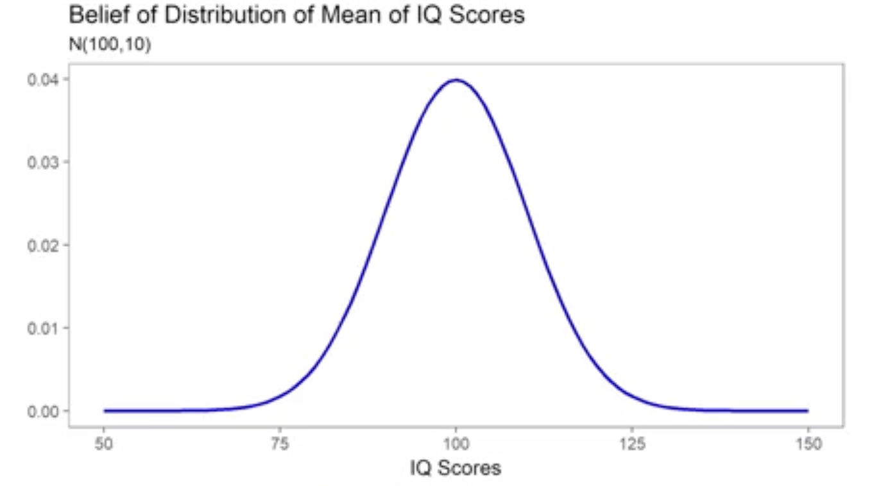
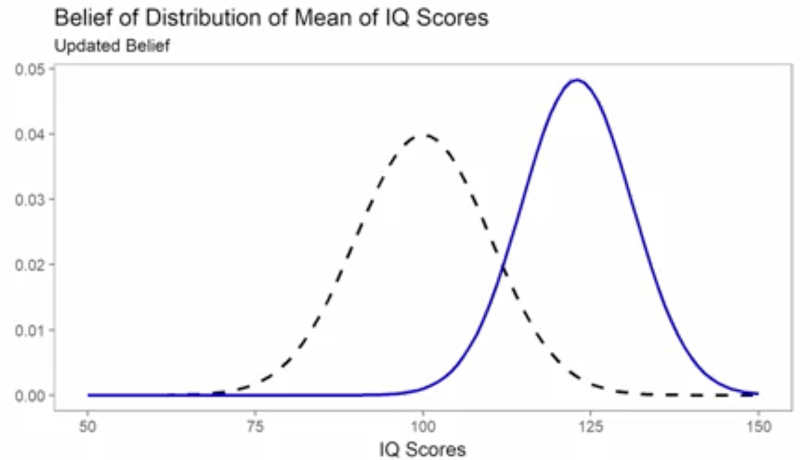
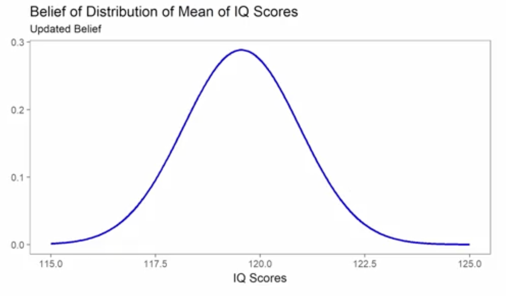

# Bayesian Approaches to Statistics and Modeling

## 1. The Intuitive Idea: A Distribution of Belief vs. A Single Best Guess

In the **Frequentist** world we've primarily studied, our goal is to find the single "best" estimate for a parameter. For example, using Maximum Likelihood, we might conclude that the best estimate for the average IQ is `118`. We then use standard errors and confidence intervals to describe our uncertainty _around_ that single point. The parameter itself is considered a fixed, unknown constant.

**Bayesian** methods approach this fundamentally differently. Instead of finding one best value, the goal is to create an **entire probability distribution** for the parameter of interest. This distribution represents our *belief* about all possible values the parameter could take.

Instead of saying "the answer is 118", a Bayesian says, "I believe the answer is *probably* around 119, but it could plausibly be 117 or 121. Here is a full distribution showing how likely I think every possible value is."

## 2. The Bayesian Workflow in Action: The IQ Example

Let's walk through the core Bayesian process with a practical example: **"What is the average IQ of students at the University of Michigan?"**

#### Step 1: The Prior Belief ("Where do I start?")
Before collecting any data, I must state my initial belief. This is my **prior distribution**. Since I don't know much about University of Michigan students specifically, I'll start with a general belief based on the US population:
* I'll assume the average IQ is centered at **100** with a standard deviation of **10**. 
* Because I'm not very confident, I'll use a wide distribution (large variance). A more confident prior would have a narrower, taller shape.

This prior is my starting point. It's subjective, and another researcher could start with a different prior (e.g., believing the average is higher, or that the distribution is skewed).

#### Step 2: Collect Data
I go out and find one student. Their IQ is **125**.

#### Step 3: Update the Belief
How should my belief change after seeing this single data point?
* My prior was centered at 100.
* I observed data at 125.
* My updated belief should be somewhere in between. The new data "pulls" my belief towards it.

My new distribution will be shifted to the right, now centered somewhere around 124. This is **Bayesian updating**.

#### Step 4: Collect More Data and Create the Posterior

I continue this process, collecting more data points: 115, 115, 120, 125, 117...

With each new data point, I repeat the updating process. Two crucial things happen:
1. The **center** of my belief distribution continues to shift based on the new evidence. 
2. The **variance** of my belief distribution **decreases**. As I collect more data, I become more certain about the true value, so my distribution of belief gets narrower and more focused.

After collecting all my data, the final, updated distribution is called the **posterior distribution**. This distribution represents my complete belief about the average IQ, having combined my initial prior with all the evidence from the data.

## 3. What Can We Do With a Posterior Distribution?

The posterior distribution is the final product of a Bayesian analysis. It's incredibly powerful because it allows us to answer questions in a direct, probabilistic way.

#### What is my best guess? 
* **Mean:** The average of the posterior distribution (e.g., 119.55)
* **Median:** The 50th percentile of the distribution.
* **Mode (MAP):** The most likely values, or the peak of the distribution.

#### What is plausible range of values?
We can calculate a **95% Credible Interval**. This is the Bayesian analogue to a confidence interval, but with a more intuitive and more direct interpretation.
* **Credible Interval Interpretation:** "Based on my model and the data, there is a **95% probability** that the true average of IQ of University of Michigan students lies between 116 and 122."
* **Confidence Interval (Frequentist) Interpretation:** "If I were to repeat this study many times, 95% of the calculated confidence intervals would contain the true average IQ." The

## 4. The "No Free Lunch" Principle: Pros and Cons

The enhanced interpretability of Bayesian methods comes at a cost.

#### Advantages
* **Intuitive Interpretations:** We can make direct probability statements about parameters (e.g., "95% probability the parameter is in this range").
* **Full Distribution:** Provides a complete picture of our uncertainty, not just a point estimate and standard error.
* **Incorporates Prior Knowledge:** Formally allows us to blend existing knowledge with new data.

#### Disadvantages
* **Requires a New View of Probability:** We must accept that probability is a "degree of belief", not a long-run frequency.
* **Mathematically Difficult:** The process of updating the prior with data (which involves Bayes' Theorem) often involves complex, high-dimensional integrals that can be intractable to solve by hand.
* **Computationally Expensive:** Because the math is hard, most modern Bayesian analysis relies on computationally intensive sampling methods (like Markov Chain Monte Carlo, or MCMC) to approximate the posterior distribution. This can take a lot of time and computing power.

---

**Next:** [Bayesian Approaches Case Study: Part I](./05_bayesian_approaches_case_study_part_1.md)