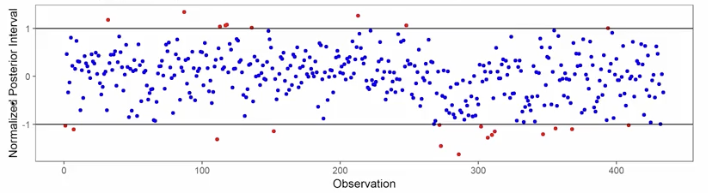
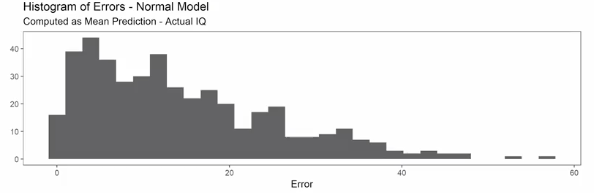
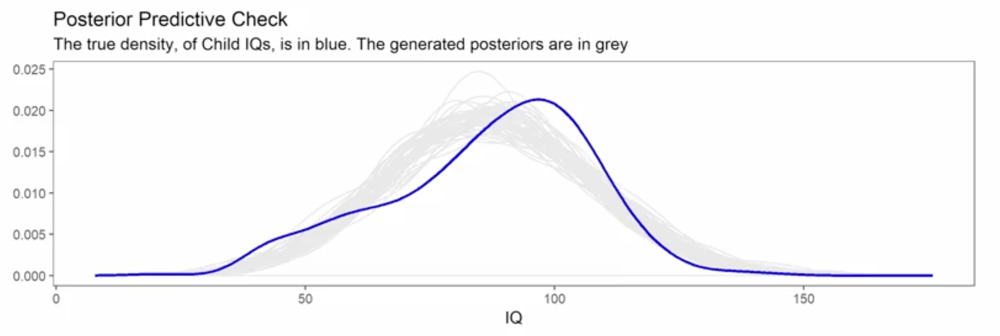

# Bayesian Approaches Case Study: Part II

## 1. The Intuitive Idea: Checking Our Work
In Part I, we meticulously set up our model by defining our prior beliefs. Now, after running the model using STAN, we have our results. This lecture is all about **interpreting those results and critically evaluating our model's performance**.

The core difference from a Frequentist approach is immediately apparent. Instead of getting a single point estimate and a standard error for each parameter, a Bayesian analysis gives us a **full posterior distribution** for everything. Our job is to explore these distributions to understand what we've learned and to use them to check if our model is a good representation of reality. 

## 2. The Posterior Distribution: Our Updated Beliefs
The primary output of our model is the set of posterior distributions for the parameters: `β₀` (Intercept), `β₁` (momIQ slope), `β₂` (momAge slope), and `σ` (the model's error term). These are represented as histograms, which are approximations generated by the MCMC sampler.

*   **Intercept (`β₀`):** The distribution is tightly centered around 0. This is expected, as we centered our predictor variables before fitting the model.
*   **Mother's IQ Slope (`β₁`):** This is the key parameter. The distribution is centered around **0.6** and is clearly positive (the entire distribution is well above zero). This provides strong evidence for a positive relationship between a mother's IQ and her child's IQ. Our belief has updated from a vague prior to a more confident prior.
*   **Mother's Age Slope (`β₂`):** This distribution is much wider and centered close to zero. Crucially, the value `0` is well within the bulk of the distribution. This tells us that, after accounting for the mother's IQ, there is **no strong evidence** that the mother's age has any effect. We remain very uncertain about this parameter.
*   **Model Error (`σ`):** This distribution tells us about the model's overall predictive uncertainty. It's centered around **18.2**, meaning that on average, we can expect a typical prediction to be off by 18 IQ points. This suggests that our model is not very precise.

## 3. Checking for Collinearity: The Pair Plot
We can also examine the relationships *between* the posterior samples of our parameters. If two parameters were strongly correlated, it would indicate multicollinearity.

The scatterplots show diffuse, cloud-like shapes with no clear positive or negative trends. This is great news! It suggests that our parameter estimates are not tangled up with each other and that multicollinearity is not a problem in this model.

## 4. The Power of Bayesian Prediction: Generating New Data
A major advantage of the Bayesian framework is the ability to generate **posterior predictive distributions**.

**The Process:**  
1. We have thousands of samples from the posterior distribution of each parameter (`β₀`, `β₁`, `β₂`).
2. To make prediction for a new mother (e.g., IQ=100, Age=25), we don't just calculate one outcome.
3. Instead, we take each set of sampled parameters, plug them into our regression equation, and generate a predicted `kidScore`.
4. By doing this thousands of times, we build up an **entire distribution of possible outcomes** for that specific new mother, fully propagating our uncertainty about the parameters into our prediction.

A Frequentist model gives a single point prediction and a standard error. A Bayesian model gives a full probability distribution of what to expect.

## A Gallery of Posterior Predictive Checks

We use these predictive distributions to diagnose our model's performance.

### Normalized Predictive Intervals ("Caterpillar Plot")
This plot visualizes whether our model's 95% predictive intervals captured the true, observed data points for all 434 children in the dataset.

* **Interpretation:** Each dot represents one child. The line spans the 95% predictive interval. The dot shows where the child's *actual* IQ score fell within that interval.
*   **Blue Dots (Inside):** The model's 95% interval successfully captured the true value.
*   **Red Dots (Outside):** The model's 95% interval **missed** the true value. These are our model's mistakes.
*   **Findings:**
    *   **Good News:** Roughly 5% of the points are red, which is what we'd expect from a 95% interval. Our intervals are reasonably well-calibrated.
    *   **Bad News:** Notice the cluster of red dots at the bottom (the low end). Our model seems to be systematically failing to predict the lowest IQ scores.

### Histogram of Prediction Errors
This plot shows the distribution of our model's mistakes (Predicted Mean - Actual Value).

*   **Findings:** While most errors are clustered around zero, there is a **long right tail**. This means our model has a few predictions where the actual IQ was *much lower* than our prediction (e.g., we predicted 100, the reality was 60, so the error is +40). This confirms our model struggles with the children on the low end of the IQ spectrum.

### The Main Posterior Predictive Check (Density Overlay)

This is one of the most important diagnostic plots. It compares the distribution of our actual, observed data to the distributions of simulated data generated by our model.

*   **Blue Line (`y`):** The distribution of the **real** `kidScore` data.
*   **Gray Lines (`y_rep`):** Many simulated datasets generated from our model's posterior predictive distribution.
*   **Interpretation:** If the model were a perfect fit, the gray lines would closely trace the blue line.
*   **Findings:**
    *   **Systemic Bias:** The gray lines are consistently shifted to the right of the blue line's peak. This means our model tends to **overestimate** IQ scores in the 65-80 range and **underestimate** them in the 90-115 range.
    *   **The Left Tail Problem:** The model completely fails to replicate the "bump" in the real data on the far left tail (around IQ 50-70). Our assumption of normally distributed errors prevents the model from generating these low values.

## 6. Summary of Our Model Deficiencies
Our diagnostic checks have revealed several key problems with our simple linear model:
1. We haven't used the `momHS` variable yet.
2. Our predictive uncertainty is very high (95% interval width is ≈71 IQ points).
3. The model systematically over- and under-predicts in different regions.
4. The model completely fails to account for the group of children with very low IQ scores, suggesting our assumption of normal errors is flawed.

---

**Next:** [Bayesian Approaches Case Study: Part III](./07_bayesian_approaches_case_study_part_3.md)