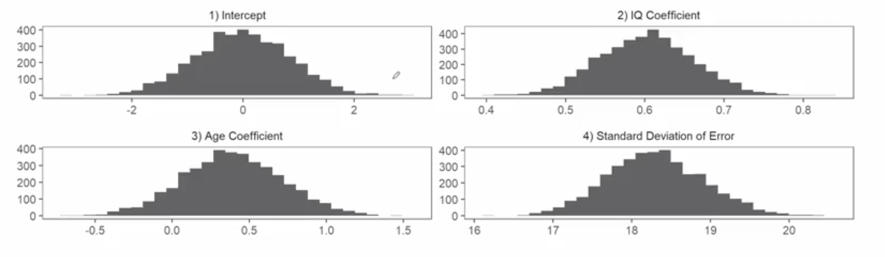
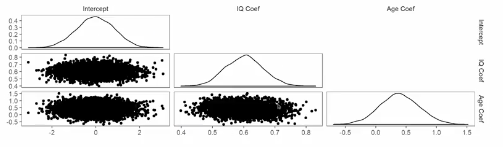

# Bayesian Approaches Case Study: Part II

## 1. The Intuitive Idea: Checking Our Work
In Part I, we meticulously set up our model by defining our prior beliefs. Now, after running the model using STAN, we have our results. This lecture is all about **interpreting those results and critically evaluating our model's performance**.

The core difference from a Frequentist approach is immediately apparent. Instead of getting a single point estimate and a standard error for each parameter, a Bayesian analysis gives us a **full posterior distribution** for everything. Our job is to explore these distributions to understand what we've learned and to use them to check if our model is a good representation of reality. 

## 2. The Posterior Distribtuion: Our Updated Beliefs
The primary output of our model is the set of posterior distributions for the parameters: `β₀` (Intercept), `β₁` (momIQ slope), `β₂` (momAge slope), and `σ` (the model's error term). These are represented as histograms, which are approximations generated by the MCMC sampler.

*   **Intercept (`β₀`):** The distribution is tightly centered around 0. This is expected, as we centered our predictor variables before fitting the model.
*   **Mother's IQ Slope (`β₁`):** This is the key parameter. The distribution is centered arounr **0.6** and is clearly positive (the entire distribution is well above zero). This provides strong evidence for a positive relationship between a mother's IQ and her child's IQ. Our belief has updated from a vague prior to a more confident prior.
*   **Mother's Age Slope (`β₂`):** This distribution is much wider and centered close to zero. Crucially, the value `0` is well within the bulk of the distribution. This tells us that, after accounting for the mother's IQ, there is **no strong evidence** that the mother's age has any effect. We remain very uncertain about this parameter.
*   **Model Error (`σ`):** This distribution tells us about the model's overall predictive uncertainty. It's centered around **18.2**, meaning that on average, we can expect a typical prediction to be off by 18 IQ points. This suggests that our model is not very precise.

## 3. Checking for Collinearity: The Pair Plot
We can also examine the relationships *between* the posterior samples of our parameters. If two parameters were strongly correlated, it would indicate multicollinearity.

