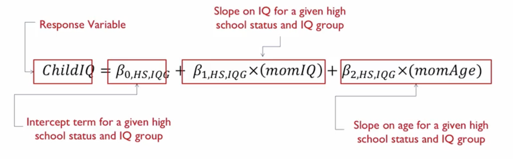
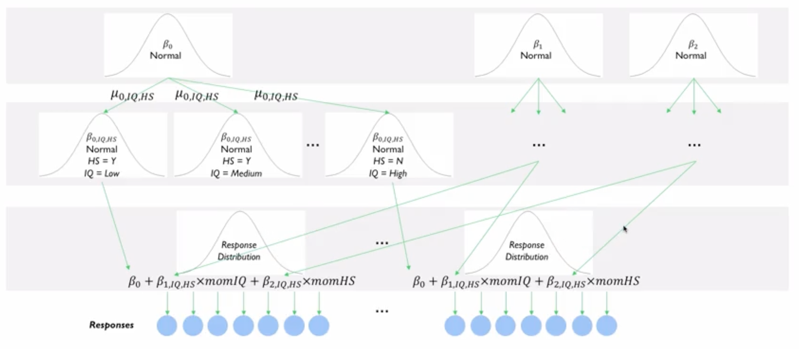
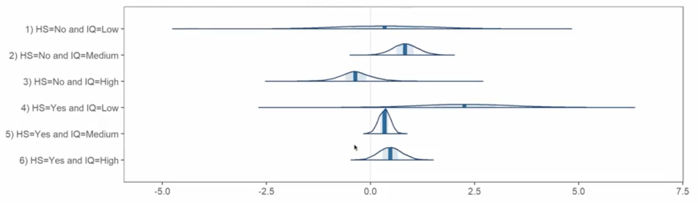
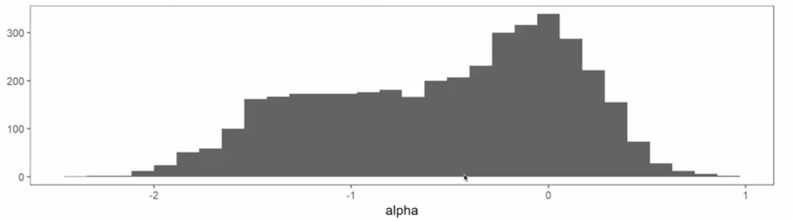
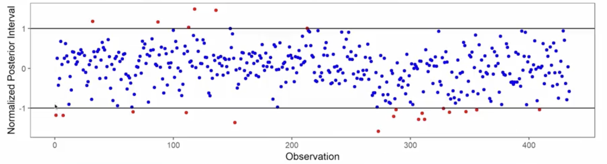
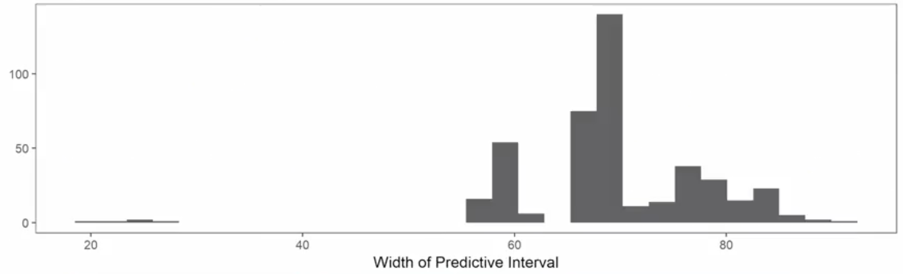
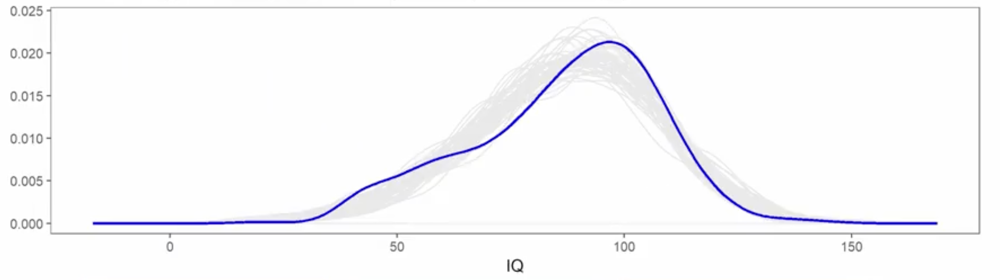

# Bayesian Approaches Case Study: Part III

## 1. The Intuitive Idea: Fixing a Flawed Model

In Part II, we built a simple linear model and, through a series of diagnostic checks, found it to be flawed. It systematically mispredicted certain groups and failed to capture the full shape of the data.

This lecture is about **model iteration**. We will take the lessons learned from our first attempt and build a more complex, and hopefully more accurate, model. This process of diagnosing, improving, and re-evaluating is the very essence of applied statistical modeling. As the saying goes, "All models are wrong, but some are useful." Our goal is to make our model *more useful*.

## 2. The Roadmap for Improvement: The Two Key Upgrades

Based on the deficiencies we identified, we will make two major upgrades to our model.

### Upgrade 1: Add a Hierarchical (Multilevel) Structure
* **The Problem:** Our first model was a "one-size-fits-all" approach, assuming the relationship between a mother's IQ and her child's IQ was the same for everyone.
* **The Solution:** We will now allow this relationship to vary across different groups of mothers. We'll create six distinct groups by combining two variables:
    1. `momHS`: Whether the mother attended high school (Yes/No).
    2. `momIQ`: Binned into three levels (Low: <85, Medium: 85-115, High: >115).
* **The Effect:** Our new model will fit a separate intercept (`β₀`) and separate slopes (`β₁`, `β₂`) for each of these six groups. This is a **hierarchical model**.

### Upgrade 2: Use a Skew-Normal Error Distribution
* **The Problem:** Our first model assumed normally distributed errors, which caused it to completely miss the "left tail" of low-IQ children in the real data.
* **The Solution:** We will replace the `Normal` distribution for our model's errors with a `Skew-Normal` distribution. This distribution has an extra parameter that allows it to be non-symmetrical, giving the model the flexibility to capture the observed left-skew in the data.

Therefore, the formula for our new model will be:

## 3. Conceptualizing the Hierarchical Model

The hierarchical structure adds a new layer of complexity, but it can be understood with a "top-down" generative story:

1. **Global Parameters (Top Level):** Imagine there are "global" or population-average parameters for intercept and slopes, just like in our first model. These are the parent distributions.
2. **Group-Level Parameters (Middle Level):** For each of the six groups (e.g., "High School: Yes, IQ: Low), the model *draws* a specific intercept and slope from the global parent distributions. This allows each group to have its own unique parameters, but they are all still related to each other through the common parent. This relationship "shrinks" or "regularizes" the group-level estimates, preventing any single group from having a wildly different slope just due to random chance.
3. **Data (Bottom Level):** The individual data points for the children within a specific group are then generated from a distribution using that group's unique parameters.

This structure explicitly states our belief: mothers in different educational and IQ brackets might have different relationships between their characteristics and their child's IQ, and we want to model that.

## 4. Interpreting the New Model's Results

### Posterior Distributions for Group-Level Slopes

Instead of one posterior for the `momIQ` slope, we now have six-one for each group.

* **Varying Uncertainty:** Notice the difference in the widths of the distributions. The posterior for the "High School: No, IQ: Low" group is very wide, indicating high uncertainty. This is because there are very few mothers in this group in our dataset. In contrast, the "High School: Yes, IQ: Medium" group has a much narrower posterior, indicating more certainty.
* **An Interesting Finding (Inference):** Look at the "High School: No, IQ: High" group. The posterior distribution for the `momIQ` slope is centered on a *negative* value. This suggests a potential "regression to the mean" effect for this specific group, an insight that was completely hidden in our simpler model.

### The Skew Parameter

Our new model included a parameter to capture skewness.

The posterior distribution for this parameter is almost entirely on the negative side of zero. This provides strong evidence that the data *is* indeed left-skewed, confirming that our decision to use a Skew-Normal distribution was a good one.

## 5. Did the Model Actually Improve? The Predictive Checks

We re-run the same diagnostic plots from Part II to see if our upgrades worked.

#### Normalized Predictive Intervals:

    
The plot shows that our new model correctly captures some of the low-end observations that it missed before. The first observation, which was previously a "miss" (red dot), is now a "hit" (blue dot).

#### Histogram of Predictive Interval Widths:

Before, all our predictions had roughly the same large uncertainty (≈71 IQ points wide). Now, the histogram shows multiple peaks. This indicates that the model is appropriately more certain about its predictions for some groups (narrow intervals) and less certain for others (wide intervals).

#### The Main Posterior Predictive Check:

This is the most important comparison. While not perfect, the new model (gray lines) does a much better job of tracing the true data distribution (blue line). The systemic over- and under-estimation is reduced, and the model is now much better at capturing the shape of the data, especially the problematic left tail.

## 6. Final Conclusions
* **Was the new model a massive improvement?** In terms of raw predictive accuracy, the improvement was modest. The error distributions still show some large misses.
* **Where did it improve?** The major improvement was in **inference**. The hierarchical model allowed us to uncover group-specific relationships (like the negative slope for one subgroup) that were invisible before. It also gave us a more honest and nuanced picture of our predictive uncertainty.
* **The Bayesian Process:** This case study demonstrates the iterative nature of Bayesian modeling. We started with a simple model, used diagnostics to identify its flaws, and then proposed a more complex model to address those flaws directly. The flexibility of the Bayesian framework allows for this rich, iterative process of model building and refinement.
* **The Trade-Offs:** This power comes at the cost of computational complexity and the need for the analyst to make and justify more assumptions (like the choice of priors and model structure). However, as computational power increases, these powerful methods are becoming more accessible and are an essential tool for modern statistical analysis.

