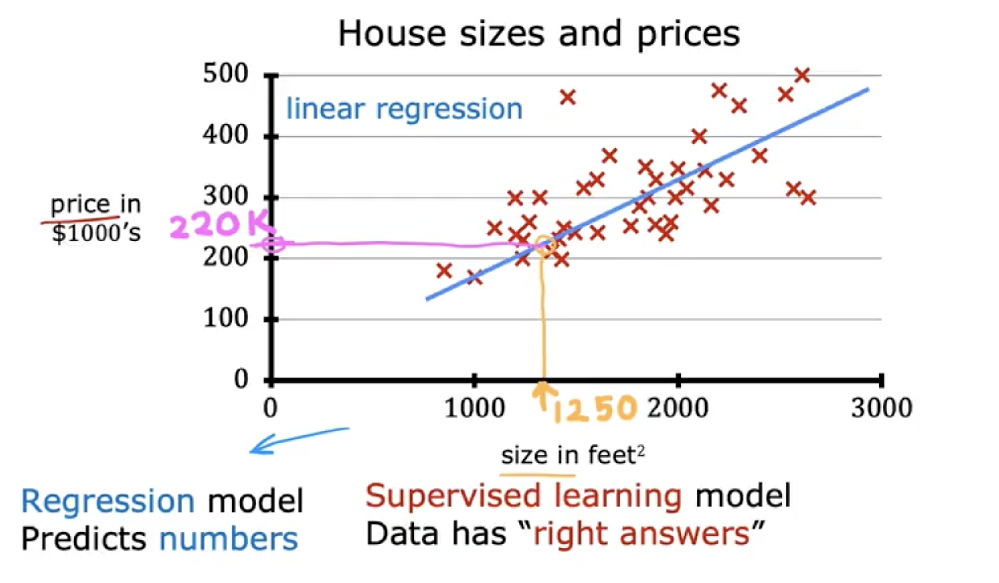

# Regression Model

## Linear Regression Model with One Variable

- **Linear Regression** is one of the most widely used learning algorithms. It fits a straight line to data.
- It is a type of **supervised learning** model.
- It is also a **regression model** because it predicts a continuous numerical output.

### Example: Housing Price Prediction

- **Goal:** Predict the price of a house based on its size.
- **Dataset:** House sizes (input) and their corresponding sale prices (output).
- **Process:**
    1. Plot the data (size vs. price).
    2. Fit a straight line to the data points.
    3. Use the line to predict the price for a new house size (e.g., a 1250 sq ft house might be predicted to sell for $220,000).

### Terminology and Notation
- **Training Set:** The dataset used to train the model.
- **Input Variable (Feature):** The input data, denoted by lowercase $x$ (e.g., size of the house).
- **Output Variable (Target):** The value to predict, denoted by lowercase $y$ (e.g., price of the house).
- **Number of Training Examples:** The total number of data points in the training set, denoted by $m$.
- **A Single Training Example:** A pair $(x, y)$ representing one input and its corresponding output.
- **The $i$-th Training Example:** The $i$-th row in the dataset, denoted as $(x^{(i)}, y^{(i)})$.
    - The superscript $(i)$ is an index, not an exponent. For example, $x^{(1)}$ is the input feature for the first training example.

---

## The Supervised Learning Process

- The **training set** contains both input features $x$ and output targets $y$ (the "right answers").
- The learning algorithm takes the training set and produces a **function** $f$ (the model).
    - $f$ is sometimes called a hypothesis, but here we call it a function or model.
- The model $f$ takes a new input $x$ and outputs a prediction $\hat{y}$ ("y-hat").
    - $y$ is the true value (target), $\hat{y}$ is the model's estimate or prediction.

### Linear Model Representation

- For linear regression, the model is a straight line:  

$$
f_{w,b}(x) = wx + b
$$

... where $w$ and $b$ are parameters (weights/bias) learned from the data.
- Sometimes written simply as $f(x) = wx + b$ for convenience.

### Why Linear?

- Linear (straight line) models are simple and easy to work with.
- They serve as a foundation for more complex, non-linear models (e.g., curves, polynomials).
- **Univariate linear regression** (one input variable) is also called **linear regression with one variable**.

### Data Table and Notation

- The data can be visualized as a table:
    - Each row: $(x^{(i)}, y^{(i)})$ for $i = 1, 2, \ldots, m$
    - $x^{(i)}$: input (e.g., house size)
    - $y^{(i)}$: output (e.g., house price)

---

## Cost Function Formula

- To implement linear regression, the first key step is to define a **cost function**.
- The cost function measures how well the model fits the data.
- **Parameters** $w$ and $b$ (also called coefficients or weights) are adjusted to minimize the cost function.

### Squared Error Cost Function

- For each training example $i$, the model predicts $\hat{y}^{(i)} = f_{w,b}(x^{(i)}) = wx^{(i)} + b$.
- The error for example $i$ is $\hat{y}^{(i)} - y^{(i)}$.
- The squared error for example $i$ is $(\hat{y}^{(i)} - y^{(i)})^2$.

- The **cost function** $J(w, b)$ is defined as the average squared error over all $m$ training examples (with a factor of $1/2$ for convenience):

$$
J(w, b) = \frac{1}{2m} \sum_{i=1}^m \left( f_{w,b}(x^{(i)}) - y^{(i)} \right)^2
$$

- $J(w, b)$ is also called the **squared error cost function**.

- The goal is to find values of $w$ and $b$ that make $J(w, b)$ as small as possible.

---

