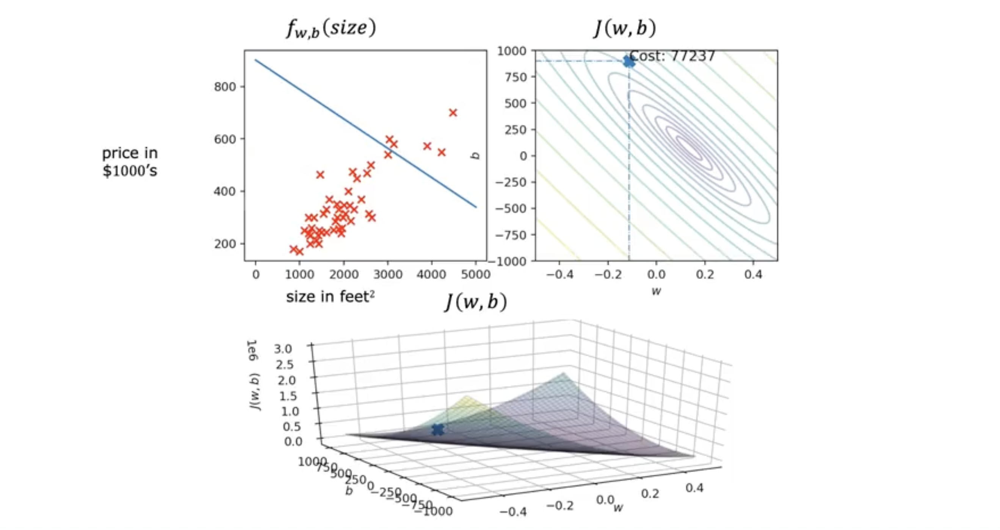
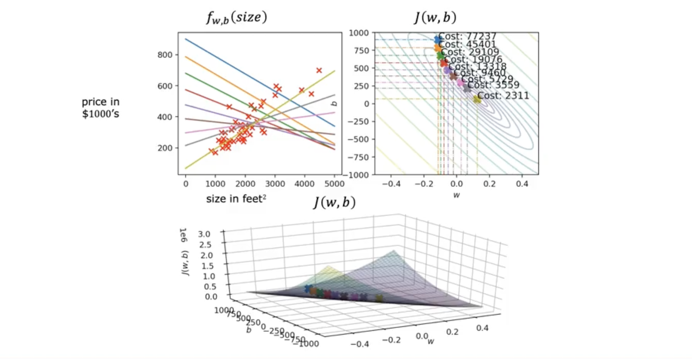

# Training the Model with Gradient Descent

> **Note:** [Gradients](../../../01_math/03_calculus_for_ml_and_ds/03_gradients/) and [gradient descent](../../../01_math/03_calculus_for_ml_and_ds/04_gradient_descent/) are already covered in detail in the **Calculus for Machine Learning and Data Science** course, which is part of the Math pillar in this repository.

## Gradient Descent

- In previous videos, you saw how different choices of parameters $w$ and $b$ affect the cost function $J(w, b)$.
- **Goal:** Find the values of $w$ and $b$ that minimize $J(w, b)$.

### What is Gradient Descent?

- **Gradient descent** is an algorithm to systematically find the minimum of a function (such as the cost function in linear regression).
- It is widely used in machine learning, including for training neural networks (deep learning).

### How Gradient Descent Works

1. **Initialize** the parameters (e.g., $w = 0$, $b = 0$).
2. **Iteratively update** the parameters to reduce the cost $J(w, b)$.
3. At each step, move in the direction of the **steepest descent** (the direction where $J$ decreases the fastest).

- For a cost function $J(w, b)$, you can visualize the surface as a 3D landscape (like hills and valleys).
- Gradient descent is like standing on a hill and always taking a small step in the direction that goes downhill the fastest.
- Repeat this process until you reach a valley (a minimum of the cost function).

### Local Minima

- For simple cost functions (like linear regression with squared error), the cost surface is bowl-shaped and has a single minimum (global minimum).
- For more complex functions (e.g., neural networks), there may be multiple valleys (local minima).
- Where you end up depends on your starting point.

---

## Implementing Gradient Descent

- The **gradient descent algorithm** updates parameters $w$ and $b$ to minimize the cost function $J(w, b)$.

### Update Rules

- On each step, update $w$ and $b$ as follows:  

$$
w := w - \alpha \frac{\partial}{\partial w} J(w, b)
$$

$$
b := b - \alpha \frac{\partial}{\partial b} J(w, b)
$$

  - Here, $\alpha$ (alpha) is the **learning rate** (a small positive number, e.g., $0.01$).
  - The symbol $:=$ denotes assignment (set $w$ to the new value).

- The derivative terms $\frac{\partial}{\partial w} J(w, b)$ and $\frac{\partial}{\partial b} J(w, b)$ indicate the direction and size of the step to take for each parameter.

### Simultaneous Update

- **Important:** Update both $w$ and $b$ **simultaneously** in each iteration.
    - Compute the new values for $w$ and $b$ (e.g., store in `temp_w` and `temp_b`).
    - Assign the new values to $w$ and $b$ at the same time.
- This ensures both parameters are updated using the same values from the previous step.

### Correct vs. Incorrect Implementation

- **Correct:** Compute updates for both $w$ and $b$ before assigning either new value.
- **Incorrect:** Update $w$ first, then use the new $w$ to update $b$ (not simultaneous).

---

## Gradient Descent Intuition

- The **learning rate** $\alpha$ controls the size of the step you take when updating parameters $w$ and $b$.
- The **derivative** (or more precisely, the partial derivative) $\frac{\partial}{\partial w} J(w, b)$ tells you the slope of the cost function at the current point.

### 1D Example: Minimizing $J(w)$

- Suppose you have a cost function $J(w)$ with only one parameter $w$.
- The update rule is:  

$$
w := w - \alpha \frac{d}{dw} J(w)
$$

- **Interpretation:**
    - If the derivative is **positive** at your current $w$, the slope is upward, so you move $w$ to the left (decrease $w$).
    - If the derivative is **negative**, the slope is downward, so you move $w$ to the right (increase $w$).
    - In both cases, you move $w$ toward the minimum of $J(w)$.

- The derivative at a point is the slope of the tangent line to $J(w)$ at that point.
    - Positive slope $\rightarrow$ move left.
    - Negative slope $\rightarrow$ move right.

### Why Does This Work?

- Gradient descent always moves $w$ in the direction that **decreases** the cost $J(w)$.
- Repeating this process brings you closer to the minimum.

---

## Learning Rate $\alpha$ and Its Effects

- The choice of the learning rate $\alpha$ is crucial for the efficiency and success of gradient descent.

### If $\alpha$ is Too Small

- Each update step is tiny.
- Gradient descent will eventually reach the minimum, but it will take a very long time (many iterations).
- The algorithm makes slow progress, taking many small "baby steps."

### If $\alpha$ is Too Large

- Each update step is huge.
- The algorithm may overshoot the minimum, jumping back and forth and possibly diverging (never settling at the minimum).
- The cost $J$ can actually increase, and the algorithm may fail to converge.

### What Happens at a Local Minimum?

- At a local minimum, the derivative (slope) is zero: $\frac{d}{dw} J(w) = 0$.
- The update rule becomes $w := w - \alpha \cdot 0 = w$.
- Gradient descent leaves $w$ unchanged, keeping the solution at the minimum.

### Automatic Step Size Adjustment

- As you approach a minimum, the derivative gets smaller, so the update steps become smaller—even with a fixed $\alpha$.
- This allows gradient descent to "settle" at the minimum.

### Key Takeaways

- **Too small $\alpha$:** Slow convergence.
- **Too large $\alpha$:** May diverge or oscillate.
- **At the minimum:** No change; gradient descent stops.
- **Near the minimum:** Steps get smaller automatically.

---

## Gradient Descent for Linear Regression

- Now, let's combine the linear regression model, the squared error cost function, and the gradient descent algorithm to train a model that fits a straight line to the training data.

### Linear Regression Model

$$
f_{w, b}(x) = wx + b
$$

### Squared Error Cost Function

$$
J(w, b) = \frac{1}{2m} \sum_{i=1}^m \left( f_{w, b}(x^{(i)}) - y^{(i)} \right)^2
$$

### Gradient Descent Update Rules

- The partial derivatives of the cost function with respect to $w$ and $b$ are:

$$
\frac{\partial}{\partial w} J(w, b) = \frac{1}{m} \sum_{i=1}^m \left( f_{w, b}(x^{(i)}) - y^{(i)} \right) x^{(i)}
$$

$$
\frac{\partial}{\partial b} J(w, b) = \frac{1}{m} \sum_{i=1}^m \left( f_{w, b}(x^{(i)}) - y^{(i)} \right)
$$

- The gradient descent updates are:

$$
w := w - \alpha \frac{\partial}{\partial w} J(w, b)
$$

$$
b := b - \alpha \frac{\partial}{\partial b} J(w, b)
$$

- Update $w$ and $b$ **simultaneously** at each step.

### Why These Formulas?

- These derivatives are derived using calculus from the squared error cost function.
- The factor $\frac{1}{2}$ in the cost function ensures the $2$ from the power rule cancels out, making the derivatives simpler.

### Convexity and Global Minimum

- The squared error cost function for linear regression is **convex** (bowl-shaped).
- Convex functions have only one minimum (the global minimum), so gradient descent will always converge to the global minimum (if $\alpha$ is chosen appropriately).
- No risk of getting stuck in a local minimum for linear regression.

---

## Running Gradient Descent for Linear Regression

- When you run gradient descent, you iteratively update $w$ and $b$ to minimize the cost function $J(w, b)$.
- **Visualization:**  
    - The upper left shows the model and data (the straight line fit).
    - The upper right shows a contour plot of the cost function.
    - The bottom shows a 3D surface plot of the cost function.

- **Initialization:**  
    - Often $w$ and $b$ are initialized to $0$, but you can start with any values (e.g., $w = -0.1$, $b = 900$).
    - Each step of gradient descent moves the parameters closer to the global minimum, improving the fit of the line to the data.

- **Trajectory:**  
    - As you take more steps, the cost $J(w, b)$ decreases.
    - The parameters $(w, b)$ follow a path (trajectory) toward the minimum.
    - The straight line fit improves with each update, eventually reaching the best fit at the global minimum.

- **Prediction:**  
    - Once trained, you can use $f(x) = wx + b$ to predict new values (e.g., predict the price for a house of 1250 sq ft).

### Batch Gradient Descent

- The process described is called **batch gradient descent**:
    - At each update, the algorithm uses **all** training examples to compute the gradients.
    - The term "batch" refers to using the entire dataset for each step.
    - Other variants (not covered here) use subsets of the data (mini-batch or stochastic gradient descent).

---

**Next:** 

