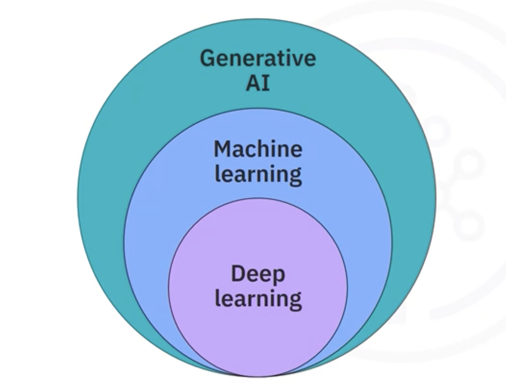

# Machine Learning: An Overview

## 1. The Intuitive Idea: Teaching Computers to Learn

In traditional programming, we give a computer explicit, step-by-step instructions to solve a problem (e.g., "if `x > 5`, then do `y`").

**Machine Learning (ML)** flips this paradigm. Instead of giving explicit instructions, we give the computer **data** and an **algorithm**, and it learns to identify patterns and make decisions on its own. The core idea is to enable computers to learn from experience without being explicitly programmed for every scenario.

## 2. The Landscape: Where Does Machine Learning Fit?

Machine learning is a part of the broader field of Artificial Intelligence (AI). It's helpful to visualize their relationship as nested concepts:

*   **Artificial Intelligence (AI) (Broadest Field):** The general goal of making computers appear intelligent by simulating human cognitive abilities. This includes fields like computer vision, natural language processing, and machine learning.
*   **Machine Learning (ML) (A Subset of AI):** The specific practice of using algorithms to learn patterns from data. It often requires humans to guide the process through "feature engineering" (selecting the right data characteristics for the model to learn from).
*   **Deep Learning (DL) (A Specialized Subset of ML):** A powerful type of machine learning that uses complex, multi-layered "neural networks." Its key advantage is the ability to automatically learn and extract features from highly complex and unstructured data (like images or audio), reducing the need for manual feature engineering.

## 3. How Do Machines Learn? The Four Learning Paradigms

Machine learning models differ in *how* they learn from data. There are four main approaches:

| Paradigm | How it Works | Key Idea & Analogy |
| :--- | :--- | :--- |
| **Supervised Learning** | The model trains on **labeled data** (data where the "correct answer" is already known). | Learning with a teacher. You show the model thousands of pictures of cats labeled "cat" and dogs labeled "dog," and it learns to tell them apart. |
| **Unsupervised Learning** | The model works with **unlabeled data** and tries to find hidden structures or patterns on its own. | Finding patterns without a teacher. You give the model a pile of mixed fruit, and it figures out how to group them into "apples," "bananas," and "oranges" based on their characteristics, without you ever telling it the names of the fruit. |
| **Semi-Supervised Learning** | A hybrid approach that uses a **small amount of labeled data** and a **large amount of unlabeled data**. | Learning with a little bit of help. You label a few pictures of cats and dogs, and the model uses that knowledge to start labeling the rest of the unlabeled pictures, iteratively improving itself. |
| **Reinforcement Learning** | An "agent" learns by **interacting with an environment** and receiving rewards or penalties for its actions. | Learning through trial and error. A chess-playing AI learns by playing millions of games, getting a "reward" for winning and a "penalty" for losing, eventually discovering the best strategies on its own. |

## 4. What Can Machines Learn to Do? A Toolbox of ML Techniques

Depending on the problem you want to solve, you can choose from a variety of ML techniques.

*   **Classification:** Predict a category or class (e.g., Is this email *spam* or *not spam*? Is this cell *benign* or *malignant*?).
*   **Regression:** Predict a continuous numerical value (e.g., What is the *price* of this house? What will the *temperature* be tomorrow?).
*   **Clustering:** Group similar data points together (e.g., Segmenting customers into *high-value*, *medium-value*, and *low-value* groups).
*   **Association Rule Mining:** Find items or events that often co-occur (e.g., Customers who buy *diapers* also tend to buy *beer*).
*   **Anomaly Detection:** Discover abnormal or unusual cases (e.g., Detecting *fraudulent* credit card transactions).
*   **Sequence Mining:** Predict the next event in a sequence (e.g., Predicting the next page a user will *click* on a website).
*   **Dimensionality Reduction:** Reduce the number of features (variables) in the data while retaining important information.
*   **Recommendation Systems:** Recommend new items to users based on their past preferences and the preferences of similar users (e.g., Amazon's "Customers who bought this also bought..." or Netflix's movie recommendations).

## 5. Case Study in Action: Benign vs. Malignant Cells

This is a classic example of a **classification** problem.
1.  **Data:** A dataset containing thousands of human cell samples, each with measured characteristics (clump thickness, cell size, etc.) and a label: **benign** or **malignant**.
2.  **Training:** A machine learning model is trained on this labeled data. It learns the patterns of characteristics that are typically associated with benign cells and those associated with malignant cells.
3.  **Prediction:** Once trained, the model can be given a *new, unlabeled* cell sample. By analyzing its characteristics, the model can predict whether the new cell is benign or malignant with a high degree of accuracy.

This demonstrates the power of ML: leveraging historical data to make crucial predictions on new, unseen cases.

## 6. Machine Learning in the Wild: Everyday Applications

Machine learning is already deeply integrated into our daily lives:
*   **E-commerce & Entertainment:** Amazon and Netflix use recommendation systems to suggest products and movies.
*   **Finance:** Banks use ML to predict the probability of loan default when making lending decisions.
*   **Telecommunications:** Companies use ML to predict customer "churn" (the likelihood a customer will cancel their service).
*   **Virtual Assistants:** Chatbots and voice assistants use ML to understand and respond to our requests.
*   **Security:** Face recognition on smartphones uses ML to verify identity.

## 7. Summary

*   Machine learning is a subset of AI that focuses on creating algorithms that can **learn from data** to identify patterns and make decisions.
*   The primary learning paradigms are **Supervised**, **Unsupervised**, **Semi-Supervised**, and **Reinforcement Learning**.
*   Common ML techniques include **Classification**, **Regression**, and **Clustering**, among others.
*   ML has a profound impact on society, powering everything from medical diagnoses and fraud detection to product recommendations and financial decisions.

---

**Next:** [Machine Learning Model Lifecycle](./02_machine_learning_model_lifecycle.md)