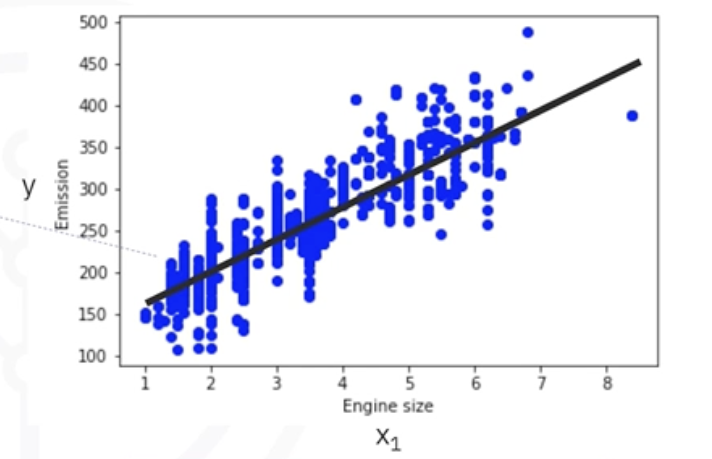

# Introduction to Simple Linear Regression

## 1. The Intuitive Idea: Drawing the Best Straight Line

Simple Linear Regression is a supervised learning technique used to model the relationship between two variables by fitting a straight line to the observed data.

**The Goal:** To use a **single independent variable:** (feature) to predict a **single continuous dependent variable** (target).

**The Analogy:** Imagine plotting your data on a scatter plot. Simple Linear Regression is the process of finding the one straight line that best "cuts through" the cloud of data points, capturing the general trend.

**Example: CO2 Emissions:**
* **Independent Variable (x):** `Engine Size`
* **Dependent Variable (y):** `CO2 Emissions`
* A scatter plot shows that as `Engine Size` increases, `CO2 Emissions` also tend to increase in a roughly linear fashion. Our goal is to find the line that best represents this relationship.

## 2. The Mathematics of the Line

The relationship is modeled using the simple equation for a straight line:

$$ \hat{y} = \theta_0 + \theta_1 x_1 $$

Where:

*   $\hat{y}$ (y-hat) is the **predicted value** of the target variable. It's the value on the regression line for a given `x`.
*   $x_1$ is the single **independent variable** or feature (e.g., `Engine Size`).
*   $\theta_0$ is the **y-intercept** of the line. It's also known as the "bias." It's the predicted value of `y` when `x` is zero.
*   $\theta_1$ is the **slope** of the line. It's also known as the "coefficient" for the feature `x₁`. It represents the change in `y` for a one-unit increase in `x`.

The machine learning algorithm's job is to find the optimal values for the parameters $\theta_0$ and $\theta_1$ that create the "best-fit" line.

## 3. How Do We Define the "Best" Line? Minimizing Errors

How does the algorithm know which line is the best? It aims to minimize the prediction error.

#### Residual Error:
For any single data point, the residual is the **vertical distance** between the actual value (`y`) and the value predicted by the line (`ŷ`). It's the measure of our model's error for that one point.
* `Error = Actual Value - Predicted Value`

#### Mean Squared Error (MSE):
To find the total error for the whole dataset, we can't just average the residuals (because positive and negative errors would cancel out). Instead, we:

1.  Square each individual residual error.
2.  Calculate the average of these squared errors.
This gives us the **Mean Squared Error (MSE)**.

#### Ordinary Least Squares (OLS):
The goal of the linear regression algorithm is to find the specific values of $\theta_0$ and $\theta_1$ that **minimize the MSE**. This method is called **Ordinary Least Squares (OLS)** because it finds the line that minimizes the sum of the squared errors.

## 4. Finding the Solution: The OLS Formulas

For simple linear regression, there is a direct mathematical solution to find the optimal parameters that minimize the MSE. These formulas were derived in the early 1800s.

**1. Calculate the Slope ($\theta_1$):**  

$$ \theta_1 = \frac{\sum_{i=1}^{n} (x_i - \bar{x})(y_i - \bar{y})}{\sum_{i=1}^{n} (x_i - \bar{x})^2} $$

**2. Calculate the Intercept ($ \theta_0 $):**  

$$ \theta_0 = \bar{y} - \theta_1 \bar{x} $$

Where $\bar{x}$ and $\bar{y}$ are the mean (average) values of the `x` and `y` variables, respectively.

#### Example Calculation:
For the CO2 dataset, after calculating the means and sums:
*   The slope $\theta_1$ is calculated to be **39**.
*   The intercept $\theta_0$ is calculated to be **125.7**.

Our final model is: `CO2 Emissions = 125.7 + 39 * Engine Size`

**Making a Prediction:**
To predict the CO2 emission for a car with an engine size of 2.4:
*   `ŷ = 125.7 + 39 * 2.4 = 214.3`

## 5. Pros and Cons of Simple Linear Regression (OLS)

#### Advantages
* **Simple to Understand and Interpret:** The linear relationship and the meaning of the coefficients are very intuitive.
* **No Hyperparameter Tuning:** The solution is calculated directly from the data; there are no complex parameters to tune.
* **Fast:** It is computationally inexpensive, especially on smaller datasets.

#### Disadvantages
* **Overly Simplistic:** It can only capture linear relationships and will perform poorly if the true relationship is non-linear.
* **Sensitive to Outliers:** Because OLS minimizes *squared* errors, a single data point that is very far from the line (an outlier) will have a huge squared error, which can dramatically pull the best-fit line towards it and reduce the model's accuracy.

## 6. Summary
*   Simple Linear Regression models the relationship between **one feature** and **one continuous target** by fitting a straight line.
*   The goal is to find the line that **minimizes the Mean Squared Error (MSE)**.
*   This is achieved using the **Ordinary Least Squares (OLS)** method, which has a direct mathematical formula to find the optimal slope ($\theta_1$) and intercept ($\theta_0$).
*   The method is fast and interpretable but is limited to linear relationships and is sensitive to outliers.

---

**Next:** 