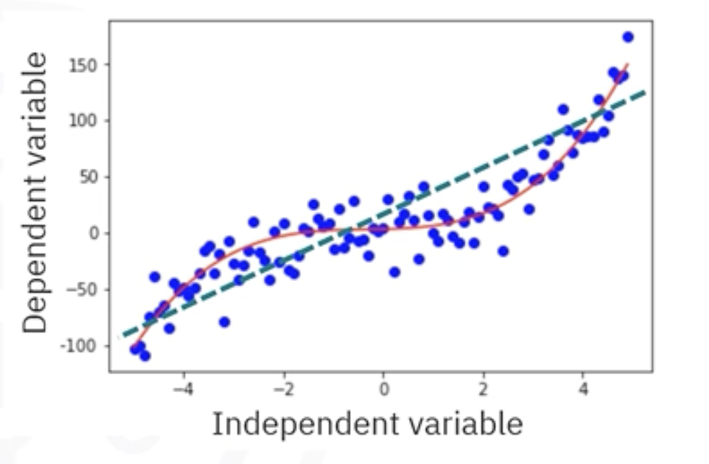
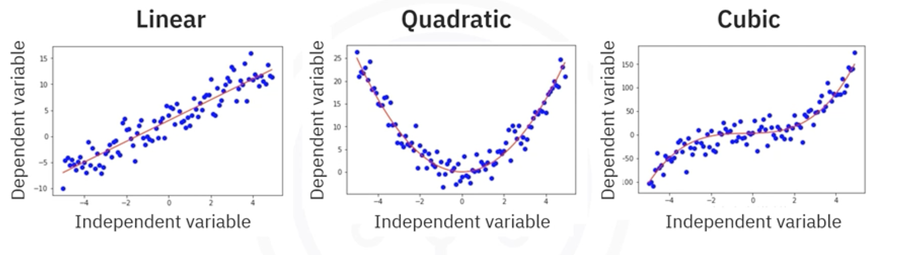
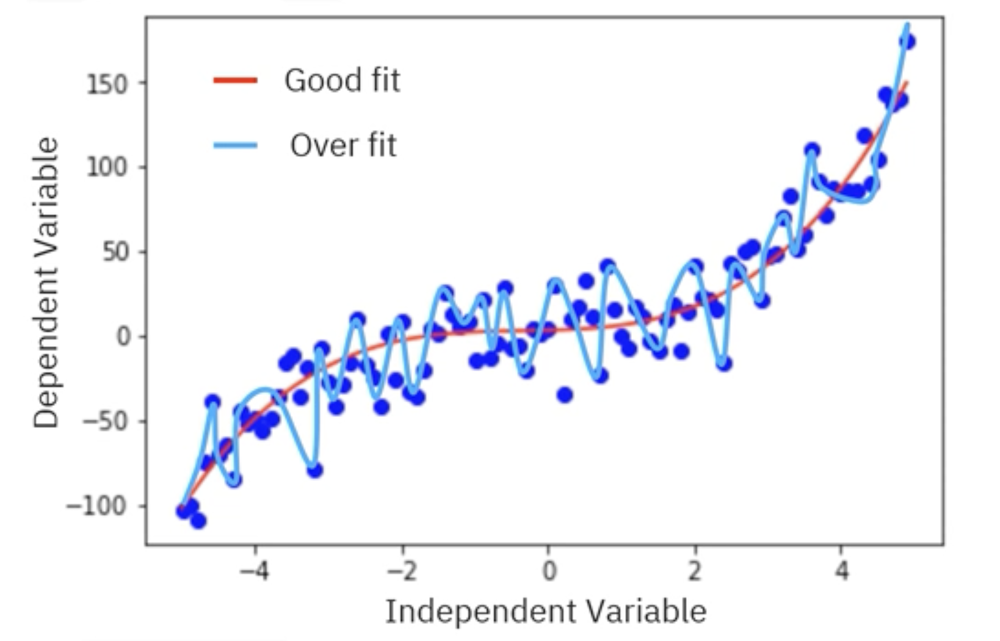

# Polynomial and Non-Linear Regression

## 1. The Intuitive Idea: Beyond the Straight Line

So far, we've focused on linear regression, which tries to fit a straight line to our data. However, real-world data is rarely so simple. Often , the relationship between our features and the target follows a curve. 

If we try to fit a stright line to data that is clearly curved, our model will be too simplistic and will make poor decisions. This is known as **underfitting**.

**Non-Linear Regression** is a broad category of methods used to model these curved, non-linear relationships between variables.

## 2. Polynomial Regression: The "Linear" Trick

Polynomial regression is one of the simplest and most common ways to model non-linear relationships. Instead of fitting a straight line, we fit a polynomial curve (like a quatratic or cubic curve) to the data.

The model equation looks like this:  

$$ \hat{y} = \theta_0 + \theta_1 x + \theta_2 x^2 + \dots + \theta_n x^n $$

Where:
*   $\hat{y}$ is the predicted value.
*   $x$ is the original independent variable.
*   $x^2, x^3, \dots, x^n$ are the new polynomial features.
*   $n$ is the degree of the polynomial.

### The Trick: Transforming it into a Linear Problem

How do we solve this? We can transform this into a **Multiple Linear Regression** problem with a clever trick: we treat each polynomial term as a *new, separate feature*.

Let's say we have a cubic model ($n=3$):  

$$ \hat{y} = \theta_0 + \theta_1 x + \theta_2 x^2 + \theta_3 x^3 $$

We can define new features:
*   $x_1 = x$
*   $x_2 = x^2$
*   $x_3 = x^3$

Now, our equation becomes:  

$$ \hat{y} = \theta_0 + \theta_1 x_1 + \theta_2 x_2 + \theta_3 x_3 $$

This is just a standard multiple linear regression equation! We can use the exact same `LinearRegression` model from scikit-learn to find the optimal coefficients ($\theta_0, \theta_1, \theta_2, \theta_3$). Because of this, polynomial regression is often considered a special case of linear regression.

### The Danger of Polynomial Regression: Overfitting

Given enough data points, you can always find a polynomial of a sufficiently high degree that passes perfectly through every single point. However, this is not a good thing.

**Overfitting** happens when the model becomes too complex and starts to "memorize" the training data, including its random noise and fluctuations, instead of learning the underlying trend.

An overfit model will have an amazing score on the data it was trained on, but it will fail miserably at predicting new, unseen data. The goal is to find a curve that captures the general trend without being overly complex.

## 3. "True" Non-Linear Regression Models

While polynomial regression is powerful, some relationships can't be modeled effectively with polynomials. These require the "true" non-linear regression models, where the relationship between the parameters ($\theta$) and the feature is not linear.

These models cannot be solved with the simple OLS method. Instead, they require more advanced optimization algorithms (like Gradient Descent) to iteratively find the best parameters.

Common examples include:

* **Exponential Growth:** Describes phenomena that increase at an ever-faster rate.
    * *Example:* The growth of China's GDP from 1960 to 2014, or how an investment grows with compound interest.
    * *Model:* $\hat{y} = \theta_0 + \theta_1 e^{\theta_2 x}$