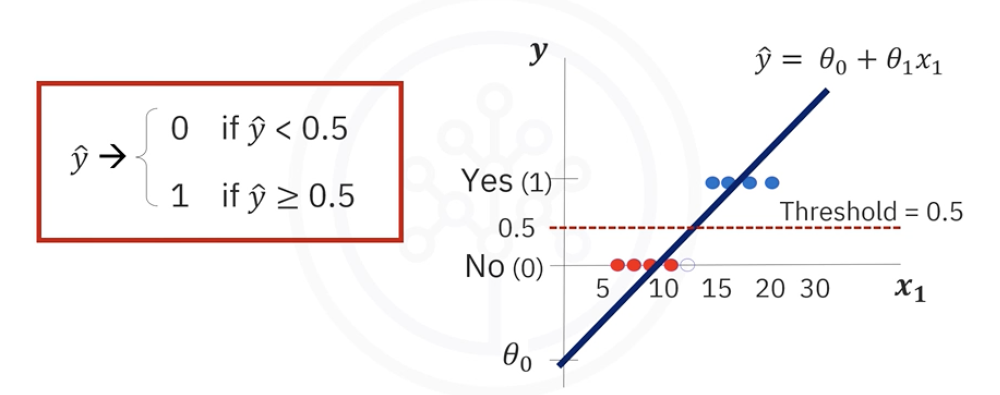
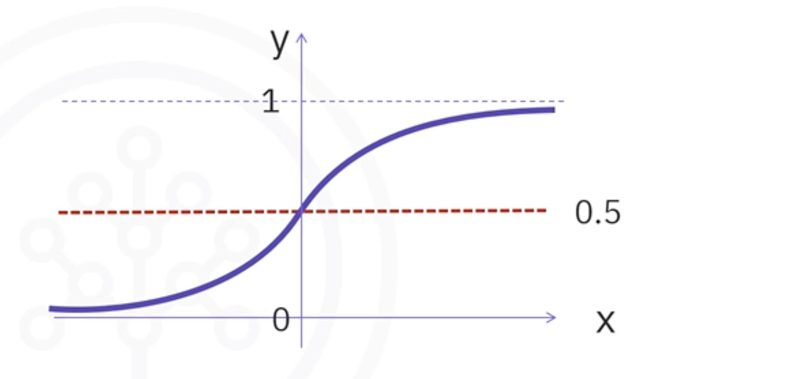

# Introduction to Logistic Regression

## 1. The Intuitive Idea: Predicting a Probability for Yes/No Questions

So far, we've used regression to predict continuous values (like the price of a house). But what if we want to answer a "yes" or "no" question?
* Will a customer *churn* or *not churn*?
* Is an email *spam* or *not spam*?
* Is a tumor *malignant* or *benign*?

This is a **classification** problem. **Logistic Regression** is a fundamental machine learning algorithm used for **binary classification** (problems with two possible outcomes, typically represented as 0 and 1).

Instead of predicting the class directly, logistic regression predicts the **probability** that an observation belongs to the positive class (class '1').

## 2. Why Not Just Use Linear Regression?

Let's say we want to predict customer churn (1=Yes, 0=No) based on their age. If we try to fit a standard linear regression line to this data, we run into two major problems:

1. **The Output isn't a Probability:** The line extends indefinitely in both directions. It can predict values greater than 1 or less than 0, which makes no sense for a probability.
2. **A Simple Threshold is Flawed:** We could try to force the output into a class by saying "if the line is above 0.5, predict 1; otherwise, predict 0." This creates a "step function", which is too abrupt. It doesn't give us a nuanced probability and treats a prediction of 0.6 the same as a prediction of 0.99.

We need a smoother, S-shaped curve that is naturally constrained between 0 and 1.

## 3. The Solution: The Sigmoid Function

Logistic Regression solves this problem by taking the output of a linear equation and passing it through a special function called the **Sigmoid function** (a.k.a. the logistic function).

**Linear Equation:**  

$$
z = \theta_0 + \theta_1 x_1 + \theta_2 x_2 + \dots + \theta_n x_n 
$$

**Sigmoid Function ($ \sigma $):**  

$$
\sigma(z) = \frac{1}{1 + e^{-z}} 
$$

The sigmoid function takes any real number `z` and "squashes" it into a value between 0 and 1.

The output of the sigmoid function, $ \hat{p} = \sigma(z) $, is our predicted **probability**.  

$$
\hat{p} = P(y=1 | X) 
$$

This is read as "the probability that the target `y` is 1, given the input features `X`."

## 4. From Probability to Classification: The Decision Boundary

Once we have the predicted probability ( $\hat{p}$ ), we can make a final classification decision by setting a **threshold**, often called the **decision boundary**.

The standard threshold is 0.5:
*   If $\hat{p} \ge 0.5$, we predict the class is **1** (e.g., "Churn").
*   If $\hat{p} < 0.5$, we predict the class is **0** (e.g., "No Churn").

This makes Logistic Regression both a **probability predictor** and a **binary classifier**.

## 5. When is Logistic Regression a Good Choice
Logistic Regression is a great first choice for a binary classification problem, especially when:

1. **Your target is binary:** The outcome you want to predict has only two categories (0/1, True/False, Yes/No).
2. **You need probabilities:** You want to know the *likelihood* of an outcome, not just the final classification.
3. **The data is linearly separable:** The model assumes a line (or a plane/hyperplane in higher dimensions) can effectively separate the two classes.
4. **You need interpretability:** The coefficients ( $\theta$ ) of the model can help you understand the impact of each feature on the predicted outcome.

## 6. Real-World Applications
* **Customer Churn:** Predicting the probability that a customer will cancel their subscription.
* **Medical Diagnosis:** Estimating the likelihood that a patient has a certain disease based on their symptoms and test results.
* **Credit Risk:** Predicting the probability that a homeowner will default on their mortgage.
* **Spam Detection:** Estimating the probability that an email is spam.

## 7. Summary
*   **Logistic Regression** is a classification algorithm that predicts the **probability** of an observation belonging to one of two classes.
*   It improves upon linear regression for classification by using the **Sigmoid function** to squash the output to a value between 0 and 1.
*   By applying a **decision boundary** (e.g., 0.5) to the predicted probability, it makes a final classification.
*   It's a powerful and interpretable model, widely used for binary classification tasks like churn prediction and medical diagnosis.

---

**Next:** [Training A Logistic Regression Model](./08_training_a_logistic_regression_model.md)