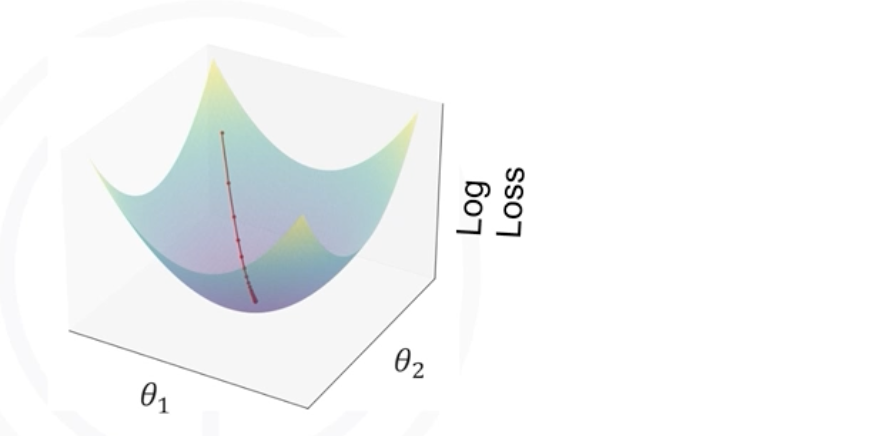

# Polynomial Regression

## 1. The Intuitive Idea: When a Straight Line Isn't Enough

We've seen that Linear Regression is powerful, but it has a major limitation: it can only model a straight-line relationship. What happens when our data follows a curve?

If we try to fit a linear model to data that is clearly curved, our model will be too simplistic and will make poor predictions. This is known as **underfitting**. 

**Polynomial Regression** is a powerful technique that allows us to use a linear model to fit non-linear data. Instead of fitting a straight line, we fit a polynomial curve (like a quadratic or cubic) that can better follow the patterns in the data.

## 2. The Mathematics: Creating New Features

The model equation for polynomial regression looks like this:

$$
\hat{y} = \theta_0 + \theta_1 x + \theta_2 x^2 + \dots + \theta_n x^n 
$$

...where:
* $\hat{y}$ is the predicted value.
* $x$ is the original independent variable.
* $x^2, x^3, \dots, x^n$ are the new polynomial features we create.
* $n$ is the **degree** of the polynomial, which determines the complexity of the curve.

### The Trick: How It's Solved With Linear Regression

This looks like a non-linear equation, but here's the clever trick: we can transform this into a **Multiple Linear Regression** problem by treating each polynomial term as a *new, separate feature*.

Let's say we want to fit a cubic model (degree `n=3`):
$$ \hat{y} = \theta_0 + \theta_1 x + \theta_2 x^2 + \theta_3 x^3 $$

We can define a new set of features:
* $x_1 = x$
* $x_2 = x^2$
* $x_3 = x^3$

Now, our equation becomes:  

$$ \hat{y} = \theta_0 + \theta_1 x_1 + \theta_2 x_2 + \theta_3 x_3 $$

This is just a standard Multiple Linear Regression equation! We can use the exact same methods to find the optimal coefficients ($\theta_0, \theta_1, \theta_2, \theta_3$).

## 3. Key Assumptions of Polynomial Regression

Since Polynomial Regression is a special case of Multiple Linear Regression, it relies on the same core assumptions. However, some have a unique twist.

1.  **Linearity (in the Parameters):** This is the most important and nuanced assumption. We are not assuming the relationship between `x` and `y` is linear. Instead, we assume the relationship is linear *in the coefficients* ($\theta_0, \theta_1, ...$). By creating polynomial features, we transform the problem so that this assumption holds.

2.  **Independence of Residuals:** The prediction errors (residuals) are independent of each other. This is mainly a concern for time-series data.

3.  **Homoscedasticity (Constant Variance):** The residuals have a constant variance across all levels of the independent variables. A residual plot should show a random scatter without any funnel or cone shape.
    > **What to do if it's violated?**
    > *   Transforming the target variable (`y`), such as with a log or square root, can sometimes help stabilize the variance.

4.  **No High Multicollinearity (A New Challenge):** The independent variables should not be highly correlated with each other. This becomes a significant issue in Polynomial Regression because the features we create ($x, x^2, x^3$, etc.) are, by their nature, highly correlated.
    > **What to do if it's violated?**
    > *   **Don't Panic for Prediction:** High multicollinearity primarily affects the reliability and interpretation of the individual coefficients ($\theta_i$). It often does not hurt the model's overall predictive accuracy.
    > *   **Use Regularization:** Techniques like **Ridge Regression** are very effective at handling multicollinearity and are often used in combination with Polynomial Regression.
    > *   **Feature Scaling:** Standardizing the features (e.g., using `StandardScaler`) before creating polynomial terms can sometimes help reduce multicollinearity.

## 4. How the Model is Trained

Because we reframe the problem as a Multiple Linear Regression, we use the same training methods. The goal is to find the coefficients ($\theta_i$) that **minimize the Mean Squared Error (MSE)**.

*   **Ordinary Least Squares (OLS):** For most cases, this direct mathematical approach is used. It finds the optimal coefficients in a single calculation using linear algebra.
*   **Gradient Descent:** For extremely large datasets, an iterative optimization approach like Gradient Descent can be used to find the coefficients.

**Note:** *Check the [Multiple Linear Regression Theory](./05_multiple_linear_regression_theory.md) to see how OLS and Gradient Descent are applied.*

## 5. Model-Specific Considerations

### Choosing the Right Degree
The **degree** of the polynomial is the most important **hyperparameter** you need to choose. It controls the model's complexity and its ability to fit the data.

1.  **Visualize Your Data:** The first and most important step is to create a **scatter plot** of your target variable against your independent variable. A visual inspection will often give you a good starting point for the degree.
2.  **Model and Evaluate:** Try fitting models with a few different degrees (e.g., 2, 3, 4) and compare their evaluation metrics (like R² and RMSE) on a held-out **test set** or using **cross-validation**. The degree that performs best on unseen data is typically the best choice.

## 6. Common Pitfalls: Overfitting

The biggest danger in Polynomial Regression is **overfitting**.

*   **What it is:** Using a polynomial degree that is too high will cause the model to become overly complex. It will start to "memorize" the training data, including its random noise, instead of learning the underlying trend.
*   **The Consequence:** An overfit model will have an amazing score on the data it was trained on, but it will **fail miserably** at making accurate predictions on new, unseen data.
*   **The Solution:**
    *   Keep the polynomial degree as low as possible while still capturing the main trend in the data.
    -   Always evaluate your model on a separate test set to check for overfitting. If the training score is much better than the test score, your model is overfit.
    -   Use regularization techniques (like Ridge) to penalize large coefficients, which can help control overfitting in high-degree polynomial models.

## 7. Summary
*   When the relationship between variables is not a straight line, we need a more flexible model.
*   **Polynomial Regression** fits a curved line by creating new polynomial features ($x^2, x^3$, etc.) and then solving it as a Multiple Linear Regression problem.
*   The **degree** of the polynomial is a critical hyperparameter that controls the complexity of the curve.
*   It introduces a high risk of **multicollinearity** (due to correlated features) and **overfitting** (if the degree is too high).
*   **Visualizing your data** and evaluating performance on a **test set** are crucial steps to choose the right degree and avoid overfitting.

---

**Next:** [Polynomial Regression Implementation](./09_polynomial_regression_implementation.py)