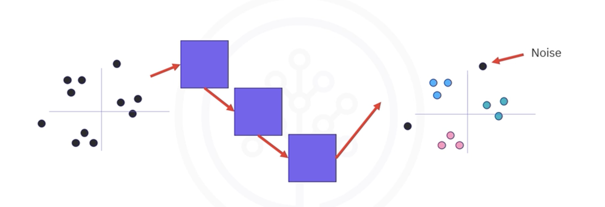
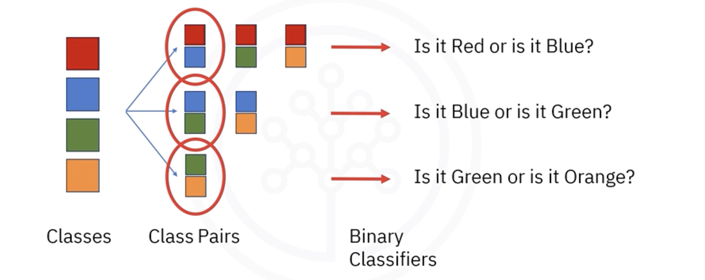

# Classification

## 1. The Intuitive Idea: Predicting a Category

While regression is used to predict a continuous number (e.g., "How much will this house sell for?"), **Classification** is a supervised learning method used to predict a discrete **label** or **category**.

The core question classification answers is: **"Which category does this belong to?"**

* Is this email *spam* or *not spam*?
* Will this customer *churn* or *not churn*?
* Does this image contain a *cat*, a *dog*, or a *bird*?

The model is trained on labeled data and learns the patterns that associate input features with a specific class. It can then predict the class for new, unlabeled data.

## 2. Binary vs. Multi-Class Classification

Classification problems can be broken down into two main types:

### 2.1. Binary Classification
* **Definition:** Problems where there are only **two** possible outcomes.
* **Examples:**
    * **Loan Default:** Predicting whether a loan applicant will *default* or *not default*.
    * **Customer Churn:** Predicting whether a customer will *churn* or *not churn*.
    * **Medical Diagnosis:** Predicting whether a tumor is *malignant* or *benign*.

### 2.2. Multi-Class Classification
* **Definition:** Problems where there are **three or more** possible outcomes.
* **Examples:**
    * **Drug Prescription:** Predicting which of three medications (*Drug A*, *Drug B*, or *Drug C*) is most suitable for a patient.
    * **Image Recognition:** Classifying an image as a *car*, *truck*, or *bicycle*.
    * **Document Classification:** Categorizing news articles as *sports*, *politics*, or *technology*.

## 3. Common Classification Algorithms

There is a wide variety of algorithms that can be used for classification, each with its own strengths and weaknesses. Some of the most common include:

* Logistic Regression
* k-Nearest Neighbors (KNN)
* Support Vector Machines (SVM)
* Decision Trees & Random Forests
* Naive Bayes
* Neural Networks

## 4. Handling Multi-Class Problems with Binary Classifiers

Many powerful classification algorithms (like SVMs) are inherently binary -they are designed to only distinguish between two classes. However, we can use clever strategies to extend them to solve multi-class problems.

The two most common strategies are **One-vs-All** and **One-vs-One**.

### 4.1. One-vs-All (OvA) / One-vs-Rest (OvR)

* **The idea:** Train one binary classifier for each class.
* **How it works:** If you have `k` classes (e.g., A, B, C), you train `k` separate classifiers:
    1. **Classifier 1:** Learns to distinguish **Class A** (positive) vs. **"the rest"** (B and C are negative).
    2. **Classifier 2:** Learns to distinguish **Class B** (positive) vs. **"the rest"** (A and C are negative).
    3. **Classifier 3:** Learns to distinguish **Class C** (positive) vs. **"the rest"** (A and B are negative).
* **Prediction:** To classify a new data point, you run it through all `k` classifiers. The classifier that outputs the highest confidence score or probability "wins", and its class is assigned to the data point.

### 4.2. One-vs-One (OvO)

* **The idea:** Train one binary classifier for every possible *pair* of classes.
* **How it works:** If you have `k` classes (e.g., A, B, C) you train a classifier for each pair:
    1. **Classifier 1:** Learns to distinguish between **Class A** and **Class B**.
    2. **Classifier 2:** Learns to distinguish between **Class A** and **Class C**.
    3. **Classifier 3:** Learns to distinguish between **Class B** and **Class C**.
* **Prediction:** To classify a new data point, you run it through all the classifiers. Each classifier "votes" for one of the two classes it was trained on. The class that receives the most votes wins.
* **Potential issue:** This method can result in a tie, which requires a more advanced voting scheme (e.g., using the confidence scores from each classifier) to resolve.

## 5. Summary

*   **Classification** is a supervised learning task for predicting a **categorical label**.
*   Problems can be **binary** (2 classes) or **multi-class** (>2 classes).
*   Classification has wide-ranging applications, from medical diagnosis and churn prediction to image recognition.
*   Many binary classifiers can be extended to handle multi-class problems using strategies like **One-vs-All (OvA)** and **One-vs-One (OvO)**.

---

**Next:** [Lab: Multi-Class Classification](./02_lab--multi-class_classification.ipynb)